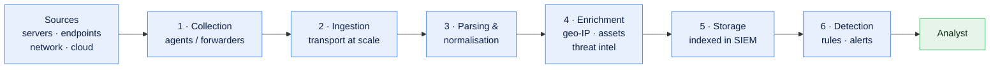
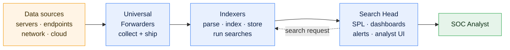
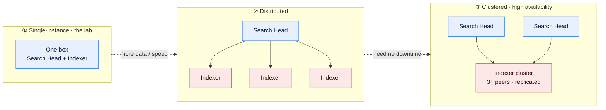

# SOC, SIEM & Splunk - A Practical Guide

    

A **Security Operations Center (SOC)** is the team (and the function) responsible for **continuously monitoring, detecting, analysing, and responding to cybersecurity threats** across an organisation. Think of it as the organisation's security "control room" - people, processes, and tooling working together to catch attacks early and respond fast when something gets through. (Note a SOC is primarily about **detection and response**, not prevention - keeping attackers out in the first place is mostly the job of firewalls, patching, and access controls.)

> **Analogy - cameras, not a guard in every room.** You can't post a security guard in every room of a building, but you _can_ put a **camera** in each one and watch them all from a single control room. A SOC works the same way: it can't place a person on every server, laptop, and account, so instead everything is **instrumented** - logs and telemetry are the "cameras" - and analysts watch those feeds centrally through the **SIEM** (Security Information and Event Management - the central platform the whole SOC works from; [explained in full below](#siem---what-it-is-an-analogy-and-2026-tooling)) to spot where the problem is. That's the whole idea behind centralised monitoring.

A SOC is fundamentally a **blue team** (defensive) operation. It's usually structured in two overlapping ways at once:

1. **Tiers / lines** - a triage-and-escalation ladder (Tier 1 → Tier 2 → Tier 3), so cheap, high-volume work is filtered first and only the hard cases reach senior people.
2. **Functional divisions** - specialised teams (threat intel, hunting, incident response, detection engineering, etc.) that the tiers draw on.

This guide runs from **SOC fundamentals → what a SIEM is → Splunk in depth**. To actually try Splunk, the companion doc **[docker.md](docker.md)** shows how to stand up a real instance in a container.

---

## Contents

**SOC (Security Operations Centre)**

- [The tiered model](#the-tiered-model-tiers--lines-of-support) - the roles: Tier 1 -> 4, who does what
- [Functional divisions / specialised teams](#functional-divisions--specialised-teams) - IR, threat hunting, CTI, detection engineering
- [The incident response lifecycle](#the-incident-response-lifecycle) - the process (NIST / SANS)
- [Common event types to look out for](#common-event-types-to-look-out-for) - the detection checklist
- [Common tools](#common-tools) - the technology stack (SIEM, SOAR, EDR, IDS/IPS, TIP)
- [SOC metrics](#soc-metrics-how-a-soc-measures-itself) - MTTD, MTTR, dwell time
- [SOC challenges](#soc-challenges)
- [SOC best practices](#soc-best-practices)
- [In-house vs outsourced (MSSP / MDR)](#in-house-vs-outsourced-mssp--mdr)
- [Data: the pipeline and what flows through it](#data-the-pipeline-and-what-flows-through-it) - how data reaches the SOC

**SIEM**

- [SIEM - what it is, an analogy, and 2026 tooling](#siem---what-it-is-an-analogy-and-2026-tooling)

**Splunk**

- [What is Splunk?](#what-is-splunk)
- [What can Splunk be used for? (and why)](#what-can-splunk-be-used-for-and-why-use-it)
- [What is a Splunk / SOC analyst?](#what-is-a-splunk--soc-analyst)
- [Versions of Splunk](#versions-of-splunk)
- [Splunk architecture](#splunk-architecture) - Search Head, Indexers, Universal Forwarders
- [Deployment options](#deployment-options-scaling-the-search-head--indexers)
- [Basic terms in Splunk](#basic-terms-in-splunk-glossary)
- [What data / files does Splunk ingest?](#what-data--files-does-splunk-ingest)
- [How does Splunk onboard / ingest data?](#how-does-splunk-onboard--ingest-data)
- [What are events?](#what-are-events-in-splunk)
- [What is SPL?](#what-is-spl)
- [SPL by example](#spl-by-example) - searches, transformations, visualisations
- [What you can build in Splunk](#what-you-can-build-in-splunk)
- [Putting it together: a mini end-to-end walkthrough](#putting-it-together-a-mini-end-to-end-walkthrough)
- [Apps vs add-ons](#apps-vs-add-ons)
- [Securing data in Splunk](#securing-data-in-splunk)
- [Encrypting data](#encrypting-data)
- [AI with Splunk](#ai-with-splunk)
- [Case studies](#case-studies)
- [Certification path](#certification-path)
- [Recommended datasets](#recommended-datasets)
- [Guides, walkthroughs & demos](#guides-walkthroughs--demos)

**Reference**

- [Key frameworks & concepts](#key-frameworks--concepts) - MITRE ATT&CK, Kill Chain, IOC/TTP
- [Quick glossary](#quick-glossary)

---

## The tiered model (tiers / lines of support)

This is the classic SOC structure. Alerts flow **up** the tiers; only what can't be resolved at one level is **escalated** to the next.

### Tier 1 - Monitoring / Triage Analyst _(1st line SOC)_

The **front line** - "eyes on glass." They watch the alert queue in real time and are the first humans to see anything suspicious.

> **The core three:** in practice the day-to-day heart of the 1st line is **monitoring → detection → triage**. The rest below (initial investigation, first-response containment, reporting, improvement) are lighter touches or shared with higher tiers - but monitor/detect/triage is where a Tier 1 analyst spends most of the shift.

**What they do**

- Continuously monitor the **SIEM** and other alert sources - **EDR** (Endpoint Detection & Response), **IDS/IPS** (Intrusion Detection/Prevention Systems), firewalls (all covered in [Common tools](#common-tools)).
- **Triage** each alert: is it real or a false positive? How urgent?
- Do initial investigation and **categorise/prioritise** incidents.
- Resolve simple, known issues using **runbooks/playbooks**.
- **Escalate** anything genuine or unclear to Tier 2, with the context they've gathered.

#### Dashboards

The analyst's main working surface is a **dashboard** in the SIEM - a real-time visual summary of the alert feed and the environment's health. Building and tuning these is part of the monitoring job (often set up with SOC/detection engineers) so the signals that matter stand out at a glance:

- The live **alert queue** - open incidents by **severity**, and what needs attention right now.
- **Trends & metrics** - alert volumes over time, false-positive rates, top-triggering rules, the noisiest systems.
- **Health / coverage** - are all log sources still reporting? (a silent source is a **blind spot**).

These same dashboards feed the **reports** that show stakeholders how the SOC is performing (see [Reporting](#reporting) below) - the dashboard is the live view, the report is the periodic summary drawn from it.

#### Detection - what they're looking for

Detection is the other half of the 1st-line job: monitoring is _watching_ the feeds; detection is _recognising_ which activity in them is suspicious. The red flags a Tier 1 analyst scans for - failed-login bursts and **impossible travel**, malware and **C2** connections, **privilege escalation**, unusual data transfers, and the like - are gathered into a single checklist further down: see [Common event types to look out for](#common-event-types-to-look-out-for).

The skill is knowing what **"normal" looks like** for the environment, so that **anomalies** stand out. Most detections are automated by rules/signatures in the SIEM and EDR - the analyst's job is to interpret what those detections mean and decide whether they're real.

#### Triage - sorting real threats from noise

Once something is detected, triage answers **two questions**:

**1. Is the issue real?** _(true positive or false positive?)_

**The vast majority of alerts are false positives** - benign activity that merely _looks_ suspicious. The classic example: an account logs in **10 times in a row**, which trips a "possible brute force" rule. Suspicious on the surface - but the mundane explanation is usually the right one: the user **forgot their password** and kept retrying, their phone was auto-retrying a saved (stale) password, or a legitimate script was re-authenticating. None of that is an attack. A _real_ brute force would more likely show **hundreds of attempts**, from an **unfamiliar IP**, against **many accounts**, at machine speed - a different shape entirely. The analyst decides using **context**: What's the baseline for this user/system? Same IP as always? Successes or all failures? Odd hour? Followed by anything else unusual?

**2. What priority does it have?** _(how urgent / severe?)_

A confirmed-real alert still isn't all equal - analysts **rank** each one so the worst are handled first. Priority typically weighs:

- **Impact** - how critical is the affected system or data? (A domain controller or customer database beats a test box.)
- **Scope** - one machine, or spreading across many?
- **Stage of attack** - a blocked probe is lower priority than active data exfiltration or ransomware already encrypting files.
- **Confidence** - how sure are we it's real?

This priority (often a Critical/High/Medium/Low severity) drives how fast it's escalated and who gets pulled in.

Getting both questions right matters both ways: **miss a true positive** and an attack slips through; **over-escalate false positives** and you flood Tier 2 and burn out on **alert fatigue**. Tuning detection rules to cut false-positive noise is a constant background task (and feeds back to Detection Engineering).

#### Investigation (initial)

For anything that survives triage, the analyst does a **first-pass investigation** to build the story before escalating. Three questions frame it:

- **When did it happen?** Build a **timeline** - first occurrence, frequency, still ongoing or finished? Timing is a clue in itself (3 a.m. activity on a 9-to-5 account is a flag).
- **What happened?** What exactly did the alert fire on - which user, host, IP, process, action? Pull the surrounding logs to see what came before and after.
- **Is it normal?** Compare against the **baseline**. Is this expected behaviour for this user/system, or a genuine deviation?

Tier 1 does the _initial_ dig and gathers context; **deep investigation and forensics escalate to Tier 2/3.**

#### Incident response (first-response actions)

When an incident is confirmed, the 1st line often takes **immediate containment steps** from a **playbook** to limit damage while the incident is escalated. For a **compromised account**, typical first actions:

- **Disable / block the account** so the attacker loses access.
- **Force a password reset** (change the credentials).
- **Force logout / revoke active sessions and tokens**, so existing logins are killed, not just future ones.
- **Isolate an affected host** from the network if a machine is involved.

These are containment _first aid_ - stop the bleeding fast. Full **eradication and recovery** (root-cause removal, rebuilding systems) is led by Tier 2/3 and the incident-response process.

#### Reporting

The 1st line **documents** what it sees and hands it on:

- **Log every incident** - a clear record of the alert, the investigation, actions taken, and the outcome (for the audit trail, handovers, and later analysis).
- **Shift handover** - pass ongoing issues to the next shift in a 24×7 SOC.
- Feed **metrics** - alert volumes, false-positive rates, response times - that show **how well the SOC is working** and where it's struggling.

#### Continuous improvement

The SOC gets better by closing the loop. The 1st line contributes by:

- **Flagging noisy/false-positive rules** so detections get **tuned** (fewer false alarms, less alert fatigue).
- **Updating playbooks/runbooks** when a case reveals a gap or a better procedure.
- Surfacing **new threat patterns** worth a detection, feeding Detection Engineering and Threat Hunting.

The goal is a feedback loop: every incident should make the _next_ one faster to catch and handle.

**Focus:** high volume, speed, filtering noise. The main job is to separate the small fraction of alerts that matter from the flood of false positives, and to escalate the real ones quickly and cleanly.

**Escalates to Tier 2 when:** an alert is confirmed suspicious/malicious, or is beyond a documented runbook.

#### Concrete example - AWS CloudWatch monitoring EC2 CPU usage

A practical picture of what "monitoring" means in the cloud:

1. **The source.** **Amazon CloudWatch** collects metrics from **EC2 instances** (virtual servers), including **CPU utilisation**. You set an **alarm** - e.g. "fire if CPU stays above 90% for 5 minutes."
2. **The alert.** One night an instance that normally sits at ~15% CPU pins at 100%. CloudWatch trips the alarm and pushes it into the SOC's queue (often via the SIEM, so it lands next to all the other alerts the Tier 1 analyst is watching).
3. **Triage (Tier 1).** The analyst asks the triage questions: _Is this expected?_ A batch job or traffic spike could explain it (a likely **false positive**). But if nothing scheduled accounts for it, an unexplained, sustained CPU spike is a red flag - a classic sign of **cryptojacking** (malware secretly mining cryptocurrency), a compromised host, or a DoS.
4. **Correlate.** They pull related signals - did CloudTrail show unusual API calls? New outbound network connections? A process the EDR doesn't recognise? A CPU alarm _plus_ connections to a known mining pool is no longer ambiguous.
5. **Escalate.** Confirmed suspicious → hand it to **Tier 2** with the gathered context, who investigate scope and **contain** the instance (isolate it, snapshot for forensics, terminate/rebuild).

The takeaway: a plain infrastructure metric (CPU %) becomes a **security signal** once you monitor it, alarm on the abnormal, and triage _why_. This is exactly the Tier 1 loop - watch a source, catch the anomaly, decide real-vs-noise, escalate the real ones. (CloudWatch/CloudTrail are common cloud **alert sources** feeding a modern SOC.)

### Tier 2 - Incident Responder / Analyst

The **investigators.** They take escalations from Tier 1 and dig in. Where Tier 1 asks _"is this real?"_, Tier 2 asks _"how bad is it, how far has it spread, and how do we stop it?"_ They handle fewer cases than Tier 1 but spend far more time on each.

**What they do**

- Perform **deeper investigation** on escalated incidents - pull logs, correlate events, work out what actually happened.
- Determine **scope and impact**: which systems, accounts, and data are affected.
- **Contain and remediate** - isolate hosts, block indicators, reset credentials, kill malicious processes.
- Turn findings into **improved detections** and feedback for Tier 1.

#### How a Tier 2 investigation works

Tier 1 hands over an alert with initial context; Tier 2 turns that into a full picture:

- **Reconstruct the timeline.** Establish the sequence of events - first sign of compromise, what the attacker did, and whether it's still ongoing. The **first event** matters most: it often points to the **entry vector** (a phishing click, an exposed service, stolen credentials).
- **Pivot across data sources.** Follow the thread from one artefact to the next - a suspicious IP leads to the accounts it touched, which lead to the hosts they logged into, which lead to the processes that ran. This **cross-source correlation** is where a SIEM like Splunk earns its keep.
- **Determine scope.** Answer the questions that decide severity: how many hosts/accounts are affected? Did the attacker gain persistence? Was data accessed or exfiltrated?
- **Find the root cause.** Not just _what_ happened but _how they got in_ - because that's what has to be closed to stop it recurring.

> **Worked example (continuing the compromised account).** Tier 1 escalates an account flagged for impossible travel. Tier 2 pulls the account's full auth history, finds the first suspicious login came from a new ASN right after a phishing email was opened, sees the attacker then accessed a file share and created a mailbox forwarding rule. Scope: one account, one data store, plus a persistence mechanism (the forwarding rule) Tier 1 wouldn't have looked for.

#### Containment, eradication & recovery

Tier 2 owns the middle of the [incident response lifecycle](#the-incident-response-lifecycle):

- **Containment** - stop the spread _now_: isolate affected hosts from the network, disable compromised accounts, block malicious IPs/domains at the firewall. Buys time without tipping off the attacker or destroying evidence.
- **Eradication** - remove the threat's foothold entirely: kill malicious processes, delete malware and persistence (scheduled tasks, forwarding rules, rogue accounts), close the entry vector.
- **Recovery** - restore clean systems from known-good backups, re-enable accounts with fresh credentials, and **monitor closely** for signs the attacker returns.

**Focus:** understanding the full picture of a confirmed incident and stopping it. Less volume than Tier 1, more depth per case.

**Escalates to Tier 3 when:** the incident is severe, novel, spans many systems, or requires advanced forensics/malware analysis.

### Tier 3 - Threat Hunter / Senior Analyst / SME

The **experts.** Senior specialists who handle the hardest incidents and, crucially, work **proactively** rather than just reacting to alerts. Tiers 1-2 are fundamentally **reactive** (they respond to alerts that fired); Tier 3's defining trait is that it goes looking for what the alerts _missed_.

**What they do**

- **Threat hunting** - proactively search for threats that evaded automated detection, using hypotheses and threat intel (assume breach, go looking).
- **Advanced investigation & forensics** - deep-dive analysis of major incidents (DFIR).
- **Malware analysis / reverse engineering**.
- Develop and tune **detection rules** so future instances get caught automatically (feeding Detection Engineering).
- Handle **major/critical incidents** and mentor lower tiers.

#### Threat hunting in practice

Hunting is **hypothesis-driven**, not alert-driven. The loop:

1. **Form a hypothesis** - a specific, testable idea about how an attacker might be operating undetected. Often framed around a **MITRE ATT&CK** technique (the industry-standard [knowledge base of attacker tactics & techniques](#key-frameworks--concepts)) or fresh threat intel.
2. **Gather the data** - pull the logs that would show it if it were true.
3. **Analyse** - search for the pattern, filtering out the known-good baseline.
4. **Confirm or refute** - either you find something (hand it to incident response) or you don't (still valuable - it validates coverage).
5. **Operationalise** - turn any finding, _and_ the hunt itself, into an **automated detection** so it's caught next time without a human.

> **Example hunt.** _Hypothesis:_ "An attacker using stolen credentials would log in from an unfamiliar network, then move laterally over RDP." _Data:_ authentication + RDP session logs. _Search:_ successful logins from a new ASN, followed within minutes by internal RDP connections to multiple hosts. _Outcome:_ if the pattern shows up, it's a live intrusion the detections missed; if it doesn't, you've confirmed the lateral-movement detection is holding.

#### Forensics & malware analysis (DFIR)

For major incidents, Tier 3 does the deep technical work:

- **Digital forensics** - disk and memory analysis, evidence preservation and chain-of-custody (so findings hold up for legal/HR), reconstructing exactly what an attacker did.
- **Malware analysis** - detonating suspicious files in a **sandbox** and reverse-engineering them to understand behaviour, extract **IOCs**, and confirm impact.

#### Feeding detection engineering

The strategic payoff of Tier 3: **every hunt and major incident should leave behind a new or improved detection.** This is the loop that makes the whole SOC smarter over time - closing the gaps so lower tiers catch tomorrow what only an expert caught today.

**Focus:** proactive defence, advanced expertise, closing the gaps that alerts miss.

### Tier 4 - SOC Manager / Lead

**Management and strategy** (sometimes counted as "Tier 4," sometimes as a separate function). Where the lower tiers work individual alerts and incidents, Tier 4 runs the SOC as a **capability** - making sure the people, process, and technology are there for the others to do their jobs.

**What they do**

- Own the SOC's **overall strategy, staffing, and processes**.
- Manage **escalations to leadership** and coordinate major incidents.
- Report **metrics** to executives; own budgets and tooling decisions.
- Liaise with other business units, legal, comms, and external parties.

#### Running the SOC as a function

- **People** - hiring, shift rotas for [24x7 coverage](#in-house-vs-outsourced-mssp--mdr), training, and managing **burnout** (a real risk in a high-alert-volume job).
- **Process** - own the playbooks, escalation paths, and the [incident response lifecycle](#the-incident-response-lifecycle); make sure lessons-learned actually feed back in.
- **Technology & budget** - decide which tools to invest in and justify the spend (e.g. SIEM data-volume licensing is a major, direct cost).

#### Metrics & reporting to leadership

Tier 4 translates raw SOC activity into **business terms** the board understands - trends in [MTTD / MTTR](#soc-metrics-how-a-soc-measures-itself), alert volumes, coverage gaps, and residual risk. This is how the SOC demonstrates value and argues for resources.

#### Major-incident command

During a serious breach, the SOC Manager becomes the **coordinator** - not doing the technical work, but running it: pulling in the right people, keeping executives informed, and bringing in **legal, comms/PR, and external parties** (regulators, law enforcement, an IR retainer) when needed.

> **Note:** many modern SOCs are moving _away_ from rigid tiers toward flatter, skill-based models - partly because automation (**SOAR** - Security Orchestration, Automation & Response; see [Common tools](#common-tools)) now handles a lot of the repetitive Tier 1 work. But the tier vocabulary is still the standard way the structure is described, and it maps cleanly onto "who does what."

---

## Functional divisions / specialised teams

Beyond the tier ladder, a mature SOC contains (or works closely with) these specialised functions. In a small SOC one person may wear several of these hats; in a large one each is its own team.

| Team / role                               | What they do                                                          | Core responsibility                                   |
| ----------------------------------------- | --------------------------------------------------------------------- | ----------------------------------------------------- |
| **SOC Analysts (Tiers 1-3)**              | Monitor, triage, investigate, respond                                 | Detect and handle threats day to day                  |
| **Incident Response (IR / CSIRT / CERT)** | Coordinate the full response to confirmed incidents                   | Contain, eradicate, recover; run the incident process |
| **Threat Hunting**                        | Proactively hunt for hidden/undetected threats                        | Find what automated detection missed                  |
| **Threat Intelligence (CTI)**             | Gather & analyse intel on attackers, TTPs, IOCs                       | Give the SOC context on _who_ attacks and _how_       |
| **Detection Engineering**                 | Build & tune detection rules/content for the SIEM/EDR                 | Turn threats into reliable automated detections       |
| **Security Engineering / SecOps**         | Build and maintain the SOC's tooling (SIEM, EDR, SOAR, log pipelines) | Keep the detection & response platform running        |
| **Digital Forensics & IR (DFIR)**         | Deep forensic analysis, evidence handling, malware analysis           | Reconstruct incidents; support legal/root-cause       |
| **Vulnerability Management**              | Scan, prioritise, and track remediation of vulnerabilities            | Reduce the attack surface before it's exploited       |
| **Red Team**                              | Simulate real attacks against the org (offensive)                     | Test defences by thinking like an attacker            |
| **Blue Team**                             | The defenders - the SOC itself                                        | Prevent, detect, and respond to attacks               |
| **Purple Team**                           | Facilitate red + blue working _together_                              | Turn attack findings into better detections fast      |
| **SOC Manager / Leadership**              | Strategy, people, process, reporting                                  | Run the SOC as a function                             |

### Red vs Blue vs Purple (a common point of confusion)

- **Blue team = defence.** The SOC _is_ the blue team - monitoring and responding.
- **Red team = offence.** Ethical hackers who simulate real adversaries to find gaps before real attackers do.
- **Purple team = collaboration**, not a permanent team so much as a _way of working_: red shares its attack techniques with blue, blue builds detections for them, and they verify together. "Purple" = the loop that makes both sides better.

---

## The incident response lifecycle

Most SOCs run incidents through a standard lifecycle. The widely used **NIST** model has four phases:

1. **Preparation** - tooling, playbooks, training, and access in place _before_ anything happens.
2. **Detection & Analysis** - spot the incident and understand it (Tier 1 → Tier 2 territory).
3. **Containment, Eradication & Recovery** - stop the spread, remove the threat, restore systems.
4. **Post-Incident Activity** - the "lessons learned" review; feed improvements back into detections and processes.

(The **SANS** model is similar but splits it into six steps: Preparation, Identification, Containment, Eradication, Recovery, Lessons Learned.)

---

## Common event types to look out for

The recurring signals a SOC watches for, gathered into one detection checklist (this is the full set the [Tier 1 detection](#detection---what-theyre-looking-for) role scans for):

- **Authentication anomalies** - brute-force attempts, bursts of failed logins, logins at odd hours, **impossible travel**, logins from new/foreign/blocklisted IPs.
- **Account misuse** - privilege escalation, new admin accounts, dormant accounts reactivating, MFA/credential changes.
- **Malware & suspicious execution** - EDR/AV detections, unknown or suspicious processes, known-bad file hashes, script/PowerShell abuse.
- **Command-and-control (C2)** - beaconing, connections to known-malicious domains/IPs, unusual DNS activity.
- **Data exfiltration** - large or unusual outbound transfers, uploads to unknown services, data staged for export.
- **Lateral movement** - unusual internal connections, remote-execution tools, credential reuse across hosts.
- **Configuration & integrity changes** - security settings altered, logging/AV disabled, new firewall rules, unexpected system/file changes.
- **Resource anomalies** - CPU/memory spikes (e.g. **cryptojacking** - see the EC2 example), unexpected new services.

In Splunk terms, these map to **saved/correlation searches**, and related events can be grouped with **eventtypes** (Splunk's feature for tagging categories of events) to make them easier to search and alert on.

---

## Common tools

The SOC's work runs on a stack of tooling - worth knowing the categories:

| Category                                                 | What it's for                                                                               | Examples of the category                                         |
| -------------------------------------------------------- | ------------------------------------------------------------------------------------------- | ---------------------------------------------------------------- |
| **SIEM** (Security Information & Event Management)       | Central log collection, correlation, and alerting - the analyst's main screen               | Splunk, Microsoft Sentinel, Elastic, QRadar, Wazuh (open-source) |
| **SOAR** (Security Orchestration, Automation & Response) | Automate repetitive response steps via playbooks                                            | Cortex XSOAR (standalone); often built into the SIEM             |
| **EDR / XDR** (Endpoint / Extended Detection & Response) | Detect and respond to threats on endpoints (and beyond)                                     | CrowdStrike, Microsoft Defender, SentinelOne                     |
| **NDR** (Network Detection & Response)                   | Analyse network traffic to spot hidden lateral movement and C2 that endpoint/log tools miss | Darktrace, Vectra AI                                             |
| **IDS / IPS** (Intrusion Detection / Prevention System)  | Detect (IDS) or block (IPS) malicious network traffic                                       | Snort, Suricata                                                  |
| **Threat Intelligence Platform (TIP)**                   | Aggregate and operationalise threat intel / IOCs                                            | MISP, Recorded Future                                            |
| **Ticketing / Case management**                          | Track incidents through their lifecycle                                                     | ServiceNow, Jira                                                 |

---

## SOC metrics (how a SOC measures itself)

- **MTTD - Mean Time to Detect:** the average time taken to notice a threat after it becomes active.
- **MTTR - Mean Time to Respond/Resolve:** how long from detection to containment/resolution.
- **Dwell time** - how long a _specific_ attacker was actually present before being found; the real-world gap that MTTD aims to shrink (lower is better).
- **False positive rate** - how much of the alert volume is noise (drives Tier 1 workload).
- **Alert/ticket volume**, **escalation rate**, and **SLA adherence**.

Lowering **MTTD** and **MTTR** - detect faster, respond faster - is the SOC's central goal.

### SLA, SLO, SLI (service-level targets)

A nested set that's easy to mix up - they answer _"how fast/well do we promise to work, and are we hitting it?"_ Especially important for **MSSP / MDR** providers, who commit to response-time targets for their clients:

- **SLA - Service Level Agreement:** the **agreed/contractual promise**, usually with consequences if missed. E.g. _"respond to Critical alerts within 15 minutes."_
- **SLO - Service Level Objective:** the **internal target** you set to stay safely inside the SLA. E.g. _"respond within 10 minutes, 95% of the time."_
- **SLI - Service Level Indicator:** the **actual measured number**. E.g. _"median response time this month = 8 minutes."_

> **SLI** (what you measure) → **SLO** (the target for it) → **SLA** (the promise you'll hit it, or else). All three lean on the same underlying data as **MTTD / MTTR**.

---

## SOC challenges

Running a SOC is genuinely hard, for reasons worth knowing:

- **Alert volume & fatigue** - a SOC can face tens of thousands of alerts a day, most of them false positives. Analysts become desensitised (**alert fatigue**) and risk missing the real one.
- **False positives & endless tuning** - noisy detections waste time; keeping them tuned is never finished.
- **Skills shortage & burnout** - cybersecurity talent is scarce, and 24×7 shift work drives high turnover.
- **Blind spots** - you can't detect what you don't collect; a misconfigured or silent log source hides attacks.
- **Data volume & cost** - ingesting and storing huge log volumes is expensive (Splunk has historically been licensed by data volume, so _what you choose to log_ has a direct cost).
- **Evolving threats** - attackers constantly change their TTPs, so detections go stale and must be updated.
- **Speed vs accuracy** - pressure to respond fast without over- or under-reacting.
- **Tool sprawl** - many disconnected tools are hard to integrate and correlate across.

---

## SOC best practices

- **Automate the routine** - use **SOAR** playbooks for repetitive Tier 1 work, freeing analysts for judgement calls.
- **Tune detections continuously** - cut false positives so real alerts aren't lost in the noise.
- **Use playbooks/runbooks** - consistent, repeatable response instead of ad-hoc reactions.
- **Map coverage to MITRE ATT&CK** - know which attacker techniques you can and can't detect.
- **Be metrics-driven** - track MTTD/MTTR and actively drive them down.
- **Hunt proactively** - don't only wait for alerts; assume breach and go looking.
- **Integrate threat intelligence** - enrich alerts with context on known threats.
- **Defence in depth** - the SOC is one layer; pair it with prevention (patching, hardening, least privilege).
- **Protect & monitor the pipeline** - a source that stops logging is a blind spot, so alert on log-source health.
- **24×7 coverage** - attackers don't keep office hours.
- **Close the loop** - every incident should improve detections and playbooks (lessons learned).

---

## In-house vs outsourced (MSSP / MDR)

Not every org runs its own SOC:

- **In-house SOC** - built and staffed internally. Most control, highest cost.
- **MSSP (Managed Security Service Provider)** - a third party provides SOC services (often monitoring) for many clients.
- **MDR (Managed Detection & Response)** - a more hands-on managed service focused on detection _and_ active response, not just alerting.
- **Hybrid / co-managed** - internal team plus an external provider (e.g. the provider covers overnight/24×7 monitoring).

SOCs typically aim for **24×7×365** coverage, which is a big driver of both staffing models and the shift/tier structure.

---

## Data: the pipeline and what flows through it

A SOC is only as good as the data reaching it - analysts can't detect what was never collected. Getting telemetry from thousands of sources into a searchable, alertable form is a real **engineering** job, and analysing the right **types of data** is what makes detection possible.

### Building the pipeline (DevOps / engineering)

The **data pipeline** carries raw telemetry from its sources to the analyst's screen. Standing it up and keeping it running is the work of **security/DevOps engineers** (sometimes "SecOps," "detection infrastructure," or "platform" engineers). The typical stages:

1. **Collection** - agents, log forwarders, and APIs pull data from sources (e.g. the **CloudWatch agent** on EC2, Sysmon on Windows, syslog from network gear, cloud APIs).
2. **Ingestion / transport** - a pipeline moves that data reliably at scale (log shippers, message queues like Kafka).
3. **Parsing & normalisation** - varied log formats are converted into a **common schema** (consistent field names, timestamps) so they can be correlated together.
4. **Enrichment** - add context: geo-IP, asset/owner info, threat-intel tags on IPs and hashes.
5. **Storage** - indexed in the **SIEM** (and/or a data lake) so it's fast to query.
6. **Detection & analysis** - correlation rules, dashboards, and queries run over it; matches become alerts.



> **The SIEM sits at the centre of this pipeline** - most of the stages above happen inside it or feed into it, and it's where the processed data becomes the searchable, alertable signal an analyst works from. (Full explanation in [SIEM - what it is, an analogy, and 2026 tooling](#siem---what-it-is-an-analogy-and-2026-tooling) below.)

**Getting alerts right (correct setup for immediate response)**

In a SIEM like **Splunk**, an _alert_ is a saved search that runs on a schedule (or in real time) and fires when its condition is met. Setting these up _correctly_ is what turns passive detection into **immediate response**:

- **Condition / threshold** - fire on the right trigger (e.g. "> 100 failed logins from one IP in 5 minutes"), not on every single event. Too tight misses threats; too loose buries analysts in noise.
- **Severity** - tag each alert (Critical/High/…) so the urgent ones stand out and are routed appropriately.
- **Action** - a well-configured alert doesn't just land in a queue. For the most urgent cases it can **notify/page an analyst**, open a ticket, or trigger an automated **SOAR** playbook - so a critical event gets an immediate reaction instead of waiting to be noticed.

Badly tuned alerts cause the SOC's two failure modes: **too sensitive** → alert fatigue from false positives; **too loose** → real threats slip through. Getting this balance right is ongoing work (owned largely by **Detection Engineering**).

**What the DevOps/engineering side owns:** deploying and configuring the SIEM/EDR, **onboarding new log sources**, keeping ingestion healthy and scalable, automating deployment (infrastructure-as-code), and building the **SOAR** automations. In the cloud, this includes wiring up **CloudTrail/CloudWatch** log delivery so the SOC even sees that data. If the pipeline breaks or a source stops logging, the SOC goes **blind** to it - which is why this "setup" work is as important as the analysis.

### Types of data analysed (event data & sources)

This raw material is often called **event data** - machine-generated records of things that happened - and it comes in several **forms**:

- **Logs** - the bulk of it: timestamped records of events (a login, a request, a process starting, a firewall allow/deny).
- **Metadata** - "data about data": the who/when/where/how of an activity without its full contents (e.g. a network connection's source, destination, port, and size - not the payload).
- **Sensor / IoT telemetry** - readings and events from devices and physical/embedded sensors (badge readers, industrial equipment, smart devices), increasingly part of the picture.

(These overlap rather than being cleanly separate categories - a log line is itself largely _made of_ metadata. The distinction is one of emphasis: a **log** is the full timestamped record, while **metadata** stresses the summary attributes - the who/when/where - rather than any payload.)

Organised by **source**, each answers a different question:

| Data type                     | What it captures                                                                                   | Useful for spotting                                                   |
| ----------------------------- | -------------------------------------------------------------------------------------------------- | --------------------------------------------------------------------- |
| **Network logs**              | Firewall, IDS/IPS, proxy, VPN, **NetFlow**                                                         | Suspicious connections, port scans, C2 traffic                        |
| **DNS logs**                  | Domain lookups                                                                                     | Malware calling home, data exfil over DNS                             |
| **Endpoint logs**             | EDR telemetry, process creation, **Sysmon**, OS event logs                                         | Malware, unusual processes, privilege escalation                      |
| **Authentication / identity** | AD / Microsoft Entra ID (formerly Azure AD), IAM, MFA, login events                                | Brute force, impossible travel, account takeover                      |
| **Application logs**          | Web server, app, database logs                                                                     | Injection attacks, abuse, errors                                      |
| **Cloud logs**                | AWS **CloudTrail** (API activity), **CloudWatch** (metrics/logs), GuardDuty; Azure/GCP equivalents | Risky API calls, misconfig, resource abuse (e.g. the EC2 CPU example) |
| **Email / gateway**           | Mail security gateway logs                                                                         | Phishing, malicious attachments                                       |
| **Threat intel feeds**        | Known-bad IPs, domains, hashes (IOCs)                                                              | Matching activity against known threats                               |
| **Vulnerability scan data**   | Scanner output                                                                                     | Exposed, exploitable weaknesses                                       |

The analytical goal is the same across all of them: establish what **normal** looks like, then surface the **anomalies** - ideally by **correlating across sources** (a CloudWatch CPU spike _plus_ a CloudTrail anomaly _plus_ a new outbound connection is far stronger evidence than any one alone).

---

## SIEM - what it is, an analogy, and 2026 tooling

**What is a SIEM?** A **SIEM** (Security Information & Event Management) is the SOC's core platform: it **ingests machine-generated data** - logs and events from every source - and **parses it into a searchable, correlated, alertable form**, turning raw machine noise into human-readable, actionable signal. It's where analysts monitor feeds, run dashboards, and receive their alerts. (See the data-pipeline section above for how data actually reaches it.)

**Analogy - the control-room monitor wall.** If the org's logs are the security **cameras** (from the analogy at the top of this doc), the **SIEM is the wall of monitors in the control room, plus the smart software behind it.** It takes every camera feed - thousands of them, each in a different format - puts them on one screen, time-syncs and labels them, and automatically **flashes an alert** when something looks off. Without it, a guard would have to squint at a thousand feeds at once; with it, the important frame lights up on its own.

**SIEM software (2026).** The major platforms you'll meet as of 2026:

- **Splunk** - the market heavyweight; powerful search language (SPL) and a huge app ecosystem (now a Cisco company).
- **Microsoft Sentinel** - cloud-native, tightly integrated with Azure and Microsoft 365.
- **Google Security Operations (Chronicle)** - cloud-scale, Google-backed.
- **Elastic Security** - built on the open ELK stack.
- **IBM QRadar** - long-established enterprise SIEM.
- **CrowdStrike Falcon Next-Gen SIEM** - SIEM converging with EDR/XDR.
- **Palo Alto Cortex XSIAM** - AI-driven, SOC-automation-focused platform.
- **Exabeam, Sumo Logic, Devo** - notable others, strong on analytics/UEBA and cloud-native ingestion.

A 2026 trend: SIEM is **converging with SOAR and XDR** into unified platforms, AI/ML is increasingly used to cut alert noise, and pricing is shifting away from pure data-volume licensing.

---

## What is Splunk?

**Splunk** is a platform for **searching, analysing, and visualising machine-generated data** - the constant stream of logs, events, and metrics produced by servers, applications, network gear, and cloud services. Its original tagline was "the search engine for machine data," which is still the clearest one-line description: point it at your data and you can ask questions of it in real time.

Although Splunk is a general **data platform** (used for IT ops, DevOps, and business analytics too), its most prominent use is as a **SIEM** - the central nervous system of a SOC. It **ingests** data from everywhere, **indexes** it for fast searching, and lets analysts **correlate, alert, dashboard, and report** on it. Splunk is the market heavyweight in this space and is now a **Cisco** company (acquired 2024).

---

## What can Splunk be used for? (and why use it)

- **Security / SIEM** - log aggregation, threat detection, correlation, alerting, incident investigation (the SOC use case that's the focus here).
- **IT operations & monitoring** - track system health, troubleshoot outages, watch performance metrics.
- **DevOps / observability** - application logs, error tracking, deployment monitoring.
- **Compliance & audit reporting** - generate evidence for standards like PCI-DSS, HIPAA, and GDPR from log data.
- **Business analytics** - turn operational data (sales, web traffic, user behaviour) into dashboards and reports.

**Why use it over alternatives:**

- **Ingests almost anything** - it's [schema-on-read](#schema-on-read-vs-schema-on-write) (explained below), so you can throw in messy, varied log formats without defining a schema up front.
- **Powerful search language ([SPL](#what-is-spl))** - Splunk's own query language (Search Processing Language, covered in full below), expressive enough to slice data in ways simple keyword search can't.
- **Real-time** - search and alert on data as it arrives, not just after batch processing.
- **Scales massively** - from a laptop instance to petabyte-scale distributed clusters.
- **Huge ecosystem** - thousands of ready-made **apps and add-ons** (e.g. Splunk Enterprise Security, the Splunk Add-on for AWS) for common data sources and use cases.

The main trade-off is **cost** - Splunk has historically been licensed by **data volume ingested per day**, so _what you choose to log_ has a direct price tag (see [SOC challenges](#soc-challenges)).

---

## What is a Splunk / SOC analyst?

A **SOC analyst** (the [tiered roles](#the-tiered-model-tiers--lines-of-support) covered earlier) who uses **Splunk as their primary tool**. Day to day this means:

- **Writing SPL searches** to investigate alerts and hunt through logs.
- **Monitoring dashboards** built in Splunk for the live state of the environment.
- **Triaging alerts** that Splunk's correlation searches fire.
- **Building and tuning** saved searches, alerts, reports, and dashboards.
- **Onboarding data** or working with engineers to get new log sources into Splunk.

"Splunk analyst" isn't a separate job from "SOC analyst" so much as a description of the toolset: it signals fluency in **SPL, Splunk data models, and the Splunk workflow**. (More senior/engineering-flavoured variants - **Splunk Engineer / Admin / Developer** - focus on running the platform itself: deployment, data onboarding, building apps.)

---

## Versions of Splunk

"Splunk" is really a **family of products**. The ones you'll actually meet:

| Product                             | What it is                                                                                                                                                  | When it's used                                                               |
| ----------------------------------- | ----------------------------------------------------------------------------------------------------------------------------------------------------------- | ---------------------------------------------------------------------------- |
| **Splunk Enterprise**               | The full **self-hosted** platform - you install and run it on your own servers.                                                                             | On-prem SOCs; full control over data and config.                             |
| **Splunk Cloud Platform**           | The same product delivered as a **SaaS** - Splunk hosts and manages it.                                                                                     | Orgs that want Splunk without running the infrastructure.                    |
| **Splunk Free**                     | A free, single-instance Splunk Enterprise capped at **500 MB/day** ingest, with **no authentication / multi-user features**.                                | Learning, testing, small personal projects.                                  |
| **Splunk Enterprise Security (ES)** | A **premium SIEM app** that runs _on top of_ Enterprise/Cloud - correlation searches, notable events, risk-based alerting, dashboards mapped to frameworks. | Mature SOCs wanting a turnkey SIEM.                                          |
| **Splunk SOAR** (formerly Phantom)  | The **automation & orchestration** product - playbooks that automate response.                                                                              | Automating repetitive SOC actions.                                           |
| **Universal Forwarder**             | The **free lightweight agent** that ships data to indexers (not a full Splunk).                                                                             | Deployed on every source machine (see [architecture](#splunk-architecture)). |

**Key distinctions to remember:**

- **Enterprise vs Cloud** = _who runs the servers_ (you vs Splunk). Same core product.
- **Free vs Enterprise** = a **feature/volume-limited** version of the same software (no auth, 500 MB/day, no clustering/alerting-by-email).
- **Enterprise Security & SOAR are add-on products**, not versions of core Splunk - they layer security-specific capability on top.

> **Editions vs the docker image:** the official `splunk/splunk` Docker image runs **Splunk Enterprise** and starts as a **trial** (full features for 60 days, then it converts to the Free tier's limits unless licensed) - ideal for a lab.

---

## Splunk architecture

Splunk isn't one monolithic program - in any real deployment it's **several specialised components**, each doing one job in the data's journey from source to analyst. Data flows in **one direction**: raw logs are collected at the edge, processed and stored in the middle, and searched at the top.

The **three core components** are the **Universal Forwarder**, the **Indexer**, and the **Search Head**.



### 1. Universal Forwarder (UF) - collection

The **Universal Forwarder** is a **lightweight agent installed on the source machines** (servers, endpoints, etc.). Its only job is to **collect log data and ship it** to the indexers.

- **Lightweight by design** - it's a stripped-down Splunk with no UI and minimal footprint, so it can run on thousands of machines without hurting performance.
- **Forwards, doesn't process** - a UF generally does _not_ parse or index; it just reliably ships raw data onward. (Its bigger sibling, the **Heavy Forwarder**, _can_ parse and route data before forwarding - used when you need filtering/routing at the edge.)
- **This is the standard way to get data in at scale** - one of the ingest methods described in [How does Splunk onboard / ingest data?](#how-does-splunk-onboard--ingest-data) below.

> **Analogy:** the UFs are the **cameras** out in the building (from the [SOC analogy](#soc-siem--splunk---a-practical-guide) at the top of this guide) - many small devices, each just capturing and sending its feed back to the control room.

### 2. Indexer - processing & storage

The **Indexer** is the **engine room**. It receives data from the forwarders and does the heavy lifting:

- **Parsing** - breaks the raw stream into individual **events**, assigns timestamps, and identifies `host`/`source`/`sourcetype`.
- **Indexing** - writes the events into **indexes** on disk in a structure optimised for fast searching.
- **Storage** - holds the data in **buckets** that age through hot → warm → cold → frozen tiers over time.
- **Searching** - when a search runs, the indexers actually **execute it over their local data** and return results (they do the search work, not just storage).

In large environments, indexers are grouped into an **indexer cluster** for scale and resilience (data is replicated across peers so no single failure loses data).

> This is where the [pipeline's](#building-the-pipeline-devops--engineering) _ingest → parse → index_ stages physically happen.

### 3. Search Head - the analyst's cockpit

The **Search Head** is the **front end** - the web interface where analysts actually work.

- **Runs SPL** - you type a search here; the search head **dispatches it to the indexers**, which run it and return results the head then **merges and presents**.
- **Hosts what you build** - dashboards, reports, alerts, and visualisations all live and run here.
- **Where users log in** - it's the UI layer; the indexers and forwarders have no analyst-facing screens.

In larger setups multiple search heads form a **search head cluster** to share workload and knowledge objects across a team.

### How a search actually flows

Putting the three together, a single search is a round trip:

1. Analyst types SPL on the **Search Head**.
2. The Search Head **distributes** the query to the **Indexers**.
3. Each Indexer runs it against **its own slice** of the data (this parallelism is why Splunk scales).
4. Indexers return partial results; the Search Head **combines** them and shows the answer.

Meanwhile, **Universal Forwarders** are continuously feeding fresh data into the indexers in the background.

### Supporting components (good to know)

Beyond the core three, a production Splunk has management roles you'll hear mentioned:

| Component                          | Role                                                                 |
| ---------------------------------- | -------------------------------------------------------------------- |
| **Heavy Forwarder**                | A forwarder that _can_ parse/filter/route data before sending it on. |
| **Deployment Server**              | Central manager that pushes configs/apps out to many forwarders.     |
| **Cluster Manager (Manager Node)** | Coordinates an indexer cluster (replication, health).                |
| **License Manager**                | Tracks data-volume licensing across the deployment.                  |
| **Monitoring Console**             | Dashboards for the health of Splunk itself.                          |

For a small lab, none of these matter - a **single all-in-one instance** plays all three core roles at once (see [Deployment options](#deployment-options-scaling-the-search-head--indexers) below).

---

## Deployment options (scaling the Search Head & Indexers)

How you deploy Splunk depends on **data volume and resilience needs**. The same components (Search Head, Indexer, Forwarder) are just arranged at different scales:

| Deployment                       | What it looks like                                                                                                                                          | Suited to                                                                |
| -------------------------------- | ----------------------------------------------------------------------------------------------------------------------------------------------------------- | ------------------------------------------------------------------------ |
| **Single-instance (standalone)** | One machine plays **all roles** - search head + indexer, receiving from forwarders.                                                                         | Labs, learning, tiny environments. **This is what the Docker lab uses.** |
| **Distributed**                  | **Separate** search head(s) and **multiple indexers**; forwarders feed the indexers. Search is spread across indexers for speed.                            | Medium/large environments - the standard production shape.               |
| **Clustered**                    | Indexers form an **indexer cluster** (data replicated for resilience) and/or search heads form a **search head cluster** (shared load & knowledge objects). | Large, high-availability SOCs - no single point of failure.              |
| **Splunk Cloud**                 | Splunk runs the whole distributed/clustered back end as a service; you just get a search head.                                                              | Orgs avoiding infra management.                                          |

The key idea: you scale by **separating and multiplying the same three roles** - the components don't change, only how many there are and how they're split:



**Search Head specifically:**

- **Single search head** - fine for most setups; one UI, dispatches to the indexers.
- **Search Head Cluster (SHC)** - 3+ search heads sharing configuration and workload, so a team gets consistent dashboards/knowledge objects and no downtime if one fails.
- **Search Head Pooling** - an older, deprecated approach (mentioned only so you recognise the term); SHC replaced it.

> **Rule of thumb:** start **single-instance**, split into **distributed** when one box can't keep up with ingest/search, and add **clustering** when you need high availability. You scale by _separating and multiplying_ the roles from the [architecture](#splunk-architecture) section - the concepts don't change.

---

## Basic terms in Splunk (glossary)

The vocabulary you'll meet constantly - consolidated in one place:

| Term                       | What it means                                                                                                                                         |
| -------------------------- | ----------------------------------------------------------------------------------------------------------------------------------------------------- |
| **Event**                  | A single record of something that happened - one log entry (see [What are events?](#what-are-events-in-splunk)).                                      |
| **Index**                  | The repository where Splunk stores ingested, processed data (think "database"). The default is `main`; security data often goes in dedicated indexes. |
| **Source**                 | The file, stream, or input an event came from (e.g. `/var/log/auth.log`).                                                                             |
| **Sourcetype**             | The **format/type** of the data (e.g. `access_combined`, `linux_secure`) - tells Splunk how to parse it.                                              |
| **Host**                   | The device/machine the event originated from.                                                                                                         |
| **Field**                  | A name-value pair extracted from an event (e.g. `status=404`, `user=alice`). Splunk auto-extracts many; you can define more.                          |
| **Fields `_time`, `_raw`** | `_time` is the event's timestamp (the backbone of everything); `_raw` is the original unparsed text.                                                  |
| **SPL**                    | Search Processing Language - the query language (see [What is SPL?](#what-is-spl)).                                                                   |
| **Search**                 | An SPL query run over indexed data.                                                                                                                   |
| **Saved search / Report**  | A search stored to re-run or schedule.                                                                                                                |
| **Alert**                  | A saved search that runs on a schedule/real-time and triggers an action when its condition is met.                                                    |
| **Dashboard**              | A collection of visualisations (panels) built from searches.                                                                                          |
| **Eventtype**              | A saved category that tags events matching a given search, so related events are easy to group and reuse.                                             |
| **Data model**             | A structured, hierarchical mapping of data that powers **pivots** and accelerates searches (e.g. the CIM).                                            |
| **CIM**                    | Common Information Model - a standard field-naming schema so data from different sources lines up (crucial for Enterprise Security).                  |
| **Knowledge object**       | The umbrella term for user-created things that enrich data: fields, eventtypes, tags, lookups, data models, etc.                                      |
| **Lookup**                 | An external table (e.g. CSV) used to enrich events (map an IP → asset owner).                                                                         |
| **App / Add-on**           | Packaged bundles of content/config that extend Splunk (see [Apps vs add-ons](#apps-vs-add-ons) below).                                                |

---

## What data / files does Splunk ingest?

Splunk's strength is that it ingests **any text-based, time-series machine data** - it doesn't need a fixed schema in advance.

- **File formats** - plain-text **logs**, `syslog`, **CSV**, **JSON**, **XML**, Windows Event Logs (`.evtx`), web/access logs, metrics.
- **The rule of thumb** - if it's **machine-generated and has (or can be given) a timestamp**, Splunk can probably ingest it.
- **Structured or unstructured** - it handles neat JSON and messy free-form logs alike, because parsing happens **at search time** (schema-on-read), not on the way in.

### Schema-on-read vs schema-on-write

A **schema** is just the **structure** of your data - which fields exist and what they're called (e.g. `user`, `status`, `src_ip`). The only difference between the two approaches is **when that structure is applied**.

> **Analogy - moving house.** _Schema-on-write_ is unpacking every box the moment it arrives and putting each item in a labelled drawer - tidy, but you can't bring anything in until you've decided where it goes. _Schema-on-read_ is stacking the boxes in the garage as-is and only opening the one you need, when you need it - instant to store, you sort it out later.

|                               | **Schema-on-write** (traditional databases) | **Schema-on-read** (Splunk)                         |
| ----------------------------- | ------------------------------------------- | --------------------------------------------------- |
| **When structure is applied** | Up front, **before** data is loaded         | Later, **when you search**                          |
| **Incoming data**             | Forced into a predefined shape              | Stored **raw, exactly as it arrives**               |
| **New / changed log format**  | Must **redesign the schema first**          | Just works - adjust field extraction at search time |
| **Speed to onboard**          | Slow (model the data first)                 | Instant (point it at the logs and go)               |

**What it looks like in Splunk.** A raw log line arrives and is stored **untouched**:

```
127.0.0.1 - alice [12/Aug/2026:10:15:32] "GET /login" 200
```

Only **when you run a search** does Splunk pull the fields out of it - `clientip=127.0.0.1`, `user=alice`, `status=200` - so you can filter and calculate on them.

**Why a SOC cares:** during an incident you can point Splunk at a brand-new or messy log source and start searching **immediately**, instead of spending a day modelling it first - and if a vendor changes their log format, nothing breaks. The trade-off is a little more work at search time, which Splunk softens by auto-extracting common fields.

---

## How does Splunk onboard / ingest data?

Several routes get data into an index - pick per source:

- **Universal Forwarder (UF)** - a lightweight agent installed **on the source machine** that ships its logs to Splunk. The standard way to collect from servers/endpoints at scale.
- **Monitor input** - Splunk watches a **file or directory** (or a network port) locally and ingests new lines as they appear (e.g. tailing `/var/log/`).
- **Upload / one-shot** - manually **upload a file** through the web UI for a single, static dataset (great for testing and this kind of lab).
- **HTTP Event Collector (HEC)** - an **HTTP/HTTPS endpoint** apps and cloud services POST events to directly (token-authenticated) - no forwarder needed. Common for modern/cloud and developer sources.
- **Scripted / modular inputs & APIs** - run a script or an add-on that pulls from an API on a schedule (e.g. cloud provider logs like **CloudTrail**).
- **Syslog / network inputs** - receive `syslog` (UDP/TCP) straight from network devices.

> **Where it lands:** whichever route, data flows to an **indexer**, gets **parsed** into events (timestamped, sourcetyped, fields extractable), and is stored in an **index** ready to search. This is the Splunk-specific version of the general ingest → parse → index pipeline described [above](#building-the-pipeline-devops--engineering).

---

## What are events (in Splunk)?

An **event** is Splunk's fundamental unit: **a single record of something that happened** - most often **one line of a log**, though multi-line events exist too. Every event has:

- **`_time`** - the timestamp Splunk assigns (extracted from the data). Time is central to everything in Splunk.
- **`_raw`** - the original raw text of the event.
- **Metadata** - `host`, `source`, `sourcetype`.
- **Fields** - the name-value pairs extracted from it (`status`, `user`, `src_ip`…), which is what you filter and calculate on.

Example - one web-access log line becomes one event:

```
127.0.0.1 - alice [12/Aug/2026:10:15:32] "GET /login HTTP/1.1" 200 1043
```

From this, Splunk can extract `clientip=127.0.0.1`, `user=alice`, `method=GET`, `status=200`, `bytes=1043` - turning a raw line into structured, searchable data. Related events can then be grouped with an **eventtype**.

---

## What is SPL?

**SPL (Search Processing Language)** is Splunk's query language - how you actually ask questions of your data. Its defining feature is the **pipe (`|`)**: like a Unix shell, each command's output feeds into the next, so you build a search as a **chain of transformations**.

A search generally reads left to right as: **get some events → refine/transform them → present the result.**

```
index=web status=404          ← retrieve matching events
| stats count by clientip     ← transform: count 404s per client IP
| sort -count                 ← order by most frequent
```

The three broad kinds of SPL commands:

- **Search/filter** - narrow down events (`index=`, `sourcetype=`, `status=404`, keyword matches).
- **Transform** - aggregate/reshape (`stats`, `chart`, `timechart`, `top`, `eval`, `dedup`).
- **Present** - format the output (`table`, `sort`, `fields`, or feed a visualisation).
- **Extract** - pull new fields out of raw text at search time with **`rex`** (regular-expression extraction) - handy when Splunk didn't auto-extract a field you need, e.g. `| rex "user=(?<username>\w+)"`.

Worked, copy-pasteable SPL examples - searches, transformations, and visualisations - are in [SPL by example](#spl-by-example) below.

---

## SPL by example

The [What is SPL?](#what-is-spl) section above introduces the pipe-based search language. Here are **worked examples** in the three categories you'll use daily. Read each `|` as "then send the results into…".

> **To run these yourself**, you'll need a working Splunk instance - stand one up with the [Docker lab](docker.md#deploying-splunk-in-docker).

> **⚠️ These examples are illustrative.** They use made-up index names like `index=web` and `index=security` to show the _shape_ of a search - but a **fresh Splunk install has no such indexes**. Out of the box you only get `main` (empty until you add data) and `_internal` (Splunk's own logs). So copy-pasting `index=web …` on a new instance returns **zero results** - that's expected, not a bug. To actually see data, either [onboard some](#how-does-splunk-onboard--ingest-data) into an index, or run the example below against `_internal`.

**Try this first (works on any fresh install):**

```spl
index=_internal | stats count by sourcetype
```

> Counts Splunk's own internal log events by sourcetype. Because `_internal` is always populated, this returns real results immediately - proof your search pipeline works. Set the time picker to **Last 24 hours** and run it. Once that works, the illustrative examples below will make sense against your own data.

### Basic searches (retrieve & filter)

Find events, narrowing by index, sourcetype, and field values.

```spl
index=web sourcetype=access_combined status=404
```

> All web-access events with an HTTP 404 status.

```spl
index=security sourcetype=linux_secure "failed password"
```

> Auth log events containing the phrase "failed password" (keyword + index filter).

```spl
index=security action=failure user=admin earliest=-24h
```

> Failed actions for the `admin` account in the last 24 hours (`earliest` sets the time range).

### Basic transformations (aggregate & reshape)

Turn raw events into counts, stats, and tables - this is where SPL gets powerful.

```spl
index=security "failed password"
| stats count by src_ip
| sort -count
```

> Count failed logins **per source IP**, most frequent first - a simple **brute-force detector**.

```spl
index=web status=404
| timechart span=1h count
```

> 404s bucketed **per hour over time** - great for spotting spikes.

```spl
index=web
| top limit=10 uri_path
```

> The **10 most-requested** URLs (`top` = count + rank in one command).

```spl
index=security "failed password"
| stats count by user
| where count > 20
```

> Accounts with **more than 20** failed logins - filtering _after_ aggregating with `where`.

```spl
index=web
| eval bytes_kb = bytes / 1024
| table _time, clientip, uri_path, bytes_kb
```

> `eval` creates a new field; `table` picks the columns to display.

### Basic visualisations

Visualisations are driven by the **transforming command** you use - the search _produces_ the data shape, then you pick a chart in the UI (or it's implied):

- **`timechart`** → line/area chart over time (e.g. events per hour).
- **`chart ... by`** → column/bar chart across a category.
- **`stats count by`** → a table (turn into a bar/pie in the Visualization tab).
- **`stats count` (single number)** → a **single-value** indicator for a dashboard.
- **`geostats` / `iplocation`** → plot events on a **map**.

```spl
index=web
| iplocation clientip
| geostats count by clientip
```

> Enrich each event with a **geographic location** from its IP, then plot request counts on a **world map** - useful for spotting traffic from unexpected regions.

```spl
index=security "failed password"
| timechart span=1h count by src_ip
```

> A **multi-series line chart**: failed logins per hour, split by source IP.

> **The pattern:** _search to retrieve → transform to aggregate → choose a visualisation to present._ Almost every dashboard panel is a saved search of exactly this shape.

---

## What you can build in Splunk

These are the building blocks a SOC produces in Splunk, from simplest to richest:

- **Reports** - a saved search you re-run or schedule (e.g. a daily "top failed logins" report emailed to the team).
- **Alerts** - a scheduled/real-time search that **triggers an action** (email, ticket, webhook, SOAR playbook) when its condition fires - the backbone of automated detection.
- **Dashboards** - panels of visualisations giving a **live operational view**; built from **Simple XML** or the newer **Dashboard Studio**.
- **Visualisations** - tables, timecharts, single-value KPIs, bar/pie charts, maps, etc.
- **Data models & pivots** - a structured layer over your data so non-SPL users can build reports via a point-and-click **Pivot** interface.
- **Knowledge objects** - reusable eventtypes, tags, lookups, and field extractions that enrich data for everyone.

For a SOC specifically, the high-value outputs are **correlation-search-driven alerts** (detections) and **monitoring dashboards** - exactly the Tier 1 working surface described in [Dashboards](#dashboards) above.

---

## Putting it together: a mini end-to-end walkthrough

The sections above cover the pieces in isolation - architecture, SPL, what you can build. Here's how they connect in the workflow you'd actually follow: **get data in → search it → visualise it → alert on it.** This assumes a running instance from the [Docker lab](docker.md#deploying-splunk-in-docker).

**1. Get data in.** In Splunk Web, go to **Settings → Add Data → Upload** and pick a log file (Splunk's own **[tutorial dataset](#recommended-datasets)** is ideal). Splunk asks for a **sourcetype** (how to parse it - e.g. `access_combined` for web logs) and an **index** to store it in (create one, e.g. `web`). This is the [ingest → parse → index](#2-indexer---processing--storage) pipeline happening through the UI.

**2. Search it.** Open **Search & Reporting** and run a search against the data you just loaded - the [SPL examples](#spl-by-example) now have real events to hit:

```spl
index=web sourcetype=access_combined status=404
| stats count by clientip
| sort -count
```

> Which clients are generating the most "not found" errors.

**3. Visualise it.** Add a time dimension and switch to a chart:

```spl
index=web sourcetype=access_combined
| timechart span=1h count by status
```

> Run it, then open the **Visualization** tab and pick a **line chart** - requests per hour, split by HTTP status.

**4. Save it as a dashboard panel.** From that visualisation, click **Save As → Dashboard panel**, name the dashboard (e.g. _Web Traffic Overview_), and save. You've turned an ad-hoc search into a **reusable monitoring view** - repeat for a few searches to build out the dashboard.

**5. Turn a search into an alert.** Take a detection-worthy search (e.g. the failed-login/brute-force one from [SPL by example](#basic-transformations-aggregate--reshape)), then **Save As → Alert**. Set it to run on a schedule (or real-time), define the **trigger condition** (e.g. results > 0), and an **action** (send an email, log an event, or fire a webhook/SOAR playbook). That's the jump from _passive search_ to _automated detection_.

> **The through-line:** this is the whole Splunk loop in five steps - **data in (Indexer) → search (Search Head + SPL) → visualise & dashboard → alert**. Every SOC use case is a variation on it; only the data and the questions change.

---

## Apps vs add-ons

Both are **packaged bundles** you install to extend Splunk, and the terms are often used loosely - but there's a real distinction:

|               | **Add-on (TA - Technology Add-on)**                                                     | **App**                                                                 |
| ------------- | --------------------------------------------------------------------------------------- | ----------------------------------------------------------------------- |
| **Purpose**   | Gets data **in** and makes it usable - inputs, parsing, field extractions, CIM mapping. | Provides the **experience on top** - dashboards, reports, UI, workflow. |
| **Has a UI?** | Usually **no** (it works behind the scenes).                                            | Usually **yes** (it's what the user interacts with).                    |
| **Example**   | **Splunk Add-on for AWS** - knows how to ingest & parse CloudTrail.                     | **Splunk Enterprise Security** - the SIEM dashboards/workflow.          |
| **Analogy**   | The **plumbing** - brings the data in, cleanly formatted.                               | The **rooms** - where you actually live and work with it.               |

**How they relate:** an **app often depends on add-ons**. Enterprise Security (an app) relies on many add-ons to normalise data (via the **CIM**) so its correlation searches work across sources. Typical flow: _install the add-on to ingest/normalise a source → install/use the app to analyse it._

Both are distributed via **[Splunkbase](https://splunkbase.com)**, Splunk's marketplace of thousands of community and vendor packages.

---

## Securing data in Splunk

Because Splunk holds sensitive log data (and _is_ a security tool), hardening it matters:

- **Role-based access control (RBAC)** - grant users the least privilege; restrict which **indexes** and data each role can search.
- **Index-level segregation** - put sensitive data in separate indexes so access can be controlled per source.
- **Field masking / anonymisation** - redact or hash sensitive fields (PII, card numbers) at ingest so they're never stored in the clear.
- **Authentication** - integrate with **LDAP / SAML / SSO** and enforce **MFA** rather than local accounts.
- **Audit** - Splunk logs its own activity to the `_audit` index; monitor _who searched what_.
- **Secure the pipeline** - TLS between forwarders, indexers, and search heads (see [encryption](#encrypting-data)).
- **Protect the license & configs** - limit who can change inputs, alerts, and knowledge objects.

> A SOC's SIEM is a high-value target: if an attacker blinds or tampers with Splunk, they blind the SOC. Securing it is part of securing the org.

---

## Encrypting data

Splunk protects data in two states:

- **In transit** - enable **TLS/SSL** on the connections between **forwarders → indexers → search heads**, and on the web UI (HTTPS). This stops logs being sniffed as they move.
- **At rest** - Splunk doesn't encrypt index buckets itself by default; you typically use **OS/disk-level encryption** (LUKS, BitLocker, cloud volume encryption) on the indexers' storage. Splunk Cloud handles at-rest encryption for you.
- **Secrets** - Splunk encrypts stored passwords/tokens in config using a **splunk.secret** key; protect that file.

> **Rule of thumb:** TLS everywhere for data in motion; disk encryption for data at rest; guard `splunk.secret`.

---

## AI with Splunk

AI/ML is an increasingly central part of the Splunk story:

- **Machine Learning Toolkit (MLTK)** - a Splunk app that brings ML into SPL: **anomaly detection**, forecasting, clustering, and building/predicting models directly on your data.
- **UEBA (User & Entity Behaviour Analytics)** - ML that **baselines normal behaviour** for users/hosts and flags deviations (impossible travel, unusual data access) - detections rules alone would miss.
- **Splunk AI Assistant** - natural-language help that can **generate and explain SPL**, lowering the barrier for analysts writing queries.
- **The 2026 direction** - AI is used heavily to **cut alert noise**, surface correlations, and speed investigation, as SIEM/SOAR/XDR converge into more automated platforms (see the [2026 trend note](#siem---what-it-is-an-analogy-and-2026-tooling) above).

---

## Case studies

How Splunk gets used in the real world, by domain:

### Security / SOC (the focus here)

- **SIEM & threat detection** - aggregating logs org-wide, running correlation searches, and alerting on threats (the core SOC use case).
- **Incident investigation & DFIR** - pivoting through historical logs to reconstruct an attack timeline.
- **Fraud detection** - spotting anomalous transactions or account behaviour at scale.
- **Compliance reporting** - PCI-DSS, HIPAA, GDPR evidence generated from log data.
- **Boss of the SOC (BOTS)** - Splunk's own blue-team CTF, widely used to _learn_ SOC investigation in Splunk (see [datasets](#recommended-datasets)).

### Data / business analysis

- **IT operations & observability** - monitoring system health, troubleshooting outages, tracking performance and uptime.
- **DevOps** - deployment monitoring, error/log tracking across CI/CD and microservices.
- **Business analytics** - turning operational data (web traffic, sales, user journeys) into dashboards for non-technical stakeholders.

### Others

- **IoT / industrial** - analysing sensor and machine telemetry from factories, vehicles, or smart devices.
- **Customer experience** - clickstream and app-usage analysis to understand behaviour.
- **Capacity planning** - forecasting resource needs from historical usage trends.

> The common thread across all of them is the same Splunk loop: **ingest machine data → search/correlate it → alert, dashboard, and report** - only the _questions_ change per domain.

---

## Certification path

Splunk's certification ladder (as a rough progression), plus what's useful for a SOC:

| Cert                                               | Level              | Focus                                                                                               |
| -------------------------------------------------- | ------------------ | --------------------------------------------------------------------------------------------------- |
| **Splunk Core Certified User**                     | Entry              | Basic searching, SPL fundamentals, navigation.                                                      |
| **Splunk Core Certified Power User**               | Intermediate       | Fields, lookups, reports, dashboards, more SPL.                                                     |
| **Splunk Core Certified Advanced Power User**      | Advanced           | Complex SPL, data models, optimisation.                                                             |
| **Splunk Certified Cybersecurity Defense Analyst** | **SOC-focused** ⭐ | Threat detection, investigation, and **Enterprise Security** - the most relevant for a SOC analyst. |
| **Splunk Enterprise Certified Admin**              | Admin              | Managing/deploying Splunk (forwarders, indexes, config).                                            |
| **Splunk Enterprise Certified Architect**          | Expert             | Designing large distributed/clustered deployments.                                                  |

**For a SOC career specifically:** start with **Core User → Power User** to get fluent in SPL, then target the **Cybersecurity Defense Analyst** cert. Broader security certs that complement it: **CompTIA Security+**, **CySA+**, and **Blue Team Level 1 (BTL1)**.

> Splunk also offers **free training** and a free tier, so you can build toward these hands-on (see [guides](#guides-walkthroughs--demos)).

---

## Recommended datasets

To practice without a live environment, load a sample dataset:

- **Boss of the SOC (BOTS)** - Splunk's flagship **security dataset + CTF** (v1/v2/v3), full of realistic attack scenarios to investigate. The go-to for SOC practice.
- **Splunk Attack Range** - a tool that **spins up a lab and generates attack data** (with Sysmon, ES, etc.) for detection practice.
- **BOTN / Boss of the NOC** - the ops-focused counterpart for IT/monitoring practice.
- **Splunk Tutorial Data** - the official sample (web/access logs) used in Splunk's own tutorials - perfect for first SPL searches.
- **Public log sets** - e.g. Apache/Nginx access logs, the **Security Datasets / Mordor** project, or your own **Docker lab** logs.

> Pair a dataset with the [SPL examples](#spl-by-example) above to practice the search → transform → visualise loop on realistic data.

---

## Guides, walkthroughs & demos

Where to learn hands-on:

- **Splunk Docs** - [docs.splunk.com](https://docs.splunk.com) - the authoritative reference (also the source for licence-safe architecture diagrams).
- **Splunk Search Tutorial** - the official "get data in → search → build a dashboard" walkthrough using the tutorial dataset.
- **Splunk Education (free courses)** - the **Search Expert** learning path and other free eLearning.
- **Boss of the SOC (BOTS)** - guided blue-team scenarios; many community write-ups walk through the answers.
- **Splunk Lantern** - Splunk's use-case and how-to library.
- **[TryHackMe](https://tryhackme.com/)** - browser-based, guided cybersecurity labs; its **SOC Level 1** learning path and Splunk rooms are directly relevant for a junior blue-team role (great to name-drop in interviews).
- **Video (start here) - [Splunk Tutorial for Beginners (Cyber Security Tools)](https://www.youtube.com/watch?v=3CiRs6WaWaU)** - covers the basics: setting up, getting data in, and searching. Best followed hands-on alongside your own instance.
- **Video (follow-up) - [Splunk Basics Tutorial for Beginners | Cyber Security](https://www.youtube.com/watch?v=5U8FSgc47Js)** - builds on the basics with more of Splunk _in action_ on real security use cases.
- **The Docker lab** - see [docker.md](docker.md) to stand up your own Splunk instance and practice against real, self-generated data.
- **Community** - the Splunk Community (`community.splunk.com`), r/Splunk, and YouTube channels for walkthroughs.

---

## Key frameworks & concepts

- **MITRE ATT&CK** - a knowledge base of real-world attacker **tactics & techniques (TTPs)**. SOCs map detections and hunts to it, so they can reason about _how_ attackers behave and where their coverage has gaps.
- **Cyber Kill Chain** (Lockheed Martin) - a model of the stages of an attack (recon → weaponise → deliver → exploit → install → command-and-control → actions). Useful for thinking about where to break an attack.
- **IOC (Indicator of Compromise)** - an artefact that signals a breach (a malicious IP, file hash, domain).
- **TTPs (Tactics, Techniques & Procedures)** - _how_ an adversary operates (more durable and useful than individual IOCs).
- **False positive / true positive** - the core triage judgement: was the alert wrongly fired, or a real threat?
- **Runbook / Playbook** - step-by-step procedures for handling a given alert type consistently.
- **Escalation** - passing an incident up a tier when it exceeds the current level's scope.

---

## Quick glossary

| Acronym             | Meaning                                                                     |
| ------------------- | --------------------------------------------------------------------------- |
| **SOC**             | Security Operations Center                                                  |
| **SIEM**            | Security Information & Event Management                                     |
| **SOAR**            | Security Orchestration, Automation & Response                               |
| **EDR / XDR**       | Endpoint / Extended Detection & Response                                    |
| **NDR**             | Network Detection & Response                                                |
| **IDS / IPS**       | Intrusion Detection / Prevention System                                     |
| **IR**              | Incident Response                                                           |
| **CSIRT / CERT**    | Computer Security Incident Response Team / Computer Emergency Response Team |
| **DFIR**            | Digital Forensics & Incident Response                                       |
| **CTI**             | Cyber Threat Intelligence                                                   |
| **IOC**             | Indicator of Compromise                                                     |
| **TTP**             | Tactics, Techniques & Procedures                                            |
| **MTTD / MTTR**     | Mean Time to Detect / Respond                                               |
| **SLA / SLO / SLI** | Service Level Agreement / Objective / Indicator                             |
| **MSSP / MDR**      | Managed Security Service Provider / Managed Detection & Response            |

---

## Try it yourself - the Docker lab

This guide is the theory and reference. To get hands-on, **[docker.md](docker.md)** walks through standing up a real **Splunk Enterprise** instance in a Docker container - prerequisites, a step-by-step deploy, a one-command Docker Compose setup, and troubleshooting. Pair it with the [SPL by example](#spl-by-example) and [end-to-end walkthrough](#putting-it-together-a-mini-end-to-end-walkthrough) sections above to practise against real data.
