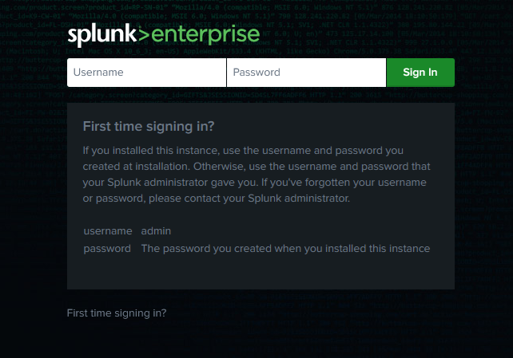
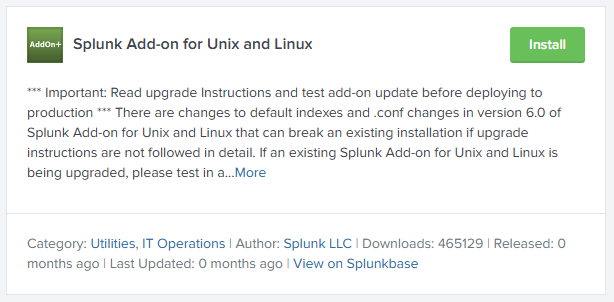
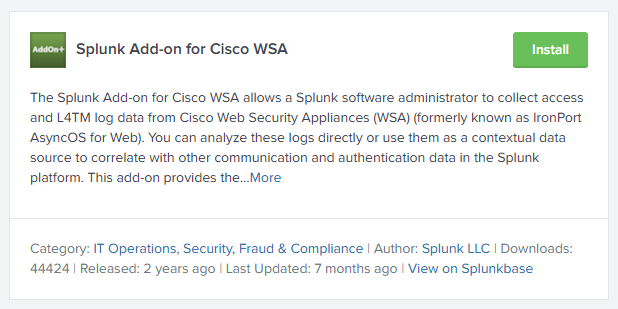
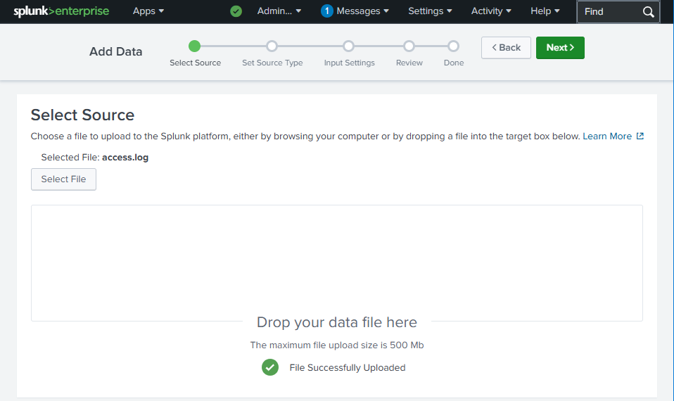
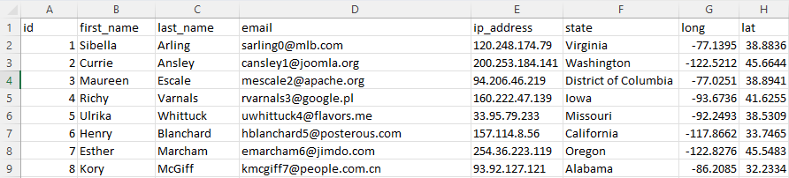
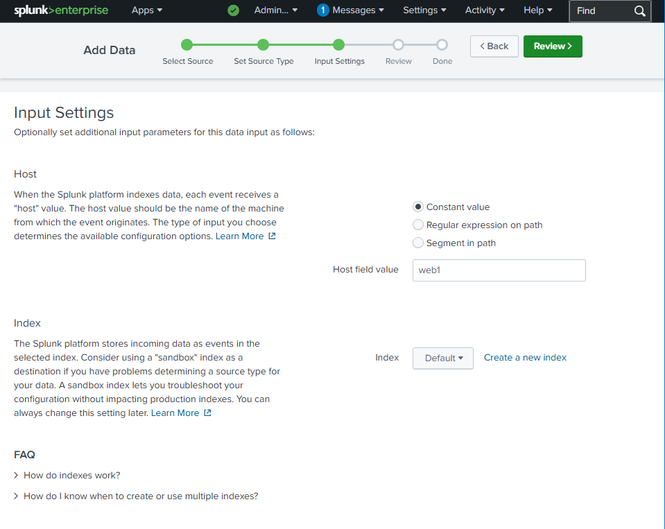
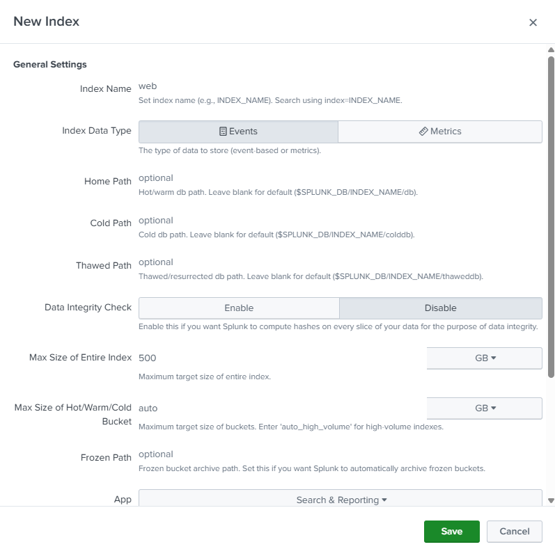
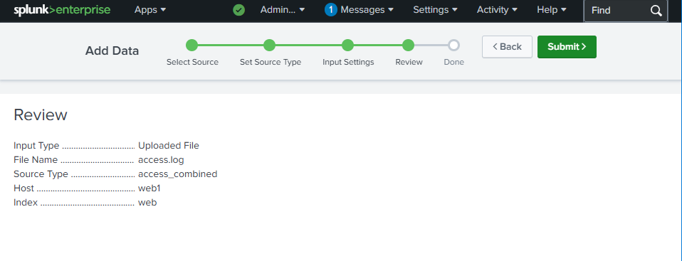
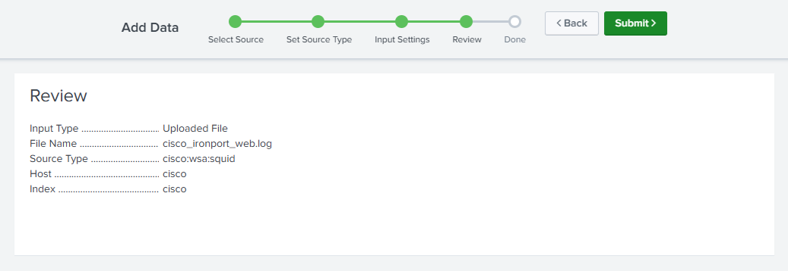
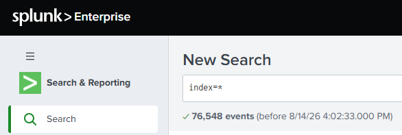

# Setting Up Splunk

Installing **Splunk Enterprise** (free trial) natively on your machine, then onboarding the lab data. This is the native-install path - for the containerised alternative, see the main [Docker guide](../docker.md).

> Screenshots in this file are from the Udemy course _Splunk: Zero to Power User_.

## 1. Download & install

1. Go to the [Splunk website](https://www.splunk.com/) and **sign up / log in** (a free account is required to download).
2. Download **Splunk Enterprise** - the **free trial** (version `9.0.0.1`). The trial runs with full features for 60 days, then converts to the Free tier's limits.
3. Select your **operating system** and click **Download**.
4. Run the installer and **install** it.
5. You set the **admin credentials** (username + password) **during installation** - remember these; they're what you log in with.

## 2. First login

Open Splunk in a browser and log in with the credentials you created during install.

## 3. Install the add-ons

Add-ons teach Splunk how to parse specific data formats (here, the Cisco web logs) - see [Apps vs add-ons](03-apps-vs-addons.md) for what an add-on actually is. Install both from Splunkbase - Splunk will **prompt you to log in with your Splunk account credentials** to download.

- **Splunk Add-on** (general parsing support)

  

- **Cisco add-on** (parses the Cisco IronPort / WSA logs used below)

  

## 4. Upload the lab data

From the home page, open **Search & Reporting**. All the lab data is added by hand through the **upload** input.

### The general upload flow

Every file below follows the **same steps** - only the **source type**, **host**, and **index** change:

1. **Settings → Add Data → Upload → Select File**, choose the log file, then **Add data**.
2. Once it finishes uploading, click **Next**.

   

3. Change the **Source type** to the correct value for that file (see the table below), then click **Next**.

   > **On the Set Source Type step:** Splunk **auto-detects** the source type and is usually good at picking the right one - but you can **override** it. In the source type editor you can tweak the parsing settings (timestamps, event breaking, key-value extractions) and **preview** how events will look once parsed; those changes must be **saved** to take effect. The goal is for each parsed event to look **as close as possible to the original** log line.
   >
   > 
4. On **Input Settings**, set the **Host** field value.

   

5. For the **Index**, choose **Create a new index**, name it (see the table), and **Save**.

   

6. Click **Review**, then **Submit**.

   

### What to upload

Repeat the flow above once per row. The three web servers (`www1`, `www2`, `www3`) each contribute an `access.log` and a `secure.log`; the Cisco appliance contributes one web log:

| Log file | Source type | Host | Index |
| --- | --- | --- | --- |
| `access.log` (www1) | `access_combined` | `www1` | `web` |
| `access.log` (www2) | `access_combined` | `www2` | `web2` |
| `access.log` (www3) | `access_combined` | `www3` | `web3` |
| `secure.log` (www1) | `linux_secure` | `www1` | `security` |
| `secure.log` (www2) | `linux_secure` | `www2` | `security` |
| `secure.log` (www3) | `linux_secure` | `www3` | `security` |
| Cisco IronPort web log | `cisco:wsa:squid` | `cisco` | `cisco` |

Notes:

- **Access logs** get their own index per server (`web`, `web2`, `web3`); the **secure logs** all share a single `security` index (distinguished by their `host`).
- The **Cisco** upload is the same flow as the rest - the Cisco add-on installed in Step 3 is what makes the `cisco:wsa:squid` source type available. The review screen before submitting looks like this:

  

## 5. Verify the upload

Confirm the data actually landed:

1. Click the **Apps** tab at the top → **Search & Reporting**.
2. Run `index=*` (search across **all** indexes).
3. Set the time range to **All time** (the uploaded events may be older than the default 24-hour window).

You should see the events you just uploaded, spread across the indexes you created - `web`, `web2`, `web3`, `security`, and `cisco`. In total the search should return **76,548 events**.

> **Why `index=*` + All time:** a fresh search only looks at the default index over the last 24 hours, so uploaded historical data can appear to be "missing." Searching all indexes over all time proves the ingest worked before you start writing narrower searches.

