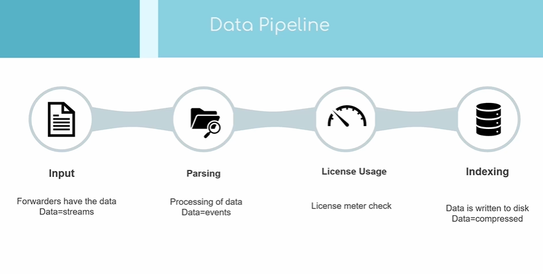
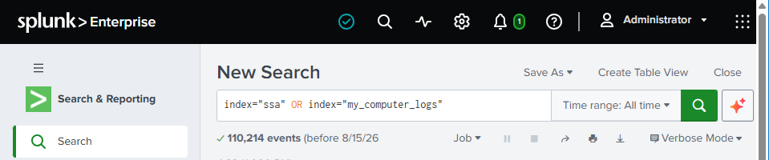
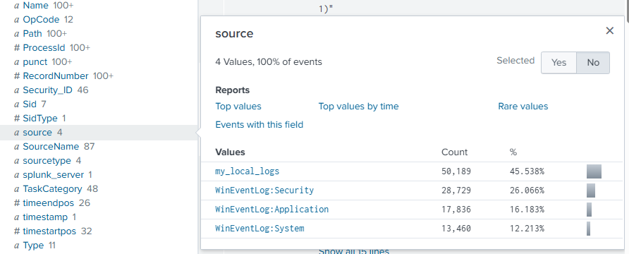
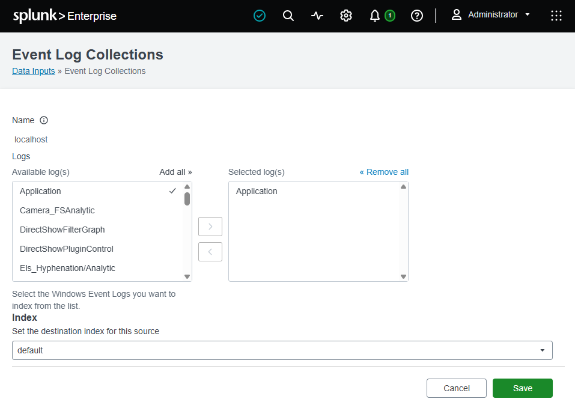
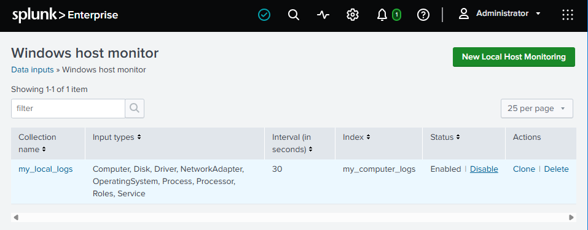

# Data Pipeline & Inputs

How data moves through Splunk from raw input to searchable, indexed events - the **input → parsing → indexing** phases - and the hands-on side of that first phase: **adding and managing your own inputs**.

This complements the main guide, which already covers the [Splunk architecture](../README.md#splunk-architecture) (Forwarder → Indexer → Search Head), the broader [SOC data pipeline](../README.md#data-the-pipeline-and-what-flows-through-it), [what an event is](../README.md#what-are-events-in-splunk), and the [full list of ingest methods](../README.md#how-does-splunk-onboard--ingest-data). The focus here is the course's phase-by-phase framing plus the practical input setup.

> Screenshots in this file are from the Udemy course _Splunk: Zero to Power User_.



## The phases

### 1. Input phase (forwarders)

- **Forwarders** hold the data and forward it off in **streams**.
- Typical inputs: **local log files**, **TCP** network streams, and **event generation**.
- At this point the data is still a raw **stream** - not yet split into events.

### 2. Parsing phase (indexer)

The **indexer** does the parsing (see [Indexer - processing & storage](../README.md#2-indexer---processing--storage) for the fuller picture):

- Processes the incoming **streams into individual events**.
- **Checks licence usage** - ingested volume counts against your Splunk licence.
- Events are **indexed, compressed, and written to disk**.

## Input metadata

Every input should carry these so Splunk knows how to handle it (defined in the main [glossary](../README.md#basic-terms-in-splunk-glossary)):

- **Input type** - how the data arrives: log files, network traffic, HEC, files & directories.
- **Source** - where the data came from (the file/stream/input it was collected from).
- **Host** - who sent the data (the originating machine).
- **Source type** - the **data format**, which tells Splunk how to parse it (e.g. `access_combined`, `linux_secure`, `cisco:wsa:squid`).

## Adding a Monitor input - local event logs

Beyond one-off uploads, Splunk can **continuously monitor** local sources (files, directories, Windows event logs):

1. **Settings → Add Data → Monitor**, then click **Next**.
2. Select **Local Event Logs**.
3. From the event-log menu, select **Application**, **Security**, and **System**.
4. Click **Next**.
5. Set the **Host** field to `mybox` and the **Index** to `ssa`, then **Save**.
6. Click **Review**, then **Submit**.

## Adding a second Monitor input - local Windows host monitoring

1. Click **Add more data → Monitor**.
2. Select **Local Windows host monitoring**.
3. Set the **collection name** to `my_local_logs`, the **interval** to `30` seconds, and add **all event types**.
4. Click **Next**.
5. Set the **Host** field to `mybox` and the **Index** to `my_computer_logs`.
6. Click **Review**, then **Submit**.

## Verify the new inputs

Search across both new indexes:

```spl
index="ssa" OR index="my_computer_logs"
```



Then click **source** in the left-hand fields menu - you should see the newly added sources listed.



## Reviewing & removing inputs

Manage existing inputs under **Settings (top) → Data inputs**. The two we just added appear here:

- **Local event log collection** - disable it, or remove the logs from the selected set.

  

- **Local Windows host monitoring** (on page 2) - disable it, then delete it.

  

> **Tidy up the lab:** these self-monitoring inputs generate a steady stream of local Windows data you don't need long-term. Disabling (and deleting) them stops the ingest once you've seen how monitor inputs work.
