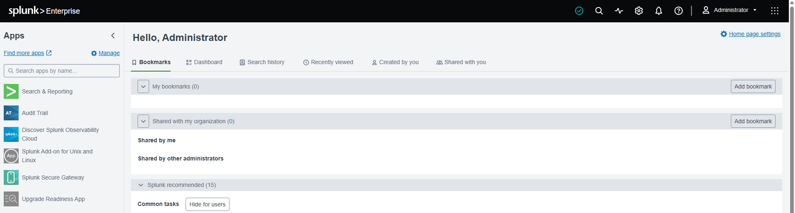
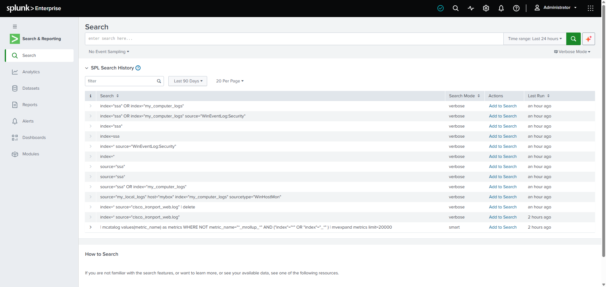
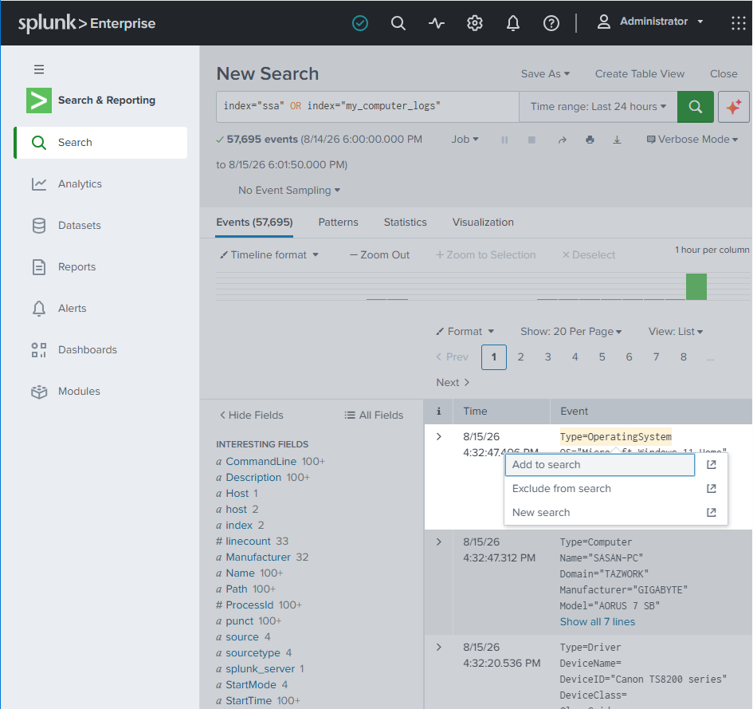

# Searching & the Frontend

A tour of the **Search & Reporting** app - how the search UI is laid out and how to drive it. For the search language itself (operators, search modes, SPL commands) see [What is SPL?](../README.md#what-is-spl) and [SPL by example](../README.md#spl-by-example) in the main guide.

> Screenshots in this file are from the Udemy course _Splunk: Zero to Power User_.

## Opening the Search & Reporting app

From the main landing page, click **Search & Reporting** in the left-hand menu.

A new set of **sub-tabs** opens across the top - **Search**, **Datasets**, **Reports**, **Alerts**, and **Dashboards** - the different things you build and work with in the app.

## Search history

Below the search bar, **Search History** lists all your **previous searches** - handy for re-running or tweaking a query you ran earlier.

## Search bar controls

To the **right of the search bar** you can:

- **Adjust the time range** - set the dates/times the search runs over (the single most important filter - see [filter by time first](../README.md#what-is-spl)).
- **Set the search mode** - Fast / Smart / Verbose, the speed-vs-completeness trade-off (explained under [Search modes](../README.md#what-is-spl)).

## Results: timeline & events

Running a search returns two things:

- **A timeline of events** across the top - a bar chart of event counts over time. You can **click-and-drag (highlight) across the timeline** to zoom the date/time range to just that window.
- **The event list** below it - the **raw log** for each event. **Click an event** to expand it and see its **extracted fields**.

### Add to search

You can **click into the raw data**, highlight a value, and **add it straight to the search** - Splunk builds the filter for you instead of typing it by hand.

## Search operators

You combine search terms with standard operators (`AND`, `OR`, `NOT`, `=`, `!=`, comparisons, wildcards, grouping, exact phrases). The full list with examples is in the main guide: [Search operators](../README.md#what-is-spl).
