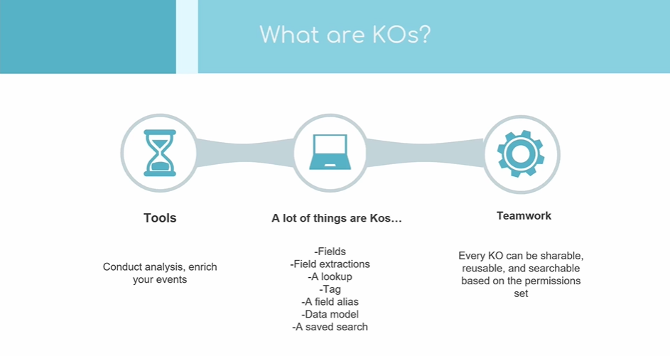
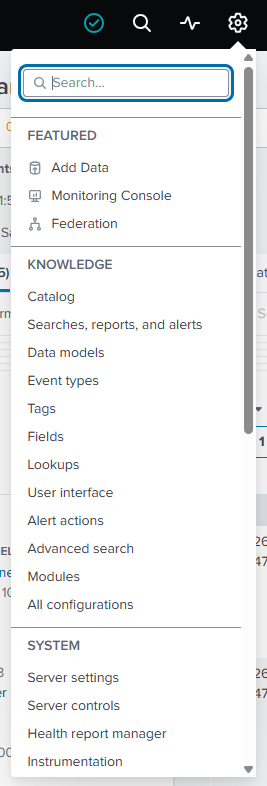
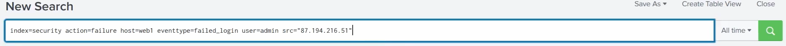
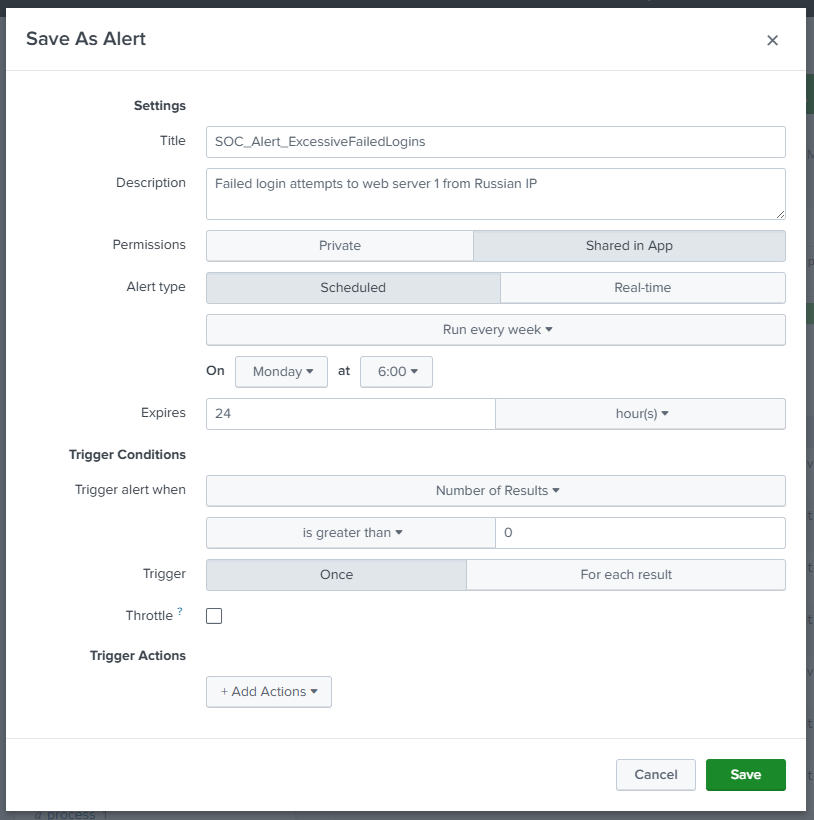
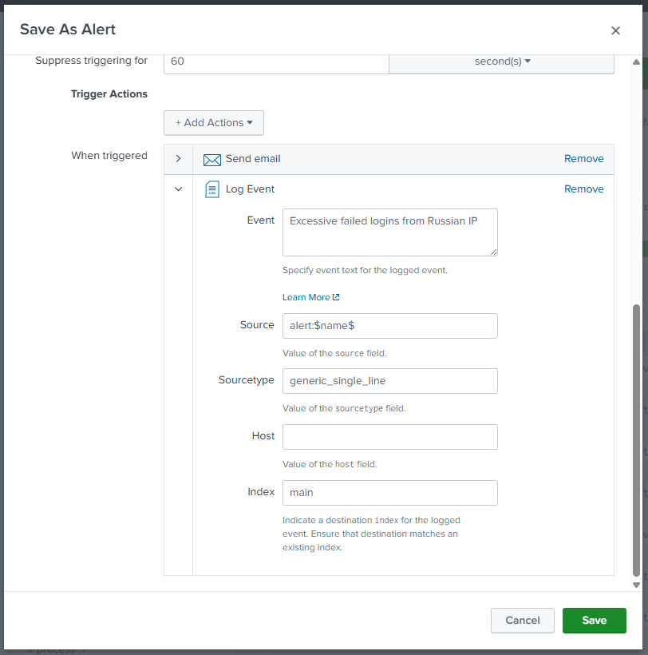
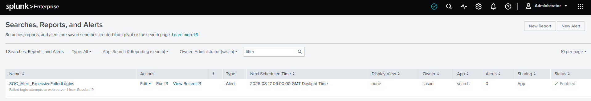
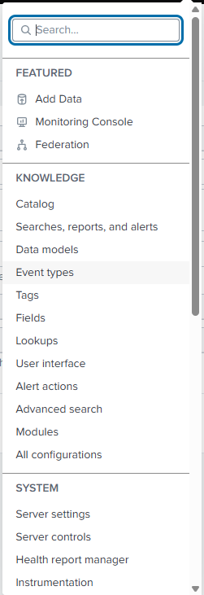
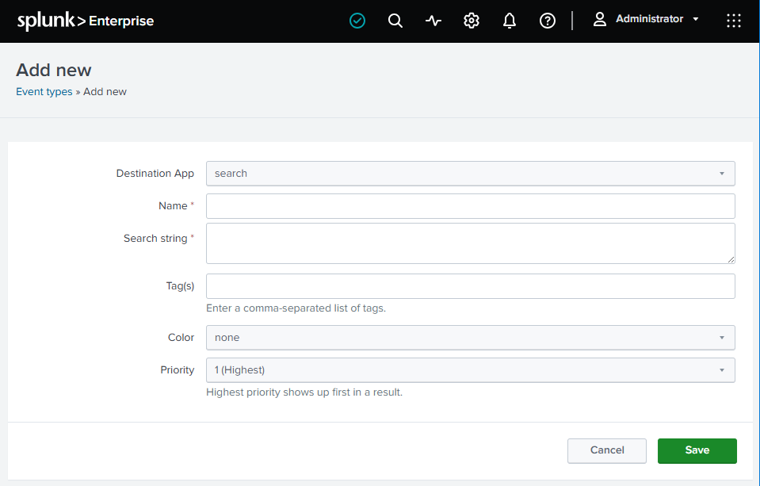

# Knowledge Objects

A **knowledge object (KO)** is the umbrella term for the user-created things that **enrich and interpret** your data in Splunk. The main guide lists the types in the [glossary](../README.md#basic-terms-in-splunk-glossary) (fields, event types, tags, lookups, data models, saved searches/reports, alerts, dashboards…); these are the course's notes on what they're _for_.

> Screenshots in this file are from the Udemy course _Splunk: Zero to Power User_.



## What counts as a knowledge object

Anything you **create on top of the raw data** to make it more useful is a KO. A couple of examples:

- **An alert** - e.g. an alert that tells you when you've made **50 sales** on your website. The alert itself is a knowledge object.
- **A tag** - e.g. tagging login events so they stand out (the sort of thing that lets a dashboard flag someone logging on in **green**). The tag is a knowledge object.

## Why they matter - collaboration

Knowledge objects are the main way a Splunk deployment gets **smarter over time as a team**:

- **Reusable** - build a useful field, eventtype, or alert once and the whole team benefits.
- **Better collaboration & a streamlined workflow** - everyone works from the same shared, consistent definitions instead of re-inventing them.

## Sharing & governance

- **Permissions** - a KO can be kept **private** (just you), or shared to an app or globally across the deployment.
- **Knowledge Manager** - a role with **oversight of knowledge objects**: keeping them organised, managing permissions, and preventing duplicate or conflicting objects from piling up.

## Finding knowledge objects in the GUI

In the Splunk web UI, click **Settings** - everything under the **Knowledge** section is a type of knowledge object (fields, event types, tags, lookups, data models, searches/reports/alerts, etc.).



## Example: creating an alert

An alert is just a saved search with a trigger, so you create one straight from a search:

1. Run a search with the filters you want to alert on:

   ```spl
   index=security action=failure host=web1 eventtype=failed_login user=admin src="87.194.216.51"
   ```

   

   Each filter narrows the events:

   | Filter                   | Meaning                                                                         |
   | ------------------------ | ------------------------------------------------------------------------------- |
   | `index=security`         | Search the `security` index.                                                    |
   | `action=failure`         | Only failed actions.                                                            |
   | `host=web1`              | Events from the host `web1`.                                                    |
   | `eventtype=failed_login` | Events categorised as failed logins (an eventtype - itself a knowledge object). |
   | `user=admin`             | For the `admin` account.                                                        |
   | `src="87.194.216.51"`    | From this specific source IP.                                                   |

   Together this finds **failed logins for `admin` on `web1` from one IP** - a classic brute-force / suspicious-login pattern worth alerting on.

2. Open the **Save As** dropdown (top right) and choose **Alert**. In the dialog, give it a **title** and a **description** (so the team knows what it's for), then set the trigger conditions and actions before saving - this stores the search as an alert knowledge object.

   

### Trigger actions

**Trigger actions** are what Splunk _does_ when the alert fires - added under **When triggered** in the Save As Alert dialog. In this example:

- **Suppress triggering for `60` seconds** - throttle, so the same condition doesn't fire the alert over and over.
- **Send email** - notify the team.
- **Log Event** - write a new event back into Splunk to record the firing, configured with:
  - **Event** text: `Excessive failed logins from Russian IP`
  - **Source**: `alert:$name$` (tokenised - uses the alert's own name)
  - **Sourcetype**: `generic_single_line`
  - **Index**: `main` (the destination index must already exist)



Click **Save** and the alert is created - the saved alert shows its details and controls (edit, enable/disable, permissions):



> This mirrors the progression from the main guide: **search → save it (report) → add a trigger + action (alert)** - see [what you can build](../README.md#what-you-can-build-in-splunk). The **action** part here (email, log event, and more - tickets, webhooks, SOAR playbooks) is exactly what turns a saved search into a live detection.

## Example: creating an eventtype

Alerts are saved from a search, but **most knowledge objects are created directly from Settings** - the same pattern for each type. Creating an **eventtype** shows it:

1. Go to **Settings** and, under the **Knowledge** section, pick the object type - here **Event types**.

   

2. Click **New Event Type** (top right) and fill in the **Add new** form:

   

   | Field               | What it does                                                              |
   | ------------------- | ------------------------------------------------------------------------- |
   | **Destination App** | Which app the object belongs to (e.g. `search`).                          |
   | **Name**            | The eventtype's name - what you'll reference it by.                       |
   | **Search string**   | The search that **defines which events match** this eventtype.            |
   | **Tag(s)**          | Optional comma-separated tags to attach to matching events.               |
   | **Color**           | Optional colour to highlight matching events in results.                  |
   | **Priority**        | Which eventtype wins when several match - `1` is highest and shows first. |

3. Click **Save**.

That **Settings → Knowledge → [object type] → New** flow is how you create most knowledge objects, not just event types.
