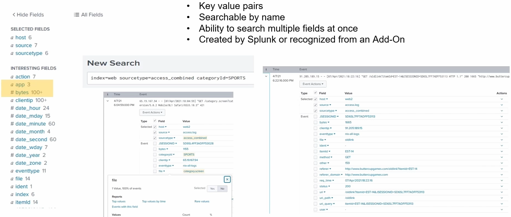

# Fields

Fields are **key-value pairs** extracted from events, **searchable by name** - you can filter on several at once, and they're either auto-extracted by Splunk or supplied by an add-on. The conceptual detail is in the main guide ([glossary](../README.md#basic-terms-in-splunk-glossary), [what an event is](../README.md#what-are-events-in-splunk), [schema-on-read](../README.md#schema-on-read-vs-schema-on-write)); this covers the **Fields sidebar** in the search UI.

> Screenshots in this file are from the Udemy course _Splunk: Zero to Power User_.



## The Fields sidebar

After a search runs, the **left-hand sidebar** lists the fields found in the results. It has two groups:

### Selected Fields

- The fields **shown under each event** in the results list.
- By default this is **`host`, `source`, `sourcetype`** (the core metadata every event has).
- You choose what appears here - click any field and **Select** it to pin it, so its value shows on every event.
- **Add the fields that matter** (e.g. `categoryId`) so the important data shows at a glance under each event, instead of expanding every event to read the raw text. More selected fields = a clearer picture of the result set.

### Interesting Fields

- Fields Splunk **discovered in the results** that aren't selected yet.
- Splunk lists a field here when it appears in **at least ~20% of the events** returned - i.e. fields common enough to be useful.
- Promote any of them to **Selected** with a click.

## Reading each field entry

- **The number** next to a field (e.g. `app 3`, `bytes 100`) is the count of **distinct values** that field has in the current results - a quick sense of its cardinality.
- The **icon** marks the field's type: **`a`** = text/string, **`#`** = numeric (numeric fields can be used in maths and ranges).
- **Hide Fields / All Fields** (top of the sidebar) toggles between the curated list and **every** extracted field.

## Clicking a field

Selecting a field opens a summary popover that shows:

- **Top values** and how often each occurs (with a share/percentage) - instant distribution without writing SPL.
- Links to **add it to the search** (filter on a value) or drop it straight into **reports/visualisations**.

This is why the sidebar is a fast way to explore unfamiliar data: run a broad search, then let the **Interesting Fields** show you what's in it and pivot from there.

## The example in the screenshot

The search at the top is:

```spl
index=web sourcetype=access_combined categoryId=SPORTS
```

- `index=web` - the web-server data.
- `sourcetype=access_combined` - the **Apache combined** access-log format; because Splunk knows this format, it **auto-extracts** the web fields (`clientip`, `bytes`, `method`, `status`, `uri`, etc.).
- `categoryId=SPORTS` - filters to events whose `categoryId` field is `SPORTS`. This one line already demonstrates **searching multiple fields at once** (index + sourcetype + categoryId together).

**Selected Fields** show the defaults with their distinct-value counts: `host 6`, `source 7`, `sourcetype 6` - so this result set spans 6 hosts, 7 sources, and 6 sourcetypes.

**Interesting Fields** are the ones Splunk pulled from the `access_combined` events, including:

- **Web fields** from the log format - `bytes` (numeric, `#`, ~100 distinct values), `clientip`, `app`, `file`, `ident`, `eventtype`, and `categoryId` itself.
- **The `date_*` family** - `date_hour`, `date_mday`, `date_minute`, `date_month`, `date_second`, `date_wday`, `date_year`, `date_zone`. Splunk **auto-generates these from each event's timestamp** so you can search/group by parts of the date (e.g. `date_hour` has 24 possible values). They come free with time-based data - you didn't extract them.

So the sidebar here is telling you: this is web access data, Splunk has broken out all the standard HTTP fields plus the time components, and you can click any of them to filter or report without writing more SPL.
