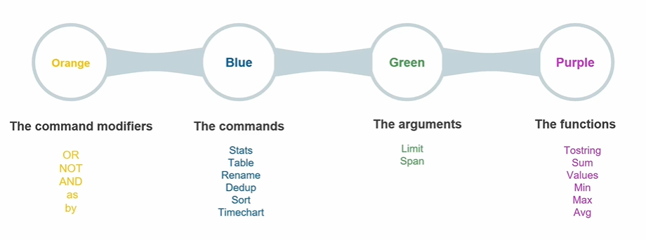
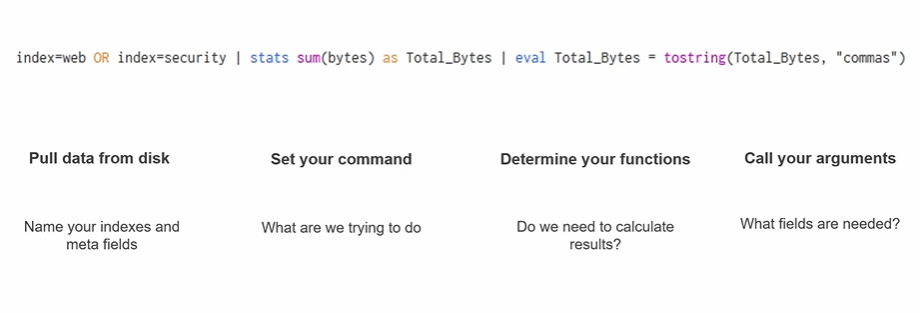
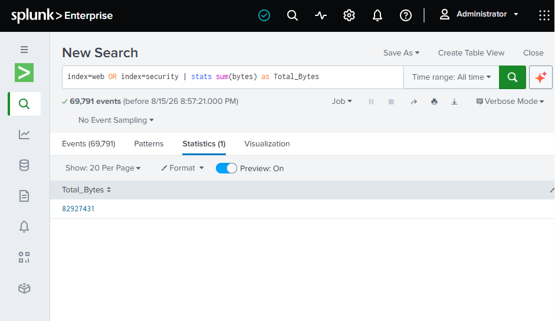
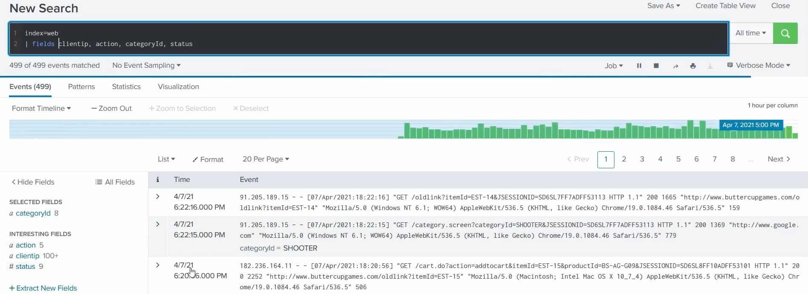
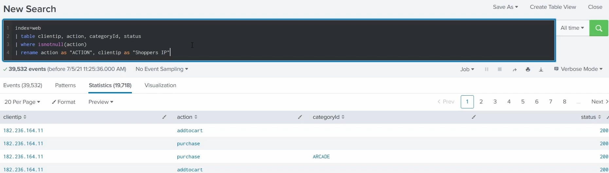
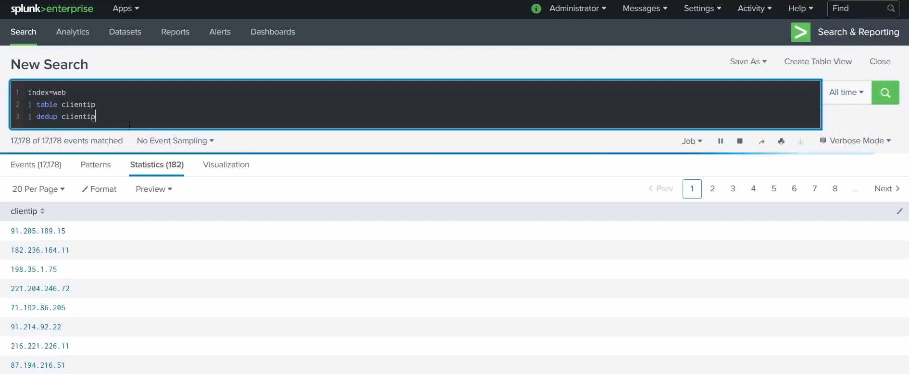

# SPL Syntax Colours

As you type SPL, Splunk's search bar **colour-codes** the different parts of a search - which makes long, piped searches far easier to read and spot mistakes in. Each colour marks a different **kind of token**. For the language itself, see [What is SPL?](../README.md#what-is-spl) in the main guide.

> Screenshots in this file are from the Udemy course _Splunk: Zero to Power User_.



## What each colour means

| Colour | Highlights | What it is |
| --- | --- | --- |
| 🟠 **Orange** | **Command modifiers** | Keywords that modify or join a search - the Boolean operators and clause words. |
| 🔵 **Blue** | **Commands** | The SPL commands themselves - the "verb" after each pipe. |
| 🟢 **Green** | **Arguments** | The named options passed to a command to tune how it runs. |
| 🟣 **Purple** | **Functions** | Functions used inside commands (e.g. within `stats`/`eval`) to calculate a value. |

The examples above are just a handful - for every command and function, see the official [Splunk Search Reference (list of search commands)](https://docs.splunk.com/Documentation/Splunk/latest/SearchReference/ListOfSearchCommands).

## What each one does

Breaking down the specific items shown in the screenshot:

### 🟠 Orange - command modifiers

| Modifier | What it does |
| --- | --- |
| `OR` | Match **either** condition. |
| `NOT` | **Exclude** matches. |
| `AND` | Match **both** (this is the default between terms, so it's often omitted). |
| `as` | **Rename** a field or result (e.g. `sum(bytes) as Total_Bytes`). |
| `by` | **Group** results by a field (e.g. `stats count by host`). |

### 🔵 Blue - commands

| Command | What it does |
| --- | --- |
| `stats` | **Aggregate** values - count, sum, average, etc. - grouped by fields. |
| `table` | Display the chosen fields as a plain **table**. |
| `rename` | **Rename** a field. |
| `dedup` | Remove **duplicate** events based on a field. |
| `sort` | **Order** results ascending/descending (e.g. `sort -count`). |
| `timechart` | Aggregate **over time** - like `stats` but bucketed into a trend chart. |

### 🟢 Green - arguments

| Argument | What it does |
| --- | --- |
| `limit` | **Cap** the number of results returned (e.g. `limit=5`). |
| `span` | The **time-bucket size** for time-based commands (e.g. `span=1h`). |

### 🟣 Purple - functions

| Function | What it does |
| --- | --- |
| `tostring` | Convert a value to a **string**, optionally formatted (e.g. `"commas"` for `1,234,567`). |
| `sum` | **Add up** numeric values. |
| `values` | List the **distinct values** of a field. |
| `min` | The **smallest** value. |
| `max` | The **largest** value. |
| `avg` | The **average** (mean) value. |

## Building a search: the colours as a thought process

The same four colours double as a **mental model for writing** a search - each colour answers a question, in order:



```spl
index=web OR index=security | stats sum(bytes) as Total_Bytes | eval Total_Bytes = tostring(Total_Bytes, "commas")
```

| Step | Question | Colour | In this search |
| --- | --- | --- | --- |
| **1. Pull data from disk** | Which indexes and meta fields? | 🟠 modifiers on 🔵-less filters | `index=web OR index=security` |
| **2. Set your command** | What are we trying to do? | 🔵 command | `stats …`, then `eval …` |
| **3. Determine your functions** | Do we need to calculate results? | 🟣 function | `sum(bytes)`, `tostring(…)` |
| **4. Call your arguments** | What fields/options are needed? | 🟢 argument / 🟠 `as` | `bytes`, `as Total_Bytes`, `"commas"` |

Walking through the example:

- **`index=web OR index=security`** - pull events from **two indexes** (the `OR` in orange joins them).
- **`| stats sum(bytes) as Total_Bytes`** - the `stats` command adds up the `bytes` field with the `sum()` function, naming the result `Total_Bytes` (`as` renames it).
- **`| eval Total_Bytes = tostring(Total_Bytes, "commas")`** - `eval` reformats that number with the `tostring()` function so it prints with **comma separators** (e.g. `1,234,567`) - easier to read.

So the flow is: **get the data → pick the command → apply a function → feed it the right arguments.** The colours make that structure visible as you type.

### Making the result readable

The `eval … tostring(…)` step is purely about **readability**. On its own, `stats sum(bytes)` returns the raw total as one long, unbroken number that's hard to read:

```spl
index=web OR index=security | stats sum(bytes) as Total_Bytes
```

Adding `eval` with `tostring(Total_Bytes, "commas")` reformats it with thousands separators:

```spl
index=web OR index=security | stats sum(bytes) as Total_Bytes | eval Total_Bytes = tostring(Total_Bytes, "commas")
```



The difference: the first prints something like `1234567`; the second prints `1,234,567`. The **value is identical** - `tostring(…, "commas")` only changes how it's **displayed**. One caveat: it converts the number into a **string**, so do any maths first and apply this formatting **last**, at the end of the search.

## Worked example: `fields` vs `table`

These commands are defined as reference in the main guide ([`fields`/`table`/`dedup`/`sort`](../README.md#spl-by-example)); the worked before/after examples are below.

`index=web | fields clientip, action, categoryId, status` keeps the normal **event list** - just limited to those fields:



`index=web | table clientip, action, categoryId, status | where isnotnull(action) | rename action as "ACTION", clientip as "Shoppers IP"` turns the results into a **statistics table** of ordered columns (also drops null actions with `where` and relabels headers with `rename`):



## Worked example: `dedup`

`index=web | table clientip | dedup clientip` collapses **17,178 events down to the 182 unique client IPs**:


