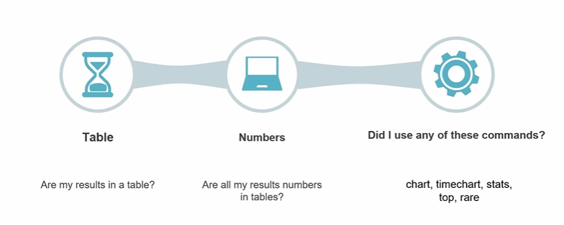
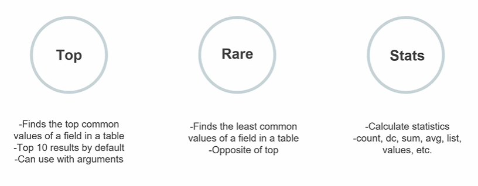
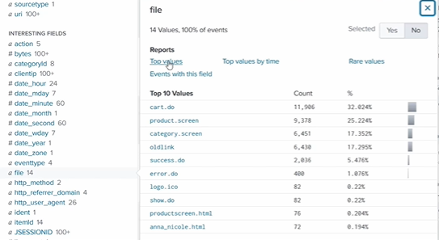
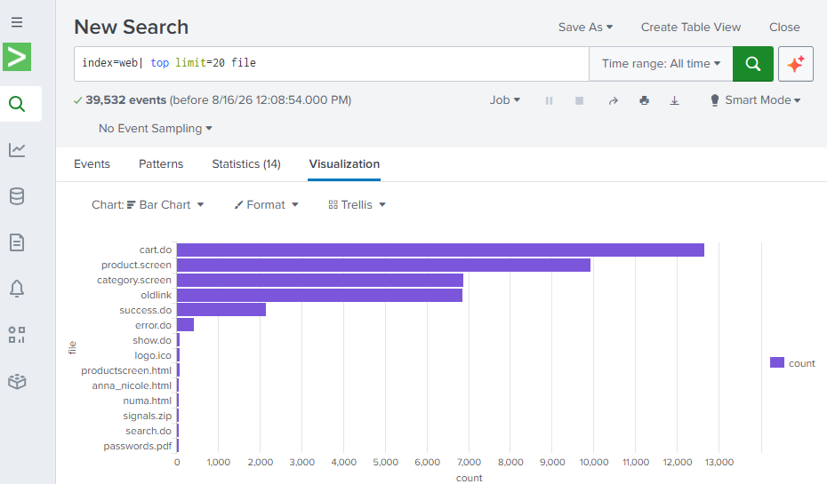
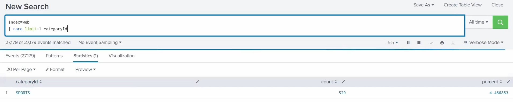
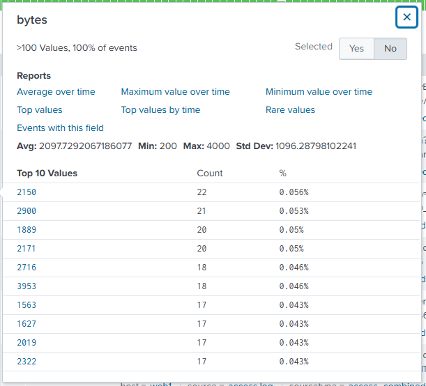

# Transforming Commands

A **transforming command** turns the field values from each event into a **results table of numbers** (statistics) that Splunk can then use - most importantly, to drive **visualisations** (charts need this tabular, numeric shape). The main guide covers them under the transform category and [Basic transformations](../README.md#spl-by-example).

> Screenshots in this file are from the Udemy course _Splunk: Zero to Power User_.

## What is a transforming command?

It **transforms** raw events into an aggregated **table** - the specified field values become numeric results Splunk can calculate on and plot.

A quick way to tell whether you've used one:

- **Table** - are my results in a table?
- **Numbers** - are the results all numbers in that table?
- **Command** - did I use one of `chart`, `timechart`, `stats`, `top`, or `rare`?

If yes, it's a transforming search - and its output is ready to become a chart.

## What each does

| Command | What it does |
| --- | --- |
| **`top`** | Finds the **most common** values of a field, in a table. Returns the **top 10 by default**, and takes arguments (e.g. `limit=`, `by`). |
| **`rare`** | Finds the **least common** values of a field, in a table - the **opposite of `top`**. |
| **`stats`** | **Calculates statistics** over the results - functions include `count`, `dc` (distinct count), `sum`, `avg`, `list`, `values`, and more. |

(`chart` and `timechart` from the first screenshot are the chart-oriented transforming commands - see [Basic visualisations](../README.md#spl-by-example) in the main guide.)

## Worked example: `top` - a field's "Top values"

Run `index=web`, then pick a field to work with - here **`file`**:

Click **Top values** and Splunk runs a `top` on that field, listing the most common values in **descending order** (20 shown here). From the results you can change the **chart** type or drill into **individual stats**.

## Worked example: `rare` - least common values

`index=web | rare limit=1 categoryId` returns the single **least common** `categoryId` - here `SPORTS` (529 events, ~4.49%):

## Numeric fields have more quick reports

A field whose values are **numeric** is marked with a **`#`** in the sidebar. Clicking it gives **extra quick-link reports** that text fields don't - **Average / Maximum / Minimum over time** and **Top values by time** - plus summary stats (**Avg, Min, Max, Std Dev**). Great for fast reporting without writing any SPL.

