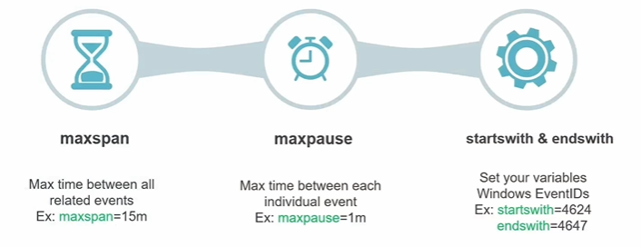
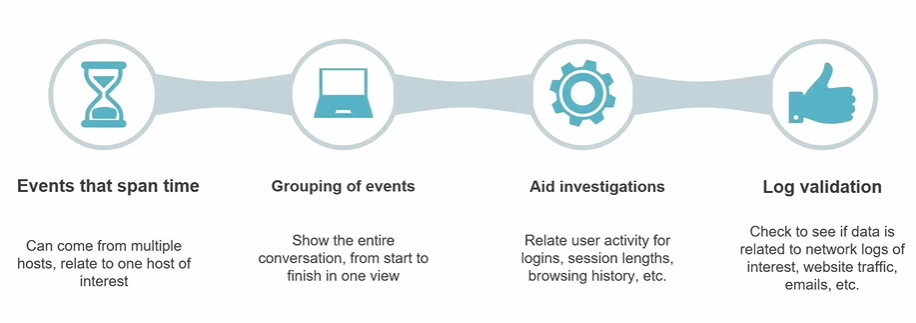
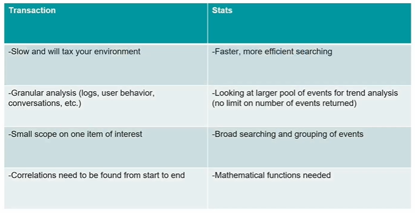
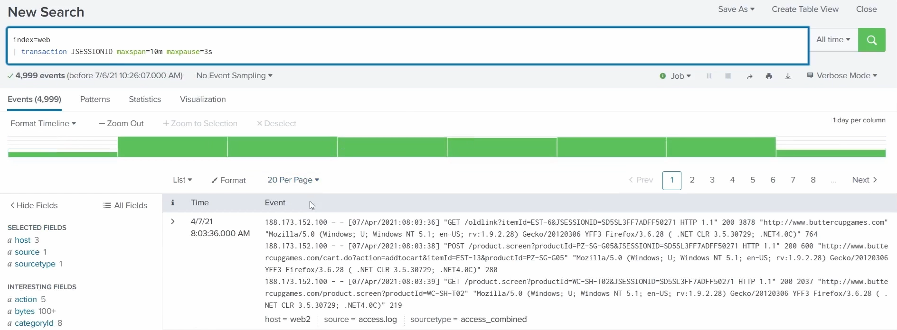
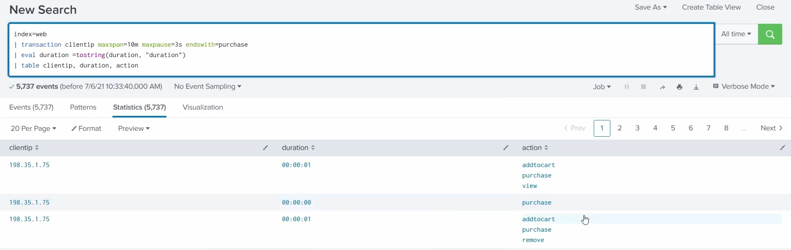
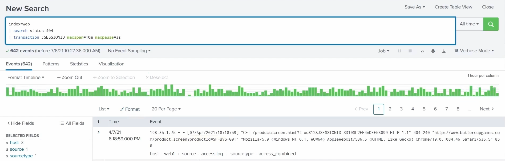

# Transactions - what the events are telling me

Events can be grouped into **transactions** based on **associated fields of interest**. If a relationship exists between those fields, the **`transaction`** command enumerates that relationship - stitching separate events into one grouped event so you can see a whole sequence together.

> Screenshots in this file are from the Udemy course _Splunk: Zero to Power User_.

## Key arguments of `transaction`



| Argument | What it does |
| --- | --- |
| **`maxspan`** | Max time between **all** related events - the total window a transaction can cover. Ex: `maxspan=15m`. |
| **`maxpause`** | Max time between **each individual** event - the biggest allowed gap from one event to the next. Ex: `maxpause=1m`. |
| **`startswith` & `endswith`** | Set the events that **open** and **close** a transaction. Ex (Windows Event IDs): `startswith=4624` (logon) `endswith=4647` (logoff). |

## What transactions are good for



- **Events that span time** - can come from **multiple hosts**, all relating to one host of interest.
- **Grouping of events** - show the **entire conversation, start to finish, in one view**.
- **Aid investigations** - relate user activity: logins, session lengths, browsing history, etc.
- **Log validation** - check whether data relates to network logs of interest, website traffic, emails, etc.

Concrete examples: **group a related email conversation** into one thread, or **validate a user's web activity** by stitching their request logs together.

## Use them sparingly

`transaction` is very powerful but **taxing on the system**, especially with a lot of data. Reach for it when you need **granular, correlated detail on one specific thing** - not for broad, high-volume searching.

## Transaction vs `stats` - when to use each



| `transaction` | `stats` |
| --- | --- |
| **Slow** and will **tax your environment**. | **Faster, more efficient** searching. |
| **Granular** analysis (logs, user behaviour, conversations). | Looking at a **larger pool** of events for trend analysis (no limit on events returned). |
| **Small scope** on one item of interest. | **Broad** searching and grouping of events. |
| Correlations need to be found **from start to end**. | **Mathematical functions** needed. |

Rule of thumb: use **`transaction`** for narrow, start-to-end correlation on a single subject; use **`stats`** for broad, efficient aggregation and maths across many events.

## Worked example: sessionising web activity

```spl
index=web | transaction JSESSIONID maxspan=10m maxpause=1s
```



**What it's doing:** it groups all web events that share the same **`JSESSIONID`** (the browser **session ID**) into a single transaction - as long as the whole group spans **≤ 10 minutes** (`maxspan`) and no gap between consecutive events exceeds **1 second** (`maxpause`).

**Why this is a transaction:** `JSESSIONID` is the **field of interest** that ties the events together. One session fires many separate request events; the command stitches them into **one grouped event**, so a user's entire session - start to finish - shows as a single row you can inspect. That's the relationship (all requests belonging to one session) being **enumerated**.

## Worked example: sessions ending in a purchase (`endswith`)

```spl
index=web
| transaction clientip maxspan=10m maxpause=3s endswith=purchase
| eval duration = tostring(duration, "duration")
| table clientip, duration, action
```



**What it's doing:**

- Groups events by **`clientip`** into transactions (total window **≤ 10m** `maxspan`, gaps **≤ 3s** `maxpause`).
- **`endswith=purchase`** - each transaction must **close on a `purchase` action**, so every group is a client's run of activity **culminating in a purchase**.
- `transaction` automatically adds a **`duration`** field (how long the group spanned); `eval … tostring(duration, "duration")` formats it as `HH:MM:SS`.
- `table clientip, duration, action` shows each transaction as one row: **who**, **how long**, and the **sequence of actions** in it (e.g. `addtocart → purchase → view`).

**Why it's a good `endswith` example:** unlike the session example (grouped purely by a shared field), this transaction is **bounded by a closing event**. It answers a funnel question - *what did each customer do on the way to buying, and how long did it take?* Drop the `endswith` and you'd group **all** of a client's activity; adding it isolates just the runs that ended in a sale.

## Worked example: 404 errors

```spl
index=web status=404
```



**Why it's useful / what the data could tell us:** HTTP **404 (Not Found)** means a client requested a page or resource that doesn't exist. A few 404s are normal (a stale link, a typo), but the pattern matters:

- **Broken links / misconfiguration** - legitimate users repeatedly hitting a dead URL points to a site problem.
- **Reconnaissance / scanning** - a **burst of 404s across many different URLs**, especially from one `clientip` or session, is a classic sign of an attacker **probing for hidden or vulnerable paths** (admin pages, backup files, known-exploit URLs).
- Grouping the 404s **by session or client** (a transaction, or `stats count by clientip`) shows **whether one actor** is generating them - turning raw errors into a story about *who* and *how persistently*.
