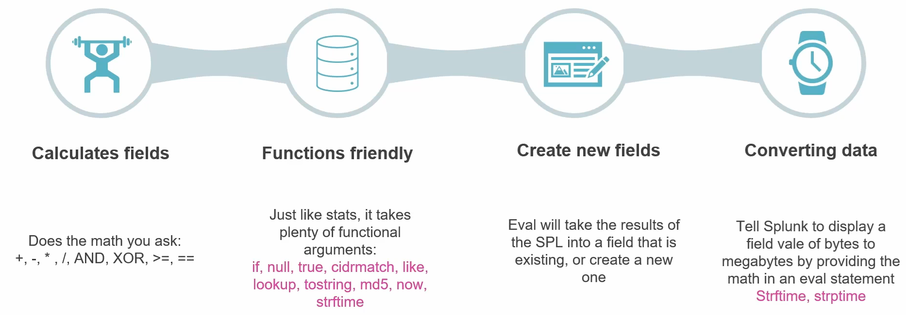
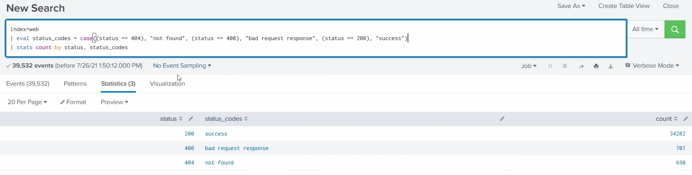
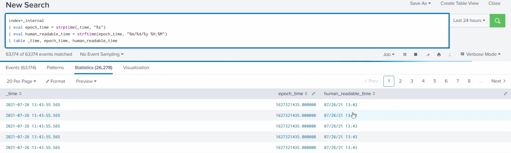
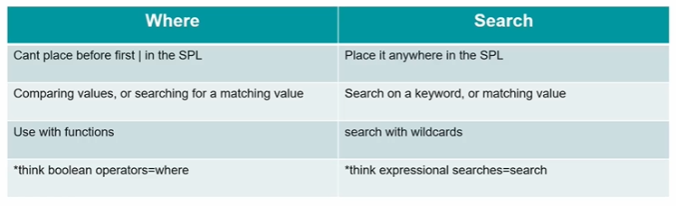
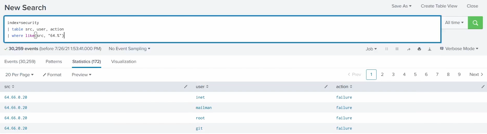

# Manipulating Your Data - `eval`

The **`eval`** command is how you **manipulate and create fields**: it evaluates an expression and writes the result into a field - either a brand-new one or an existing one. (`eval` is listed among the transform commands in the main guide's [SPL section](../README.md#what-is-spl); this covers it properly.)

> Screenshots in this file are from the Udemy course _Splunk: Zero to Power User_.



## 1. Calculates fields

Does the **maths** you ask for - arithmetic and logical/comparison operators: `+`, `-`, `*`, `/`, `AND`, `XOR`, `>=`, `==`.

```spl
... | eval total = price * quantity
```

## 2. Functions friendly

Just like `stats`, `eval` takes plenty of **functions** as arguments - e.g. `if`, `null`, `true`, `coalesce`, `like`, `lookup`, `tostring`, `md5`, `now`, `strftime`.

```spl
... | eval status_text = if(status=200, "OK", "Error")
```

### Worked example: labelling status codes with `case()`

```spl
index=web
| eval status_codes = case(status == 404, "not found", status == 400, "bad request response", status == 200, "success")
| stats count by status, status_codes
```



What's happening:

- `eval status_codes = case(...)` creates a **new field** `status_codes`. The **`case()`** function takes **condition/value pairs** and returns the value of the **first condition that's true**:
  - `status == 404` → `"not found"`
  - `status == 400` → `"bad request response"`
  - `status == 200` → `"success"`
- `stats count by status, status_codes` then **counts events grouped by** both the numeric `status` and the new readable label, giving:
  - `200 · success · 34,282`
  - `400 · bad request response · 701`
  - `404 · not found · 690`

So `case()` is eval's **multi-way conditional** (like a chain of if / else-if) - it turns raw codes into human-readable categories in a new field you can then group, chart, or alert on. Note the **`==`** (comparison, inside `case()`) versus the single **`=`** that **assigns** the result to `status_codes`.

## 3. Creates new fields

`eval` takes the result of the expression and puts it **into a field** - either **creating a new one**, or **overwriting an existing** field of the same name.

```spl
... | eval mb = bytes / 1024 / 1024
```

Here `mb` is a new field; had you written `eval bytes = …` it would overwrite `bytes` instead.

> **`eval` works at search time - it does not re-index.** Overwriting a field **doesn't change the stored/indexed data**; `eval` only manipulates the data to **display the result you want** in your search (e.g. converting an epoch timestamp to a human-readable one). The raw indexed event stays untouched.

## 4. Converting data

Use `eval`'s maths and functions to **convert or reformat** values - for example, tell Splunk to **display bytes as megabytes** by doing the maths inline, or convert timestamps with **`strftime`** / **`strptime`**.

```spl
... | eval size_mb = round(bytes / 1024 / 1024, 2)
... | eval readable_time = strftime(_time, "%Y-%m-%d %H:%M:%S")
```

- **`strftime`** - turn an epoch timestamp **into** a human-readable string.
- **`strptime`** - parse a time string **back into** an epoch timestamp.

### Worked example: converting time

```spl
index=_internal
| eval epoch_time = strptime(_time, "%s")
| eval human_readable_time = strftime(epoch_time, "%m/%d/%y %H:%M")
| table _time, epoch_time, human_readable_time
```



Line by line:

- `index=_internal` - search Splunk's **own internal logs** (always populated, so the example runs on any instance).
- `eval epoch_time = strptime(_time, "%s")` - **`strptime`** parses a time **string into epoch seconds**; the format code `"%s"` means "epoch seconds". This produces the raw numeric timestamp, e.g. `1627321435.000000`.
- `eval human_readable_time = strftime(epoch_time, "%m/%d/%y %H:%M")` - **`strftime`** formats that epoch number **back into a readable string** using the pattern `%m/%d/%y %H:%M` → `07/26/21 13:43`.
- `table _time, epoch_time, human_readable_time` - lays the three side by side so you can **compare** the original `_time`, the epoch number, and your reformatted version.

The format codes used: `%m` month · `%d` day · `%y` 2-digit year · `%H` 24-hour hour · `%M` minute · `%s` epoch seconds.

**Why it matters:** it's the time round-trip - **`strptime` in** (string → epoch, so you can do maths or comparisons on time) and **`strftime` out** (epoch → the exact display format you want). And as noted above, this happens at **search time** - the stored events are never re-indexed.

> In short: `eval` is the Swiss-army knife for **deriving** data - calculate, apply functions, reformat, and store the result in a field you can then search, group, or display.

## `where` vs `search`

Both **filter** events, but they work differently:



| `where` | `search` |
| --- | --- |
| **Can't** be placed before the first `\|` - it needs a pipe feeding it. | Can go **anywhere**, including as the very first command. |
| **Compares values** (including field-to-field) or searches for a matching value. | Searches on a **keyword** or matching value. |
| Used with **functions** (`if`, `like`, `isnotnull`, `cidrmatch`, …). | Supports **wildcards** (`*`). |
| Think **boolean / operator** comparisons. | Think **expressional / keyword** searches. |

### Single vs double quotes

In `where` (and `eval`) the quote type changes the meaning:

- **Double quotes `"..."` = a literal string value.** `where action="purchase"` compares the field `action` to the **text** `purchase`.
- **Single quotes `'...'` = a field name.** `where 'action'=action` (or comparing two fields) treats the quoted token as a **field**, not text - useful when a field name has spaces/special characters, or when comparing one field to another.

Get this wrong and your filter silently misbehaves - e.g. `where status="404"` (match the string) vs `where status=code` (match another field's value).

### Advantages & disadvantages

- **`search`** - backed by the **index**, so it's **fast and efficient**; ideal for the up-front keyword/value filtering and it supports wildcards. Downside: limited to simpler matching (no functions, no field-to-field comparisons).
- **`where`** - **flexible**: functions, calculated expressions, and field-to-field comparisons. Downside: it runs **after** events are retrieved (post-pipe), so it's **slower** and can't be the first command.

Rule of thumb: **filter early with `search`** (fast, index-backed) to cut the event volume, then use **`where`** for the function/expression/field-comparison filtering that `search` can't do.

### Worked example: `where` with `like()`

```spl
index=security
| table src, user, action
| where like(src, "64.%")
```



- `table src, user, action` - show just those three columns.
- `where like(src, "64.%")` - keep only rows where **`src` matches the pattern `64.%`**. The **`like()`** function uses **SQL-style wildcards**: `%` matches any sequence of characters (like `*`), and `_` matches a single character. So `"64.%"` matches any source IP **starting with `64.`**.

The result is a run of **failed** actions from `64.66.0.20` against several accounts (`inet`, `mailman`, `root`, `git`) - exactly the **failed-login / brute-force pattern** you'd filter for in an investigation.

This is *why* you reach for `where`: `like()` is a **function**, and functions are what `where` gives you over plain `search` - and, as noted above, `where` has to come **after** a pipe.
