# Field Extraction

**Field extraction** is how you pull **new fields** out of raw event text - so values buried in the `_raw` string become searchable, named fields. There are three approaches, and which you pick depends on **how structured the data is** and whether you want a **permanent** field or a **one-off** in a search. (The main guide introduces `rex` briefly under [What is SPL?](../README.md#what-is-spl).)

> Screenshots in this file are from the Udemy course _Splunk: Zero to Power User_.

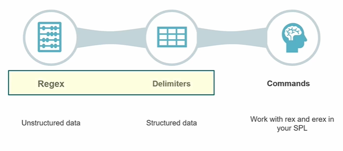

## When to use each

### Regex - for **unstructured** data

- Use when the data is **free-form / unstructured** - there's no consistent separator, and the value you want is embedded in varied text.
- You write a **regular expression** to match the pattern around the value.
- This is the flexible-but-fiddly option: it can extract almost anything, but you have to get the pattern right.

### Delimiters - for **structured** data

- Use when the data is **structured** - values separated by a consistent **delimiter** (comma, tab, pipe, space), like CSV/TSV.
- You just tell Splunk the **delimiter** and it splits the fields out - **no regex needed**.
- Simpler and faster than regex when the data is neatly separated.

> Regex and Delimiters are the two modes of the **Field Extractor (IFX)** - the point-and-click GUI tool that builds a **permanent** extracted field (a knowledge object) you don't have to re-declare each search.
>
> **Open it from:** **Settings → Fields → Field extractions → Open Field Extractor**. (You then pick a sourcetype/sample event and choose **Regex** or **Delimiters**.)

### Commands - `rex` and `erex` in your SPL

Extract fields **on the fly, inside a single search** - handy for **ad-hoc** work when you don't need a saved field. The two commands differ in **who writes the regex**:

| | `rex` | `erex` |
| --- | --- | --- |
| **Who writes the regex** | **You** do. | **Splunk** does, from your examples. |
| **What you give it** | A regex with a named group: `\| rex "user=(?<username>\w+)"` | Example values: `\| erex username examples="alice,bob"` |
| **Regex knowledge needed** | Yes. | No. |
| **Precision / control** | Full - handles complex, exact patterns. | Approximate - Splunk infers a pattern that may miss edge cases. |
| **Best for** | Precise or complicated extractions. | Quick extractions when you don't know regex. |

> **Handy workflow:** run **`erex`** first to let Splunk **generate a regex** from examples - it prints the regex it built. Copy that into a **`rex`** and refine it. So `erex` is often the *starting point*, `rex` the *precise, reusable* version.

> **Tip - build the regex with regex101:** when you write the pattern yourself (in `rex`, or via the Field Extractor's "I prefer to write the regular expression myself" option), [regex101.com](https://regex101.com) is a free tool for working out **the regex that captures the value you want to extract**. Paste a sample event, craft a pattern with a **named capture group** (e.g. `port (?<src_port>\d+)`), and it **highlights the matches live** - so you get a working expression right before pasting it into Splunk, instead of trial-and-error on real data.

## Quick guide

| Situation | Use |
| --- | --- |
| Messy, free-form data; value embedded in text | **Regex** (Field Extractor, or `rex`) |
| Neatly separated data (CSV/TSV, consistent delimiter) | **Delimiters** (Field Extractor) |
| One-off extraction inside a search | **`rex`** (write the regex) or **`erex`** (let Splunk infer it) |
| A permanent, reusable field for everyone | **Field Extractor** (regex or delimiter) - it's a knowledge object |

## Worked example: extracting a field with the Field Extractor

A **regex** extraction on the SSH auth logs (`linux_secure`) - pulling out a value that Splunk doesn't auto-extract.

### Step 1 - Select the sample event

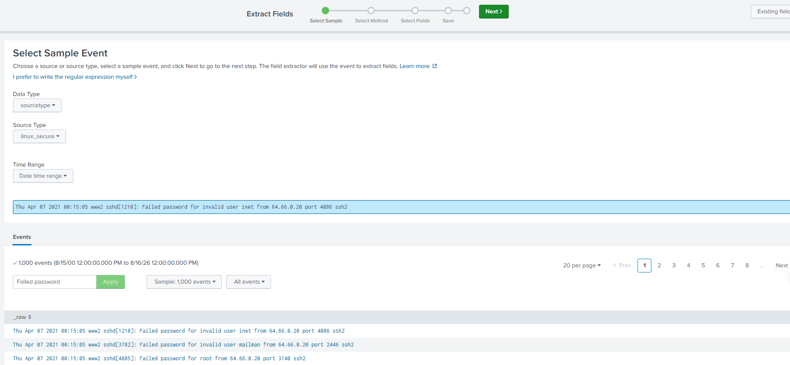

On the **Select Sample Event** step:

- **Data Type** = `sourcetype`, **Source Type** = **`linux_secure`** - the Linux secure / SSH auth logs (not the web logs).
- **Time Range** is set wide enough to include the 2021 data, so it finds **1,000 sample events**.
- The **filter** box has **`Failed password`** applied, narrowing the samples to **failed SSH logins**.

The sample events are all the same shape - failed SSH password attempts:

```
Thu Apr 07 2021 00:15:05 www2 sshd[4885]: Failed password for root from 64.66.0.20 port 3140 ssh2
```

Each `_raw` line has useful values embedded that **aren't yet their own fields** - the **username** (`root`), the **source IP** (`64.66.0.20`), and the **port** (`3140`). Extracting them turns those into searchable fields.

Pick one representative event (e.g. the `root` line above) and click **Next** to move on to **Select Method**.

### Step 2 - Select the method

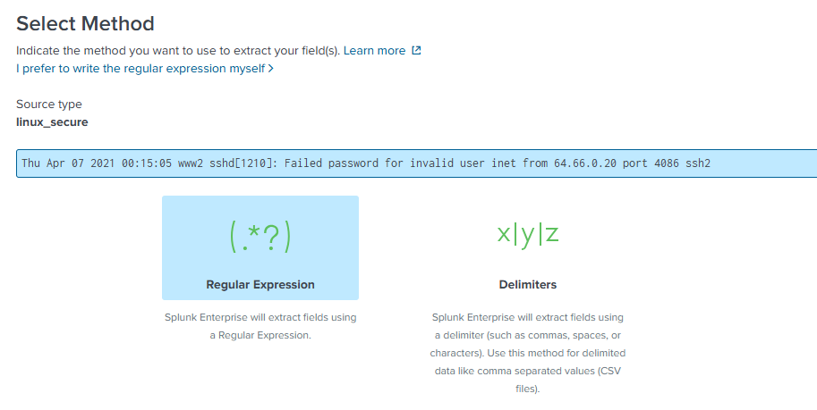

You're offered the two methods from the start of this doc:

- **Regular Expression** `(.*?)` - extract using a **regex**. Best for **unstructured** data like these SSH logs.
- **Delimiters** `x|y|z` - extract using a **delimiter** (comma, space, tab, pipe). Best for **structured** data like CSV files.

The SSH log is free-form, so choose **Regular Expression**.

> **A perk of the Regex method:** because you're extracting with a regular expression, you get the option to **view the regex Splunk generates from what you highlighted** (via **Show Regular Expression** on the Validate step). The **Delimiters** method has no regex to show - it just splits on the separator - so this option only appears when you pick **Regex**. Handy for learning the pattern, or copying it into a `rex`.

For reference, if you'd picked **Delimiters** you'd choose the separator (**Space / Comma / Tab / Pipe / Other**) and Splunk would split the line into columns for you to rename - no regex involved:

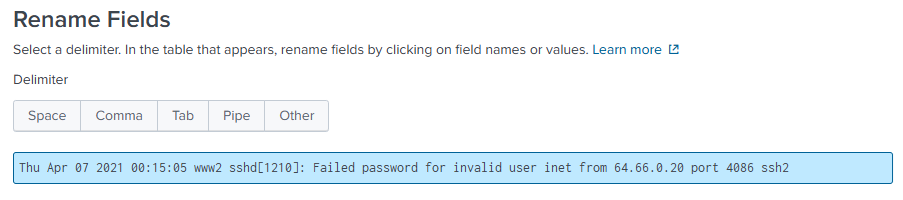

Our SSH log isn't cleanly delimited, so that's not the right method here.

### Step 3 - Highlight the value and name the field

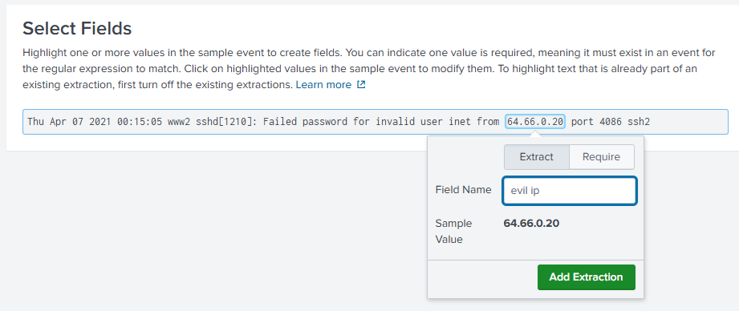

With **Regular Expression** chosen, you **highlight the value you want** directly in the sample event - here the source IP **`64.66.0.20`**. As soon as you highlight it, a **dropdown box appears** to turn that selection into a field:

- **Field Name** - what to call it (here `evil ip`).
- **Sample Value** - the value your highlight captured (`64.66.0.20`), so you can confirm it's right.
- **Add Extraction** - commits it.

The key point: **Splunk writes the regex *for you* from what you highlighted** - you don't hand-write the pattern (this is the GUI equivalent of `erex`). The **Require** tab lets you mark a value as **mandatory** for the pattern to match an event.

Click **Add Extraction**, then **Next** to review the matched fields.

### Step 4 - Preview the extraction

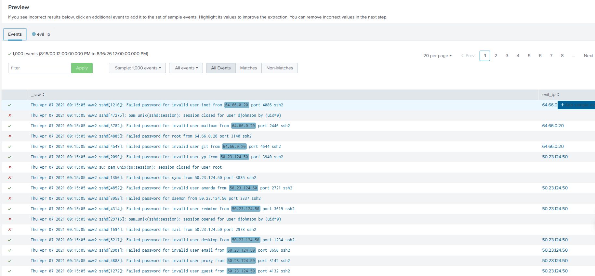

The **Preview** shows your new field applied across the sample events **before you save**:

- A new **`evil_ip`** column appears, populated with the value the regex pulled from each event, and the matched portion is **highlighted** in the `_raw` text so you can see exactly what was captured.
- The **All events / Matches / Non-Matches** tabs let you check **coverage** - **Matches** are the events the pattern caught; **Non-Matches** are the events it **missed** (a quick way to spot where the regex is too strict).
- If some results look wrong, you can **click another event to add it as a sample** and highlight its value to improve the pattern, or **remove incorrect events** in the next step.

This is the **validation gate**: confirm the field is extracting correctly on real data before committing it. Click **Next** to validate and save.

### Step 5 - Validate

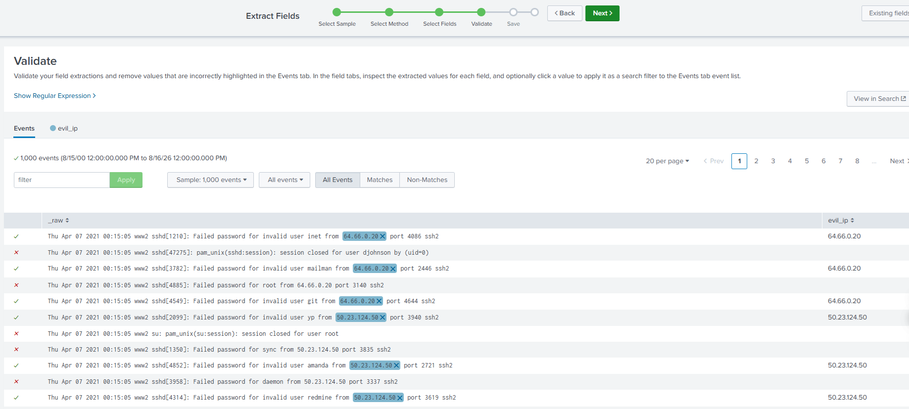

The **Validate** step is where you **check every extraction is correct** before saving:

- Each event shows its extracted **`evil_ip`** value, with the matched text highlighted in `_raw` - inspect them for anything captured **incorrectly**.
- **The ✗ (X)** next to an event **removes that event's match** - you're telling Splunk this value should **not** have been extracted. Splunk then **refines the regex** so it stops matching those wrong cases, tightening the accuracy of the field. (The ✓ marks an extraction you're confirming as correct.)
- **Show Regular Expression** reveals the actual regex Splunk generated for you - handy to inspect, copy into a `rex`, or tweak by hand.
- Clicking an extracted value applies it as a **search filter** on the event list, and **View in Search** opens the whole extraction as a search.

Once every value looks right, continue to **Save**.

### Step 6 - Save

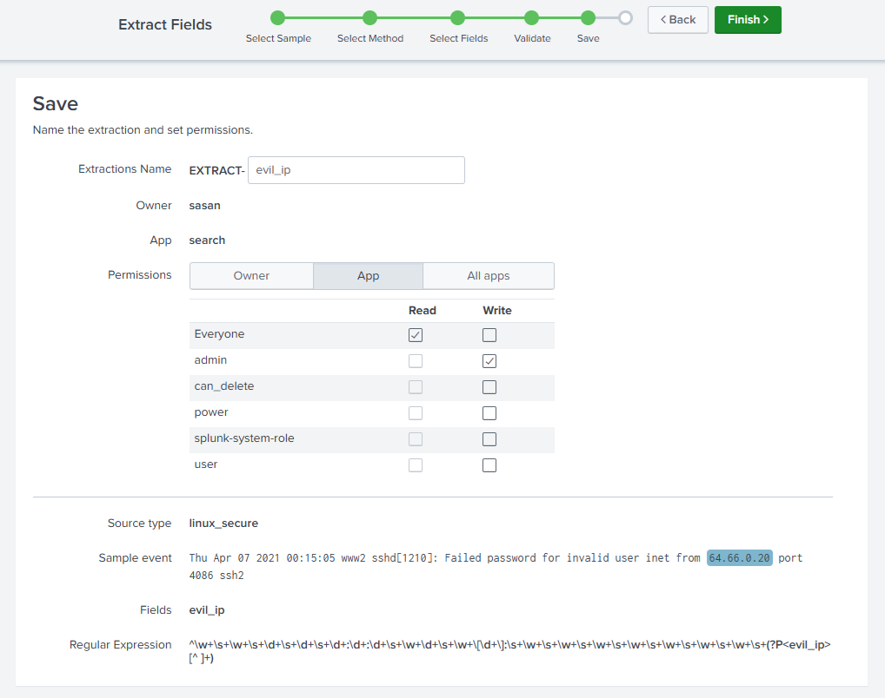

The final **Save** step names the extraction and sets who can use it:

- **Extractions Name** - stored as **`EXTRACT-evil_ip`** (Splunk prefixes field extractions with `EXTRACT-`).
- **Owner / App** - who created it (`sasan`) and which app it lives in (`search`).
- **Permissions** - the same knowledge-object sharing controls from [05](05-knowledge-objects.md): **Owner** (private to you), **App** (everyone using this app), or **All apps** (global). Here it's shared at **App** level, with **Everyone → Read** and **admin → Write**.

The summary at the bottom confirms what you built:

- **Source type**: `linux_secure` · **Fields**: `evil_ip`
- **Regular Expression** - the pattern Splunk **generated for you** from the single value you highlighted, ending in the named capture group **`(?P<evil_ip>[^ ]+)`** (capture everything up to the next space into a field called `evil_ip`).

Click **Finish**. `evil_ip` is now a **permanent extracted field** you can search directly, e.g. `index=security evil_ip="64.66.0.20"`.

> **The whole flow:** **Select Sample → Select Method → Select Fields (highlight) → Validate → Save** - a full regex extraction built entirely through the GUI, with Splunk writing the regex for you.

## Confirming the extraction in search

Back in **Search & Reporting**, run the source search and click **`evil_ip`** in the Interesting Fields sidebar - its summary confirms the extraction worked:

```spl
index=security sourcetype=linux_secure
```

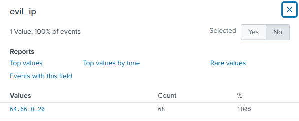

- **1 Value, 100% of events** - every event in this result set has an `evil_ip`.
- That single value is **`64.66.0.20`**, appearing **68 times (100%)** - so *all* these failed SSH logins came from **one IP**: a clear brute-force source.
- The **Reports** quick-links (Top values, Top values by time, Rare values, Events with this field) now work on it exactly like any built-in field.

`evil_ip` is now a first-class field you can search, group, and report on - `index=security evil_ip="64.66.0.20"` filters straight to that attacker's activity.

## Worked example: `rex` in a search

The Field Extractor builds a **permanent** field through the GUI; **`rex`** does the same job **inline in one search**. The screenshot shows the `rex` **syntax template** on the Cisco logs (`field_name` and `theregexwemake` are placeholders):

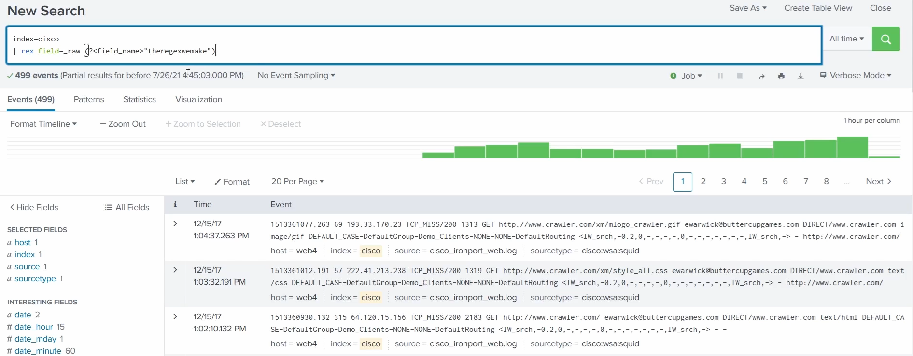

```spl
index=cisco
| rex field=_raw "(?<field_name>theregexwemake)"
```

Reading the syntax:

- **`index=cisco`** - the data to run over (the Cisco IronPort web-proxy logs).
- **`rex field=_raw "…"`** - apply a **regular expression** to each event's raw text.
- **`(?<field_name>…)`** - a **named capture group**: `field_name` is the **name you give the new field**, and the pattern inside (the placeholder *"theregexwemake"* = "the regex we make") is the **regex you write** to capture the value - typically built and tested in [regex101](https://regex101.com) first.

The field exists **for this search only**, so `rex` is ideal for **ad-hoc** extraction. Once extracted you can filter on it (`| search field_name="value"`) or pipe it into `stats`/`table`. For a **reusable** field, use the Field Extractor above instead.

Filling that template in with a **real regex** - pulling **email addresses** out of the Cisco proxy logs:

```spl
index=cisco
| rex field=_raw "(?<email>\S+@\S+.com)"
```

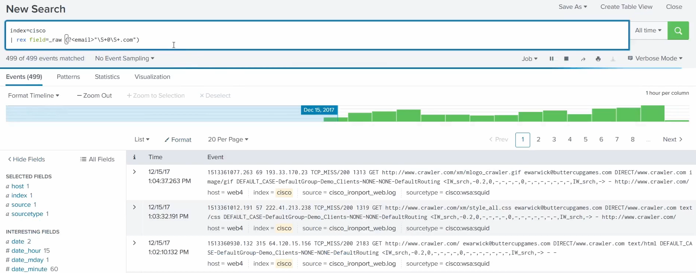

- **`(?<email>…)`** names the new field **`email`**.
- **`\S+@\S+.com`** is the pattern: `\S+` = one or more non-space characters, `@` = a literal at-sign, `\S+` = more non-space characters, ending in `.com` - the shape of an email address.
- **All 499 events matched**, pulling the address (e.g. `ewarwick@buttercupgames.com`) into `email` - now a field you can search and report on.

## Worked example: `erex` in a search

`erex` is the same idea but you give **example values** instead of a pattern - Splunk generates the regex for you:

```spl
index=cisco | erex files examples="text/css", "image/gif"
```

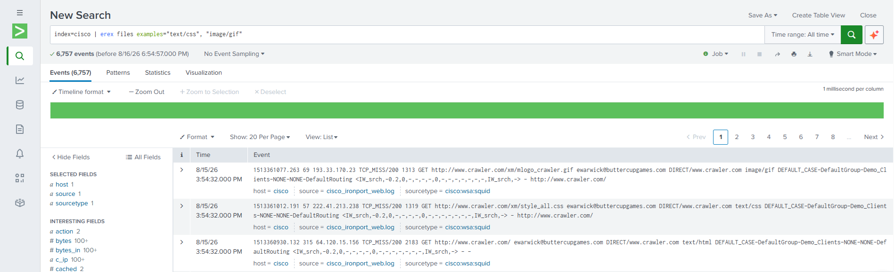

- **`files`** is the **name of the new field**.
- **`examples="text/css", "image/gif"`** are sample values you spotted in the events - here the **content types** the Cisco proxy logged.
- Splunk analyses those examples, **builds a regex** that matches that shape, extracts every similar value into `files`, and **prints the regex it generated** - which you can copy into a `rex` to reuse or refine (the bootstrap-then-lock-in workflow from the top of this doc).
