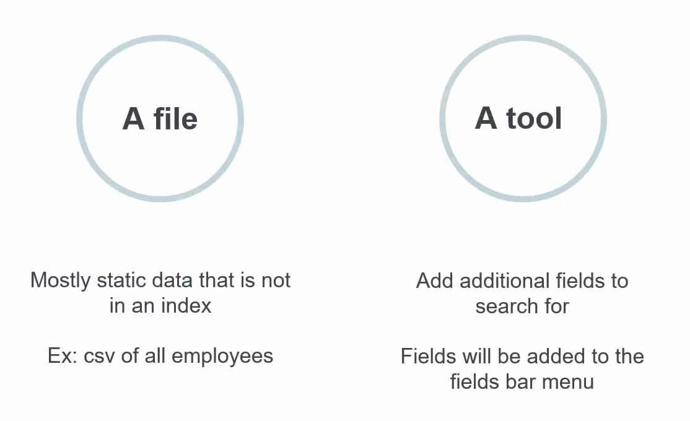
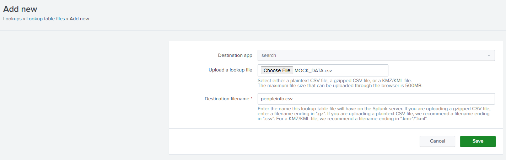
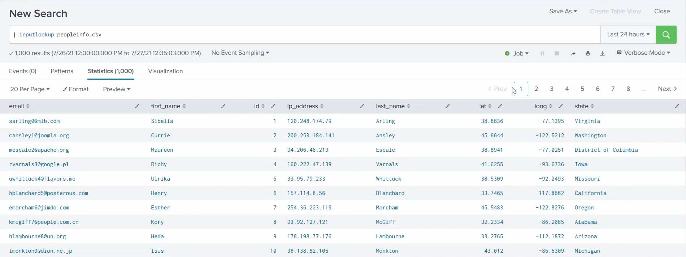
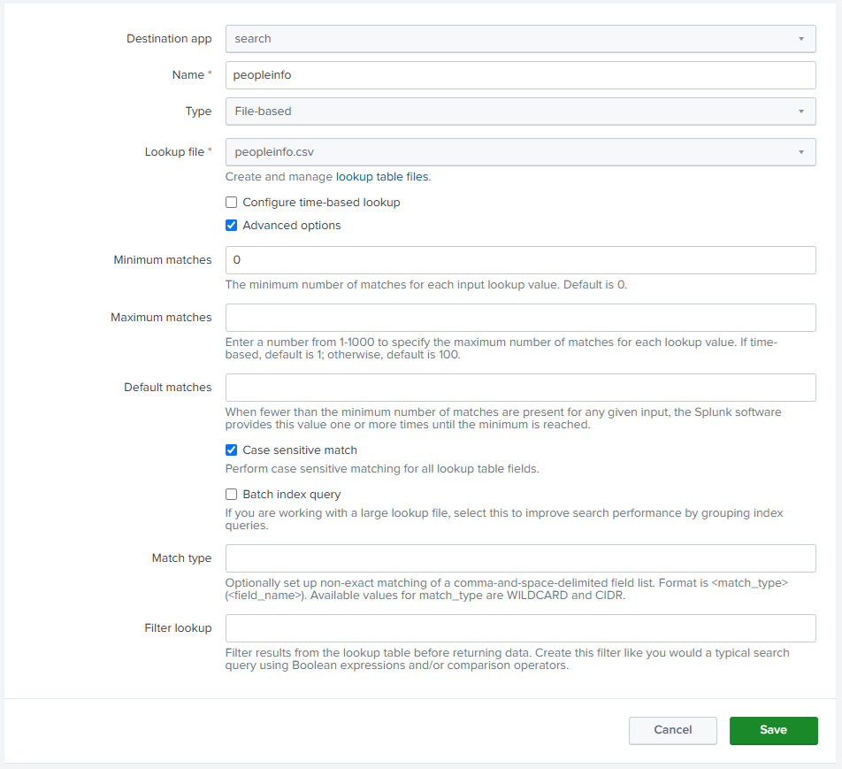
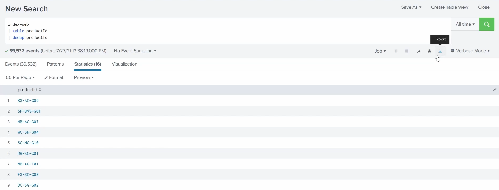
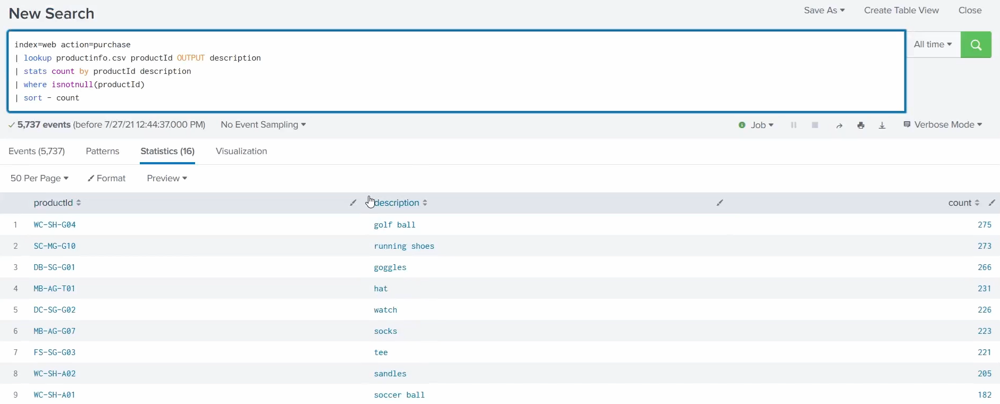

# Lookups

A **lookup** enriches your events with **extra context** by matching a field against an **external table/file** (e.g. a CSV). The key thing: that reference data is **not stored in an index** - it lives in a separate file you point searches at, adding relevant information that isn't in the raw events. (The main guide defines a lookup briefly in the [glossary](../README.md#basic-terms-in-splunk-glossary).)

> Screenshots in this file are from the Udemy course _Splunk: Zero to Power User_.



## What a lookup is (from the image)

### Data enrichment

- Add information stored in a **table/file format** that you can then **search** against.
- It **enriches an index** with additional, relevant info the raw events don't contain - so an event carrying only an ID or a code gains the human-readable detail that goes with it.
- **Not stored in indexes** - lookups are kept as separate reference files, apart from your event data.

### Commands

- **`lookup`** - enrich search results by matching an event field against the lookup table and adding its columns.
- **`inputlookup`** - read the lookup table's contents **directly**, as if the file were events (useful to inspect it).
- **`outputlookup`** - **write** search results out to a lookup table (create or update the file).
- **`OUTPUT` / `OUTPUTNEW`** - options on `lookup` that control which fields get added; **`OUTPUTNEW`** only writes a field if the event doesn't already have it (won't overwrite).

### Create or Upload

- **Select a file to upload**, or **make one**, to reference.
- Once it exists, a lookup can be **configured to run automatically** - an _automatic lookup_ enriches every matching search without you typing `lookup`.

## The workflow

1. **Create / upload the lookup file first** - you can't reference it until it exists.
2. **Use it in searches** (via `lookup`, or automatically).
3. Matching events come back **enriched** with the extra columns from the file.

## Examples of lookup files

A few common ones (the pattern is always _key → extra detail_):

- **IP address → owner / location** (map `src_ip` to the asset or geo).
- **HTTP status code → description** (`404` → "Not Found").
- **User ID → full name / department**.
- **Product/vendor code → product name**.

## Creating a lookup table file

Navigate to **Settings → Lookups → Lookup table files → New Lookup Table File** and fill in the **Add new** form:



- **Destination app** - which app it belongs to (`search`).
- **Upload a lookup file** - choose the file (here `MOCK_DATA.csv`). Accepts a plaintext CSV, a gzipped CSV, or a KMZ/KML file, up to **500MB** through the browser.
- **Destination filename** - the name it'll have on the Splunk server (here `peopleinfo.csv`); end it `.csv` for plaintext, `.gz` for gzipped, `.kmz`/`.kml` for KMZ/KML.
- Click **Save**.

### Set permissions

After saving, open its **permissions** and change the **Owner to `admin`** (and share it as needed) - the same knowledge-object sharing controls as everything else, so the lookup is available to the searches/users that need it.

## Searching the lookup

Once uploaded, read the file's contents directly with **`inputlookup`**:

```spl
| inputlookup peopleinfo.csv
```



This returns the CSV's **1,000 rows** as a normal **results table** - columns like `email`, `first_name`, `last_name`, `id`, `ip_address`, `lat`, `long`, and `state`.

Because it's just search results, you can **filter it like anything else** - e.g. pipe it into `where` to narrow to one state:

```spl
| inputlookup peopleinfo.csv | where state="New York"
```

That returns only the rows whose `state` is `New York` (double quotes = a literal string value, as covered in [manipulating your data](10-manipulating-data.md)).

## Creating a lookup definition

Uploading the CSV gave you a **lookup table file**; a **lookup definition** is the named configuration that tells Splunk **how to use that file** as a lookup - the matching rules, and the **name you'll call it by** in the `lookup` command. (The raw file already works with `inputlookup`, but you need a **definition** to reference it by name in `lookup` and to set it up as an automatic lookup.)

**Where:** **Settings → Lookups → Lookup definitions → New Lookup Definition**.



The fields:

- **Destination app** - which app the definition lives in (`search`).
- **Name** - the name you'll **reference the lookup by** in searches (`peopleinfo`).
- **Type** - `File-based` (a CSV/KMZ file); other types are **KV Store** and external/scripted lookups.
- **Lookup file** - which uploaded **lookup table file** this definition points at (`peopleinfo.csv`).
- **Configure time-based lookup** - for **temporal** lookups that also match on time (off here).
- **Advanced options** - reveals the matching controls below.
- **Minimum matches** - fewest matches to return per input value (default `0`).
- **Maximum matches** - most matches per input value (`1-1000`; default 100, or 1 if time-based).
- **Default matches** - the value to supply when fewer than the minimum matches are found.
- **Case sensitive match** - whether field matching is case-sensitive.
- **Batch index query** - a **performance** option for large lookup files (groups index queries).
- **Match type** - set up **non-exact** matching per field: **`WILDCARD`** (pattern match) or **`CIDR`** (match an IP against a subnet), format `<match_type>(<field_name>)`.
- **Filter lookup** - **filter the lookup table before it returns data**, written like a normal search (Boolean / comparison expressions).

Click **Save**, and `peopleinfo` is now usable by name in the `lookup` command.

> **Always set permissions on a new knowledge object.** A lookup definition - like the lookup table file, and every KO you create (fields, event types, alerts, extractions…) - defaults to **private to you**. After saving, open its **permissions**, set the **Owner** (e.g. `admin`) and share it to the app or globally, or nobody else's searches can use it. See [knowledge objects](05-knowledge-objects.md#sharing--governance).

## Building a lookup from a search (export & enrich)

You can also **build the lookup's contents from your own data**. This search pulls the distinct product IDs out of the web logs:

```spl
index=web
| table productId
| dedup productId
```



- `table productId` shows just that column; `dedup productId` collapses it to the **unique** IDs - here **16** distinct products.
- The **Export** button (top-right download icon) saves this list to a file (e.g. CSV).

**How the data gets enriched after the export:** the exported file has only the **keys** (`productId`). Away from Splunk you **add the columns that give them meaning** - e.g. `productId → product_name, price, category`.

That **enriched file (now with the new fields/data) is then uploaded as a brand-new lookup** - its own table file + definition, exactly as above. Once it's in, a `lookup` on `productId` **joins those extra columns onto your events**: a web event that only carried `BS-AG-G09` gains the product's name, price, and category.

So the full cycle is: **search your data → export the keys → add fields → upload as a new lookup → `lookup` it back onto events**. That's the payoff - turn a bare ID in your logs into meaningful, searchable detail.

## Enriching a search with `lookup`

Here's the whole point in action - using the lookup to add meaning to a search:

```spl
index=web action=purchase
| lookup productinfo.csv productId OUTPUT description
| stats count by productId description
| where isnotnull(productId)
| sort - count
```



Line by line:

- `index=web action=purchase` - actual **purchase** events from the web logs.
- `lookup productinfo.csv productId OUTPUT description` - the enrichment: match each event's **`productId`** against the **`productinfo.csv`** lookup and **`OUTPUT`** its **`description`** field onto the event (the `OUTPUT`/`OUTPUTNEW` options from the command list above).
- `stats count by productId description` - count purchases per product, now grouped by the readable **description** too.
- `where isnotnull(productId)` - drop rows with no `productId`.
- `sort - count` - most-purchased first.

**How it gives more value to the search:** without the lookup, `stats count by productId` would give a ranked list of **cryptic IDs** (`WC-SH-G04` → 275) that mean nothing to a human. The lookup **translates each ID into what it actually is** - `WC-SH-G04` → **golf ball**, `SC-MG-G10` → **running shoes** - so the result reads as _"golf balls are the top seller with 275 purchases."_ Same search, but now instantly **readable and actionable**. That's the essence of enrichment: joining external context to your events turns opaque keys into meaningful answers.

Notice it looks **very similar to searching indexed event data** (compare the results table with the data preview back in [setting up](01-setting-up-splunk.md)) - same columns-and-rows layout, the Statistics tab, field values you can click. The only difference is the data is coming **from the lookup file, not an index**. That's the whole idea: a lookup is just another table of data you can search - and, next, **join against your events** to enrich them.
