# Visualising Your Data

Once a [transforming command](08-transforming-commands.md) has shaped your events into a table of numbers, you can turn that table into a **visualisation**. This covers the visualisation **types**, the **`chart` vs `timechart` vs `stats`** distinction, and the **panel format options**. (The main guide lists the commands under [Basic visualisations](../README.md#spl-by-example).)

> Screenshots in this file are from the Udemy course _Splunk: Zero to Power User_.

## Types of visualisation

- **Tables** - rows and columns of values (from `stats`/`table`).
- **Charts** - line, area, column, bar, pie, scatter, etc.
- **Maps** - plot events geographically (`iplocation` + `geostats`).
- **Single-value** - one big number/gauge (e.g. `stats count`).

Any of these can be **single-series** (one line / one set of bars) or **multi-series** (several, split by a field - e.g. a line per status code).

## `chart` vs `timechart` vs `stats`

The three transforming commands produce different shapes - this is the common point of confusion:

| | `stats` | `chart` | `timechart` |
| --- | --- | --- | --- |
| **Output** | a results **table** | a table shaped **for a chart** | a table with **time on the x-axis** |
| **X-axis** | none (just grouped rows) | the field after **`by`** | always **`_time`** |
| **Best for** | numbers, tables, single-value | comparing across a **category** | **trends over time** |
| **Example** | `stats count by status` | `chart count by status` | `timechart count by status` |

The shortcut: **`timechart` = `chart` with time as the x-axis**, and **`stats`** gives you the raw table while `chart`/`timechart` shape it for plotting.

## When a search has no transforming command

A plain search like `index=web` just **retrieves events** - there's no transforming command, so there's nothing to chart. Splunk tells you this on the **Statistics** and **Patterns** tabs, and the Statistics tab suggests how to fix it.

The four result tabs, and what each does:

- **Events** - the raw **event list** (what a plain retrieving search shows).
- **Patterns** - groups similar events into common **patterns/clusters**, to spot trends and anomalies in raw data.
- **Statistics** - the results **table** produced by a transforming command (`stats`/`chart`/`timechart`). **Empty** if your search has none.
- **Visualization** - renders that Statistics table as a **chart**. Also needs a transforming command to have anything to draw.

So `Statistics` and `Visualization` only light up once your search **summarises** the data. When they're empty, the Statistics tab explains it and offers three routes:

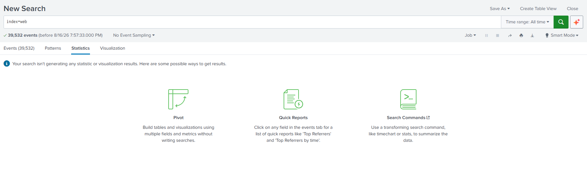

- **Pivot** - build tables and visualisations by **point-and-click** (fields + metrics), **without writing searches** - it runs off data models.
- **Quick Reports** - click any field in the **Events** tab for ready-made reports - the field-sidebar quick reports.
- **Search Commands** - add a **transforming command** like `timechart` or `stats` to summarise the data (the SPL way).

For example, clicking the numeric **`bytes`** field surfaces its **Quick Reports** - ready-made links like *Average / Maximum / Minimum value over time*, *Top values*, *Top values by time*, and *Rare values*, plus summary stats (Avg, Min, Max, Std Dev):

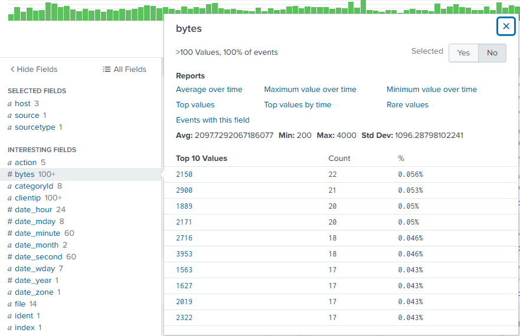

## Worked example: `chart` vs `timechart`

The same aggregation - `avg(bytes) by host` - run two ways shows the difference exactly.

**`chart` - a value per category:**

```spl
index=web | chart avg(bytes) by host
```

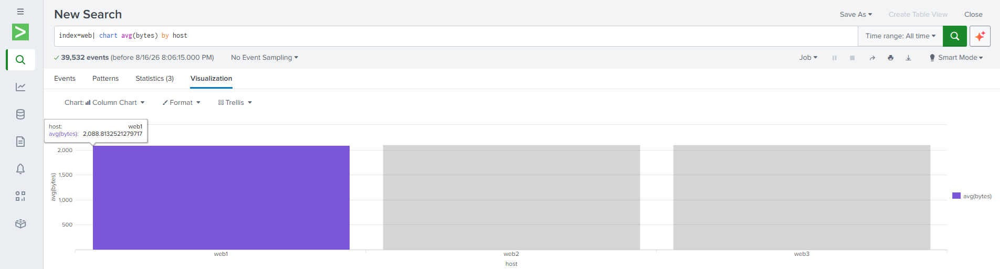

- The x-axis is **`host`** (the category after `by`). Each of the 3 hosts gets **one column** = its overall average bytes (web1 ≈ 2,088).
- **Statistics (3)** - three rows, one per host. A **snapshot comparison across hosts**, no time involved.

**`timechart` - values over time:**

```spl
index=web | timechart avg(bytes) by host
```

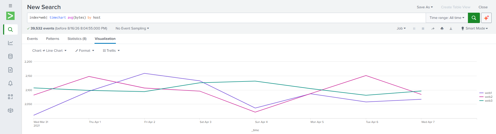

- The x-axis is **`_time`**. The average is bucketed **over time** (here per day, Mar 31 → Apr 7), and **`by host`** splits it into **one line per host** (web1/web2/web3).
- **Statistics (8)** - eight rows, one per time bucket. It shows the **trend** - how each host's average rises and falls day to day.

**The difference in one line:** `chart` collapses each host to a **single value** (bars across a category); `timechart` breaks that same value out **over time** (lines across `_time`). Notice `by host` plays a different role in each - the **x-axis category** for `chart`, but the **series split** for `timechart` (where `_time` is always the x-axis).

## Panel format options

On the **Visualization** tab, the **Format** menu controls how the chart is drawn - the chart type, **how values are displayed** (e.g. Show Data Values), axes, legend, overlays, and more. These examples all use one search: `index=web | where isnotnull(action) | timechart count by action`.

- **Multi-series mode** - draw **each series separately** (e.g. one line/column per action) instead of merging them into one.

- **Stacking** - set via **Stack Mode** in Format: stack the series **on top of each other** so each column's segments add up to a **total** (stacked column / stacked area). Good for **part-to-whole** and the cumulative total at once.

  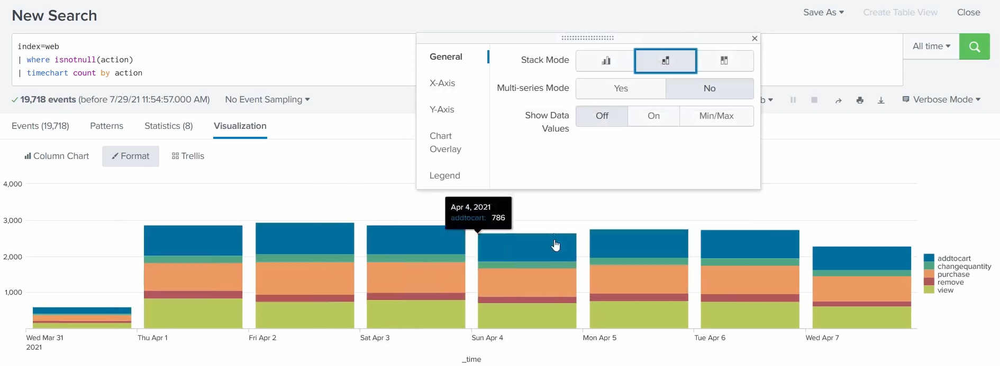

- **Overlay** - the **Chart Overlay** option in Format draws one series **over** the main chart - e.g. a trend line laid over bars, or a second series on its own axis. Good for **comparing series of different scales**.

- **Trellis** - the **Trellis** menu splits the visualisation into **individual charts** - one small chart per value of a field - instead of cramming every series onto a single x-axis. Options: **Split By** (which field), **Size**, and **Scale** (**Shared** or **Independent** axes).

  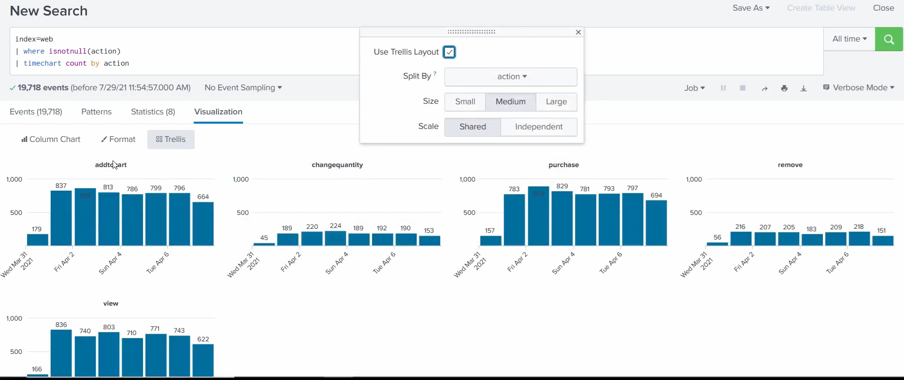

## More visualisation commands

A few commands that feed specific visualisations or add detail to a results table:

### `iplocation`

- **What it does:** enriches events by adding **geographic fields** (city, region, country, latitude/longitude) derived from an **IP address**.
- **Why it's useful:** turns a bare IP into a real-world location - the groundwork for maps and geo-analysis.
- **Example:** `index=web | iplocation clientip` - adds `City`, `Country`, `lat`, `lon` for each `clientip`.

In action, run against the `peopleinfo` lookup's IPs:

```spl
| inputlookup peopleinfo.csv
| iplocation ip_address
```

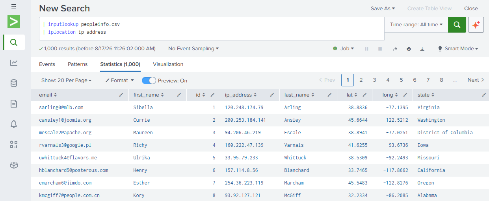

It reads the lookup, then runs `iplocation` on the **`ip_address`** field, enriching each of the 1,000 rows with **geographic fields** derived from the IP - City, Region, Country, and crucially **`lat` and `lon` (latitude and longitude)**. Those generated coordinates are exactly what **`geostats`** needs to plot the data on a map (next). (These are random mock IPs, so it demonstrates the mechanism rather than real locations.)

### `geostats`

- **What it does:** aggregates results **by geographic location** (using lat/long) into the form a **cluster map** needs.
- **Why it's useful:** shows **where** activity is happening - spot traffic or attacks concentrated in a region.
- **Example:** `index=web | iplocation clientip | geostats count by clientip` - a map of request counts by location.
- **Common args:** `latfield`, `longfield` (which fields hold the coordinates), `globallimit`, `locallimit` (cap how many series overall / per cluster).

In action, plotting the `peopleinfo` lookup on a map:

```spl
| inputlookup peopleinfo.csv
| geostats latfield=lat longfield=long globallimit=10 count by email
```

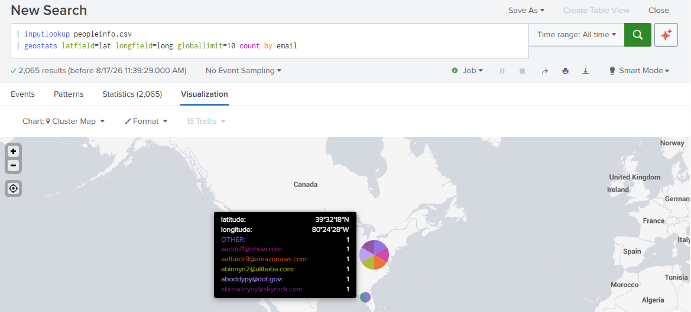

- It reads the lookup and uses its **`lat`/`long`** columns (via `latfield`/`longfield`) as the coordinates - the same kind of `lat`/`lon` that `iplocation` generates.
- `count by email` aggregates, and `globallimit=10` caps the number of series.
- The visualisation switches to a **Cluster Map** - pie-chart clusters at each location; hovering shows the exact **latitude/longitude** and the per-email breakdown.

This is the payoff of the pairing: **`iplocation` produces the coordinates, `geostats` maps them.**

### `addtotals`

- **What it does:** adds **totals** to a stats table - by default a `Total` **column** summing the numeric fields in each row; with `col=t` it adds a **summary row** of column totals.
- **Why it's useful:** get row/column totals without extra `eval` maths.
- **Example:** `index=web | chart count over host by status | addtotals` - adds a `Total` column per host; `... | addtotals col=t` appends a totals row.
- **Common args:** `fieldname` (name the total field), `label`/`labelfield` (the label text, and which field it goes in, for the totals row).

In action, totalling the purchases across geo-binned data:

```spl
index=web action=purchase
| iplocation src
| geostats count by action
| addtotals row=f col=t label="Total Purchases" labelfield=longitude purchase
```

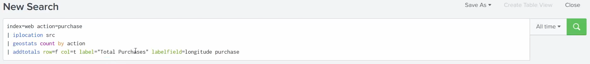

Reading the `addtotals` options:

- `row=f` - **don't** add a per-row `Total` column (summing `latitude` + `longitude` + `purchase` on each row would be meaningless).
- `col=t` - **do** add a **totals row** at the bottom that sums the column.
- `purchase` - only total the **`purchase`** field (the counts), not the coordinates.
- `label="Total Purchases"` - the text for that totals row.
- `labelfield=longitude` - put that label in the **`longitude`** column of the totals row.

So it appends one summary row - the **grand total of all purchases** across every geo-bin, labelled *Total Purchases*. (The earlier commands set it up: `iplocation src` adds the coordinates, `geostats count by action` bins the purchases geographically.)

### `trendline`

- **What it does:** computes a **moving-average trend** of a field (simple `sma`, exponential `ema`, or weighted `wma`) over the results - a smoothed line.
- **Why it's useful:** smooths out noise to reveal the underlying **trend**, ideal to **overlay** on a `timechart`.
- **Example:** `index=web | timechart count | trendline sma5(count) as trend` - adds a 5-point simple moving average `trend` you can overlay on the raw count.

In action, smoothing Splunk's own internal event count:

```spl
index=_internal sourcetype=splunkd
| timechart count
| trendline sma5(count) as "Our Moving Average of Total Events"
```

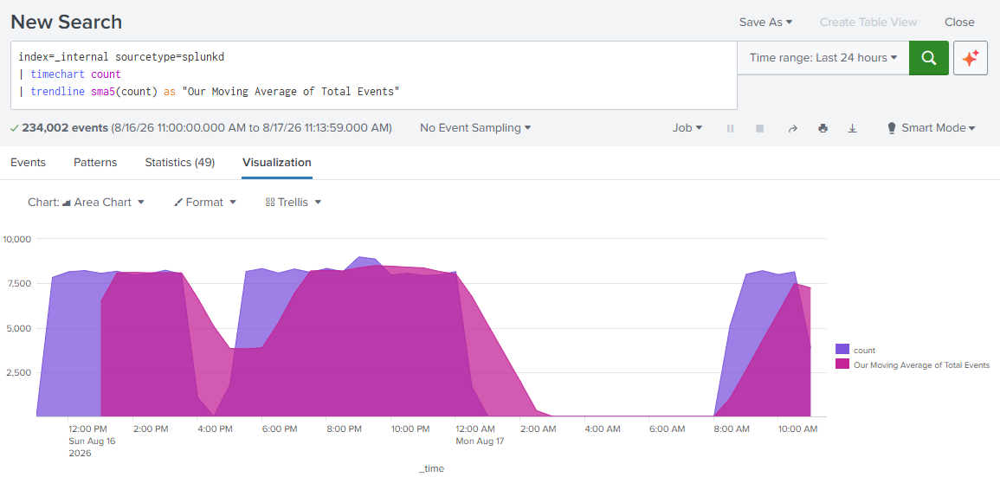

- `timechart count` plots the **raw event count** over time (the purple area).
- `trendline sma5(count) as "…"` overlays a **5-point simple moving average** (the magenta area), smoothing the noisy count into a trend - so you see both on the same chart.
- Note the moving-average value is **empty for the first 4 buckets** - a 5-point average needs 5 data points before it can produce its first value.

## Building a dashboard

A **dashboard** collects multiple visualisations - **panels** - into one at-a-glance view. You build one by saving searches/visualisations as panels. (Covered conceptually in the main guide's [what you can build](../README.md#what-you-can-build-in-splunk) and the Tier 1 [working surface](../README.md#dashboards).)

### Creating a new dashboard

From a search's **Visualization**, click **Save As → New Dashboard**. That opens the **Save Panel to New Dashboard** form:

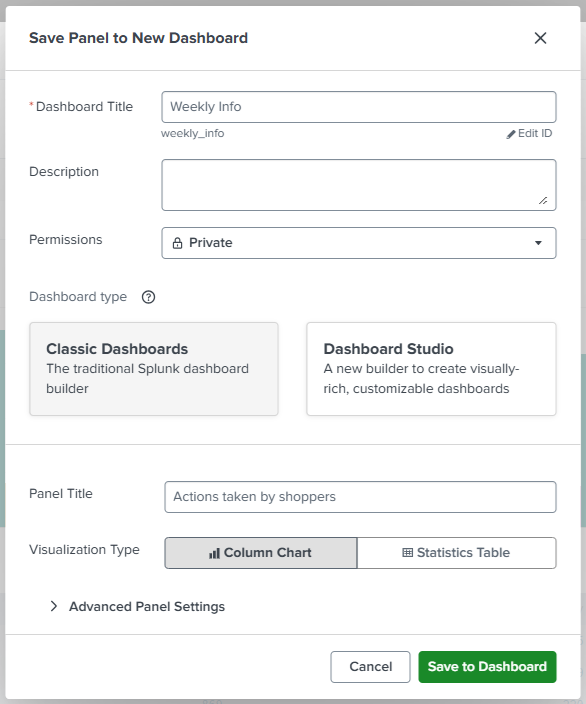

- **Dashboard Title** - the dashboard's name (`Weekly Info`); Splunk derives an **ID** (`weekly_info`) from it that you can **Edit**.
- **Description** - optional notes on what the dashboard shows.
- **Permissions** - who can see it (`Private` here - share it later like any knowledge object).
- **Dashboard type** - **Classic Dashboards** (the traditional Simple XML builder) vs **Dashboard Studio** (the newer, visually-rich builder).
- **Panel Title** - the title of this first **panel** (`Actions taken by shoppers`).
- **Visualization Type** - how this panel renders (**Column Chart** / Statistics Table).
- **Save to Dashboard** creates the dashboard with this panel.

The result is a new dashboard holding your first visualisation:

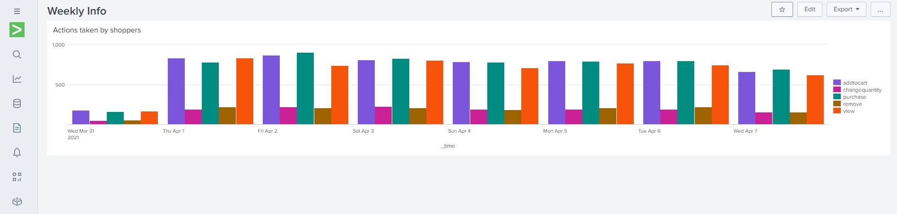

### Adding more panels

Build another search/visualisation you want on the dashboard:

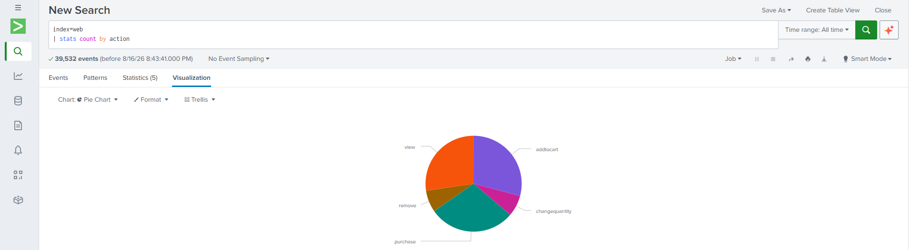

Then **Save As → Existing Dashboard** and pick the one to add it to:

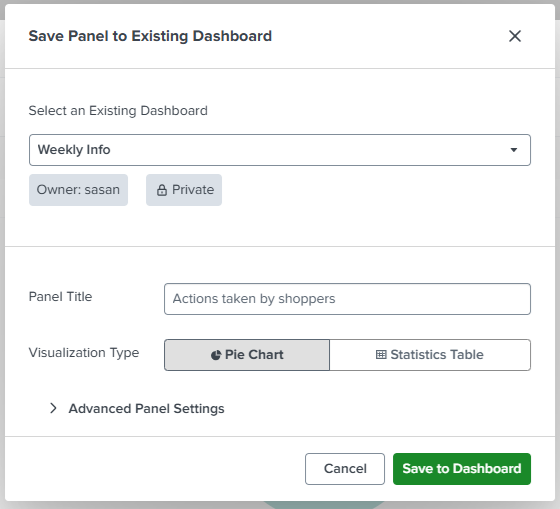

- **Select an Existing Dashboard** - choose the target (`Weekly Info`, Owner `sasan`, Private).
- **Panel Title** / **Visualization Type** - name the new panel and pick its chart (here a **Pie Chart**).
- **Save to Dashboard** adds it as a **new panel** on that dashboard.

Now the dashboard shows **multiple visualisations** together:

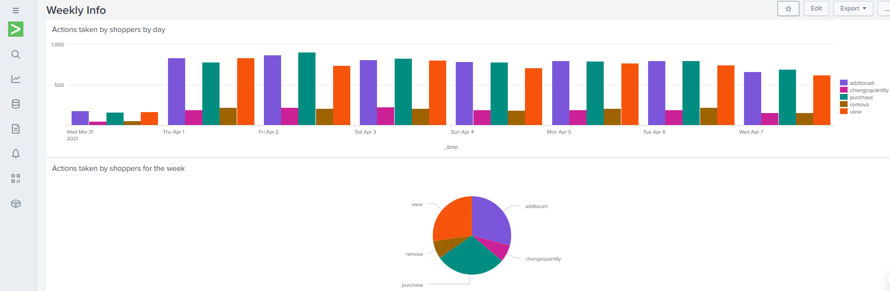

> **Set permissions.** A dashboard is a **knowledge object** and defaults to **Private**. Share it (Owner → `admin`, to the app or globally) so your team can see it. See [knowledge objects](05-knowledge-objects.md#sharing--governance).
