# Reports & Drilldowns

> Screenshots in this file are from the Udemy course _Splunk: Zero to Power User_.

## What is a report?

A **report is a saved search** - anything you can search, you can save as a report. (The main guide covers the search → report → alert progression in [what you can build](../README.md#what-you-can-build-in-splunk).) The course frames a report in three parts:

- **A saved search** - anything that is a search can be saved as a report.
- **Live results** - re-run a report on demand, or set it to run on a **schedule**.
- **Sharable knowledge object** - let anyone **view** your reports, or **add them to a dashboard** for people to reference. (Example name: `Audit_Report_LicenseUsage`.)

**Why useful / what they show:** a report captures a search's output - a **table**, **stats**, or a **chart** - that you can re-run anytime or run on a **schedule** (e.g. a daily "top failed logins"), share with the team, or drop into a dashboard as a panel.

> **Set permissions.** A report is a **knowledge object** - defaults to private, so set the **Owner** and share it (to the app or globally) for others to use. See [knowledge objects](05-knowledge-objects.md#sharing--governance).

## Creating a report and adding it to a dashboard

Build the search you want to keep - here, executables running on a host:

```spl
index=* "*.exe" host=mybox
| table Name, Path, CommandLine
```

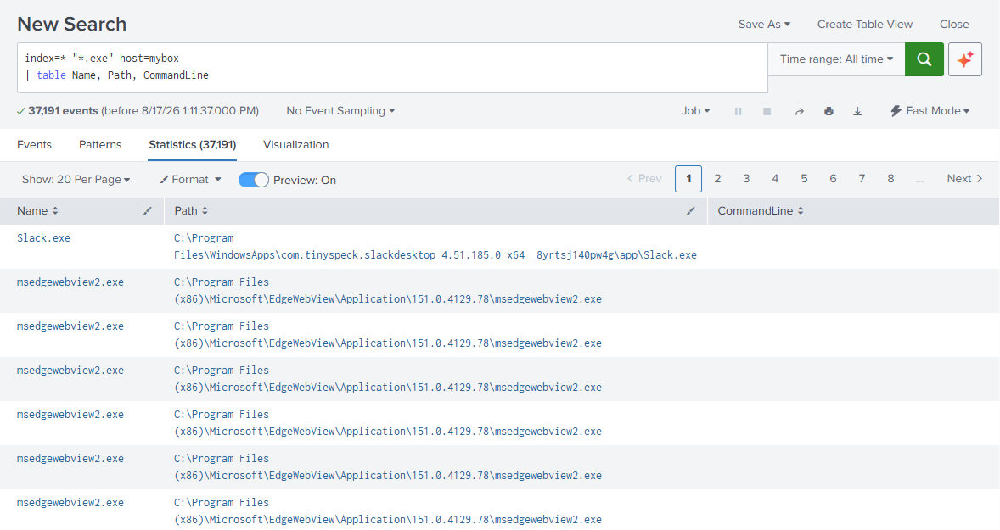

Save it via **Save As → Report**:

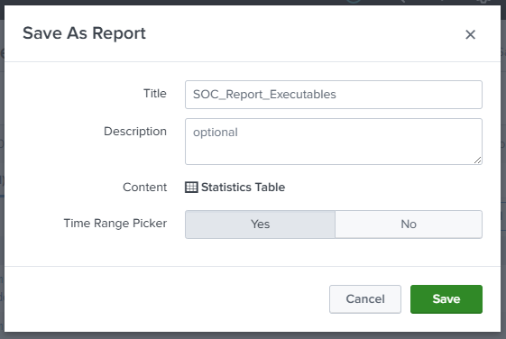

- **Title** - the report's name (`SOC_Report_Executables`).
- **Description** - optional notes.
- **Content** - what it's saved as (a **Statistics Table** here).
- **Time Range Picker** - whether the report shows a time picker when run (**Yes**).

Once saved, **add the report to a dashboard**: edit the dashboard → **Add Panel → New from Report** → pick `SOC_Report_Executables`. (Or from the report's results, **Save As → Dashboard Panel**.) The report becomes a **panel** - and because the panel references the same saved report, updating the report updates the panel.

## Scheduling a report

To have a report **run automatically**, **edit** it (from the report itself or **Settings → Searches, reports, and alerts**), open **More Info**, and **set a schedule** - e.g. run daily/weekly at a fixed time. A scheduled report can then keep a dashboard panel fresh, email its results, or trigger an action when it runs.

> **Export to PDF:** a dashboard or report can be exported as a **PDF** via the **Export** button (top right) - handy for sharing a snapshot. A scheduled report/dashboard can also be set to **email a PDF** automatically.

## Drilldowns

A **drilldown** makes a dashboard panel (or report) **interactive** - clicking a value drills into more detail. Three parts:

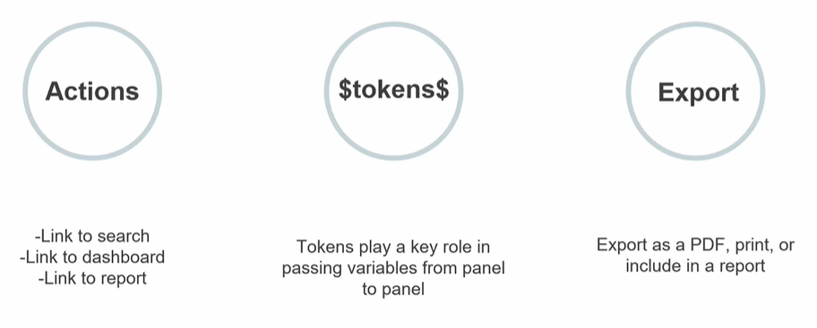

- **Actions** - what a click _does_. It can **link to a search**, **link to a dashboard**, or **link to a report** - carrying you (and the value you clicked) somewhere with more detail.
- **`$tokens$`** - **variables** (written `$token$`) that capture what you clicked and **pass it from panel to panel** - the mechanism that makes drilldowns dynamic (see _Manage tokens_ below, and [Tokens in action](#tokens-in-action), for how).
- **Export** - export the results as a **PDF**, **print** them, or **include them in a report**.

So a drilldown turns a static number on a dashboard into a **starting point**: click it, pass its value along as a token, and land in a filtered search/dashboard/report that explains it.

### Setting up a drilldown

Configure a panel's click behaviour in the **Drilldown Editor**. The **On Click** dropdown lists the possible actions:

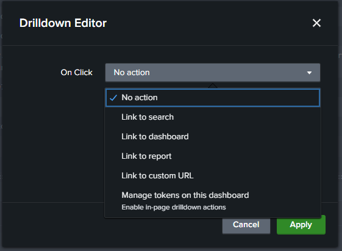

- **No action** - clicking does nothing (the default).
- **Link to search** - open a **new search** filtered to the clicked value.
- **Link to dashboard** - navigate to **another dashboard**, passing the clicked value as a token.
- **Link to report** - navigate to a saved **report**.
- **Link to custom URL** - open a **URL** (which can include the clicked value via a token) - e.g. an external threat-intel lookup or tool.
- **Manage tokens on this dashboard** - instead of navigating away, a click **sets a token** on the current dashboard, which other panels can then use to update in place (worked through in [passing a token between panels](#worked-example-passing-a-token-between-panels) below).

Choosing **Link to search** then gives **Auto / Custom** options:

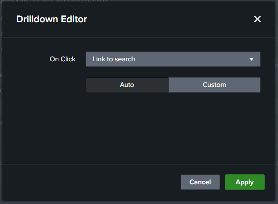

- **Auto** - Splunk builds the drilldown search **automatically** from what you clicked; **Custom** - you define the search and tokens yourself.

With the drilldown enabled, the panel's values become **clickable hyperlinks**:

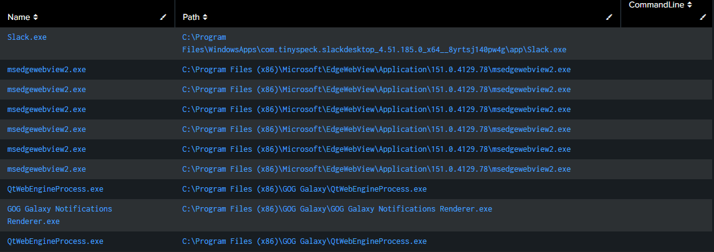

Each value (e.g. a `Name` or `Path`) turns **blue** - click one and it drills through to the linked search, filtered to that value. That's the **Action** part of a drilldown made real: the once-static table cells are now entry points into a deeper search.

### Worked example: passing a token between panels

The **Manage tokens on this dashboard** action in practice - click a value in one panel and a second panel searches for it.

**1. Set the token on click.** In the Drilldown Editor, **On Click → Manage tokens on this dashboard**, then **Set** a token (named `userclick`) to a value from the click:

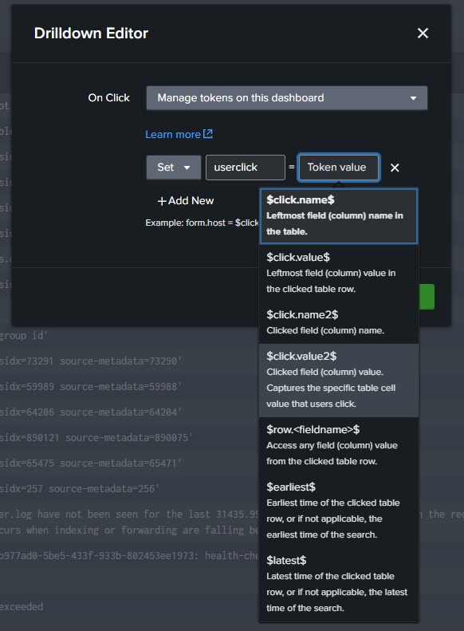

The **token value** dropdown lists what you can capture from the click:

- **`$click.value$`** - the leftmost column's value in the clicked row.
- **`$click.value2$`** - the **specific cell** the user clicked.
- **`$click.name$` / `$click.name2$`** - the column _name_ (leftmost / clicked).
- **`$row.<fieldname>$`** - any field's value from the clicked row.
- **`$earliest$` / `$latest$`** - the time range of the clicked row.

**2. Add a panel that uses the token.** Add a new panel whose search references `$userclick$`:

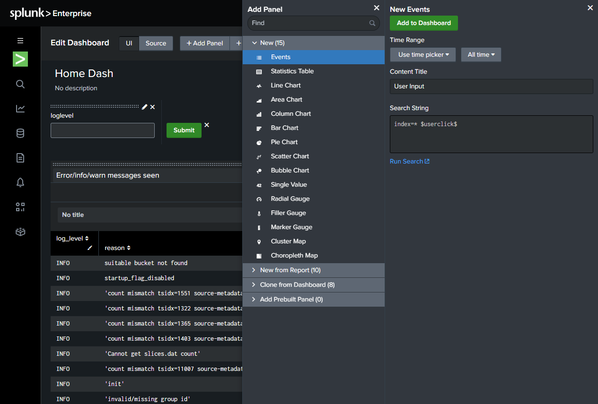

Here the _User Input_ panel's search is `index=* $userclick$` - so it filters on whatever `userclick` is set to.

**3. Click - and the second panel auto-searches.** Clicking a value in the first panel sets `userclick` to that value, and the _User Input_ panel **automatically re-runs** `index=* <clicked value>`, showing the matching events:

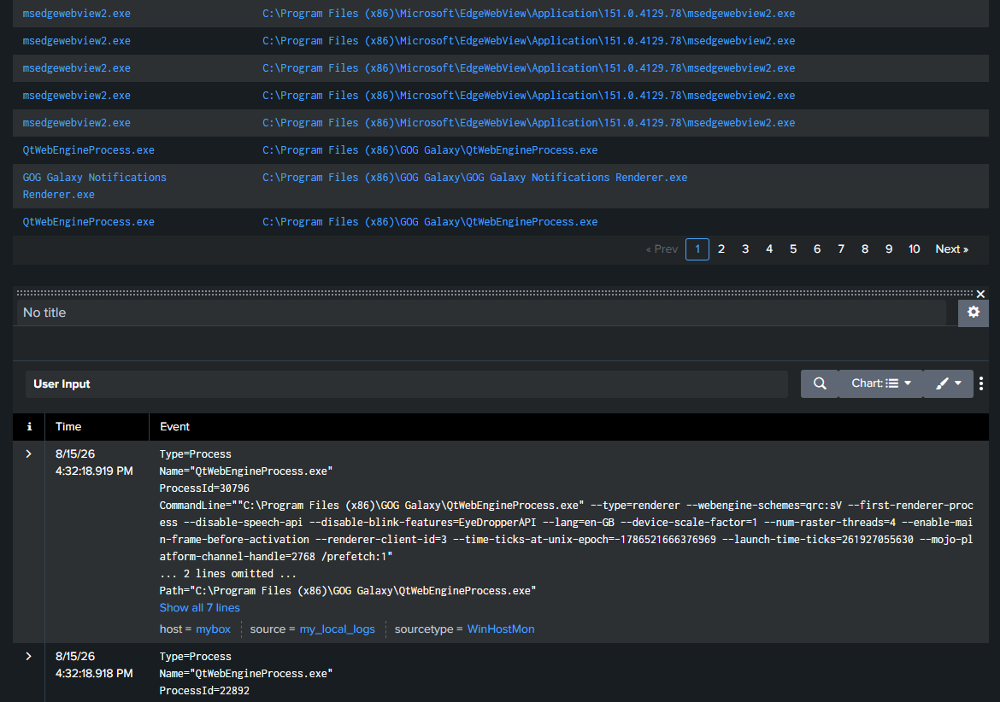

That's the full **panel-to-panel** flow: **click panel A → it sets the `userclick` token → panel B searches for it**. It's the **click-driven** counterpart to the **input-box** token in [Tokens in action](#tokens-in-action) below.

## Home dashboard

You can make a dashboard your **home dashboard** - the one that greets you when you open the app instead of the default landing page. Open the dashboard (from the **Dashboards** tab in Search & Reporting, or **Settings → User interface → Views**), then use its **Edit** menu → **Set as Home Dashboard**. Handy for putting your most-used monitoring view front and centre.

For example, this search builds a tidy table you might want on that home dashboard - and it recaps commands from earlier chapters:

```spl
index=_internal log_level=*
| eval Date=strftime(_time, "%m/%d/%Y")
| where isnotnull(reason)
| table log_level, reason, Date
| dedup reason
| sort Date
```

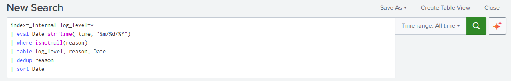

Line by line:

- `index=_internal log_level=*` - internal logs with any `log_level`.
- `eval Date=strftime(_time, "%m/%d/%Y")` - make a readable **`Date`** field from `_time` (`strftime`, from [manipulating your data](10-manipulating-data.md)).
- `where isnotnull(reason)` - keep only events that **have** a `reason`.
- `table log_level, reason, Date` - show just those three columns.
- `dedup reason` - one row per **unique** `reason`.
- `sort Date` - order by date.

The result is a clean, **distinct list of log reasons** with their level and date - exactly the kind of at-a-glance panel you'd **save as a new dashboard** and set as your home view.

## Tokens in action

Here's the [drilldown](#drilldowns) `$tokens$` idea in practice - turning that home-dash panel into an **interactive** dashboard where the user chooses the log level.

**Setting up the token:** with the search saved as a dashboard, edit the panel's search and replace the hardcoded filter with a **token** - `$loglevel$`:

```spl
index=_internal $loglevel$
| eval Date=strftime(_time, "%m/%d/%Y")
| where isnotnull(reason)
| table log_level, reason, Date
| dedup reason
| sort Date
```

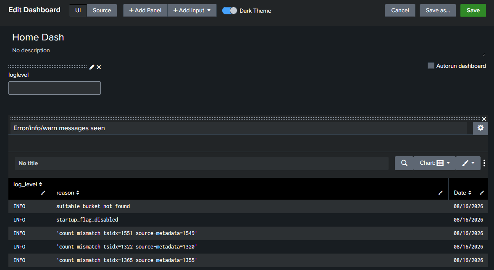

`$loglevel$` is a **placeholder** that gets filled in from a dashboard **input** (a text box named `loglevel`). Wherever `$loglevel$` appears in the search, Splunk **substitutes whatever the user enters**.

**Using the token:** on the dashboard the user types a value into the **loglevel** input - here `INFO` - and clicks **Submit**:

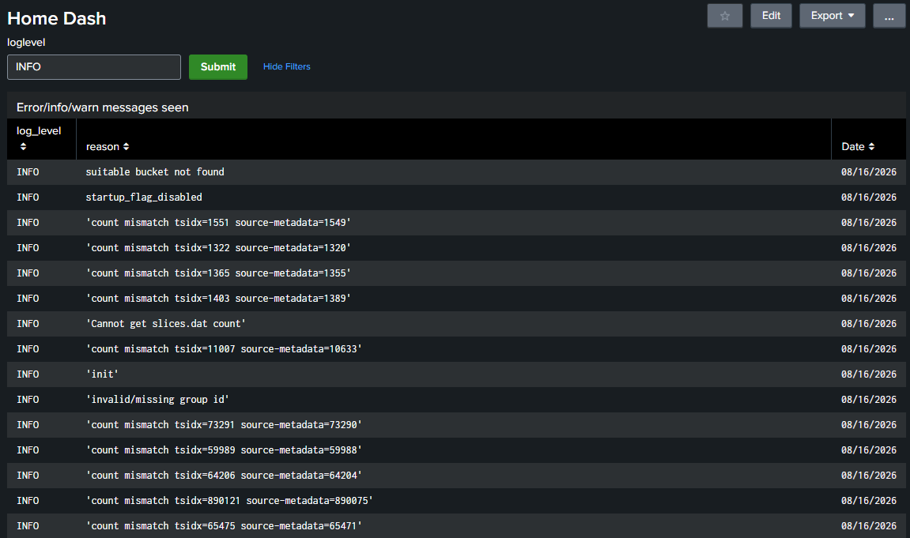

The token `$loglevel$` becomes `INFO`, so the search effectively runs as `index=_internal INFO | …` and the panel now shows **only INFO-level messages**. Change the input and Submit again and the panel re-runs with the new value. That's the whole point of a token: it **carries the user's choice into the search**, making one panel serve many filters.

> **Time tokens too:** a token isn't limited to a value like a log level - a **time-range input** can drive a **time token** that sets the search's **time range**. Add a time-picker input and its selection (via `$token.earliest$` / `$token.latest$`) controls the window each panel searches over - so the user can pick both _what_ to filter and _when_ to look.
