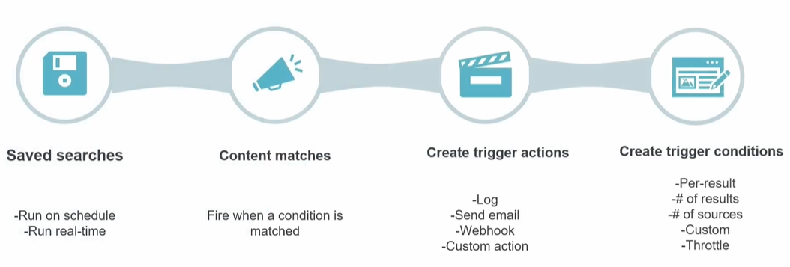
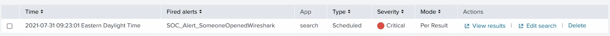

# Alerts

An **alert** is a **saved search that runs automatically** and **fires an action** when a condition is met - the backbone of automated detection. Like everything you build on top of your data, an alert is a **knowledge object** (a saved search + trigger config). The main guide covers the concept in [what you can build](../README.md#what-you-can-build-in-splunk), and [05 - creating an alert](05-knowledge-objects.md#example-creating-an-alert) is the hands-on walkthrough. This breaks down the **anatomy** of an alert.

> Screenshots in this file are from the Udemy course _Splunk: Zero to Power User_.

The slide is a good summary - an alert has **four moving parts**:

## 1. Saved search (the basis)

Every alert is fundamentally a **saved search**. It runs one of two ways:

- **On a schedule** - runs the search at fixed intervals (cron-like, e.g. every 5 minutes, hourly). Cheaper on resources and the most common choice.
- **In real-time** - evaluates **continuously as data arrives**, firing the instant a match appears. Catches things immediately but costs more resources, so use it sparingly.

## 2. Content matches (what it watches for)

The alert **fires when a condition is matched** - i.e. when the saved search **returns results**. No matching results, no alert. This is why the *search* is the heart of the alert: it defines what "something worth alerting on" looks like.

## 3. Trigger conditions (when exactly it fires)

Returning results isn't always enough - **trigger conditions** decide *when* the alert actually fires:

- **Per-result** - fire **once for every matching result** (e.g. alert on each failed login).
- **Number of results** - fire when the **count** crosses a threshold (e.g. `> 100` failed logins).
- **Number of sources** - fire based on **how many distinct sources** match (e.g. errors across many hosts).
- **Custom** - a **custom condition** written as an SPL expression, for anything the presets don't cover.
- **Throttle** - after the alert fires, **suppress further firing** for a set period (optionally **per field value**, e.g. once per `src_ip`). This stops one ongoing issue from **spamming duplicate alerts** - a key defence against [alert fatigue](../README.md#soc-challenges).

## 4. Trigger actions (what happens when it fires)

**Trigger actions** are what the alert *does* once triggered:

- **Log** - write an event back into Splunk to record the firing.
- **Send email** - notify a person/team.
- **Webhook** - POST to a URL, handing off to an external system.
- **Custom action** - e.g. run a script, open a ticket, or kick off a **SOAR** playbook.

You can attach **several** actions to one alert.

## Severity

Separately from *when* and *what*, an alert carries a **Severity** - a **priority tag** chosen from **Info → Low → Medium → High → Critical**. It **doesn't** change whether or when the alert fires; it's **metadata** that labels the fired alert so it appears with that severity in the **Triggered Alerts / Activity** view, letting analysts **prioritise** which to handle first. It's the alert-level version of the Critical/High/Medium/Low triage severity from the main guide's [SOC triage](../README.md#tier-1---monitoring--triage-analyst).

## Putting it together

An alert = **a saved search (scheduled or real-time) → that matches content → subject to a trigger condition → firing one or more trigger actions**, and tagged with a **severity** for prioritisation. For the click-by-click build (Save As → Alert, setting the condition and actions), see [05 - creating an alert](05-knowledge-objects.md#example-creating-an-alert).

A **fired alert** in the **Triggered Alerts** view pulls those parts together:

Reading the row for `SOC_Alert_SomeoneOpenedWireshark`:

- **Type: Scheduled** - the saved search runs on a schedule (part 1).
- **Mode: Per Result** - its trigger condition fires **per matching result** (part 3).
- **Severity: Critical** - its priority tag, shown in red so it stands out.
- **Actions** - **View results**, **Edit search**, or **Delete** the fired alert.

So one glance at the Triggered Alerts view tells you an alert's schedule type, how it triggers, and how urgent it is - the anatomy above made concrete.

> **Set permissions.** An alert is a **knowledge object** - defaults to private, so set the **Owner** and share it for others/other searches to use. See [knowledge objects](05-knowledge-objects.md#sharing--governance).
