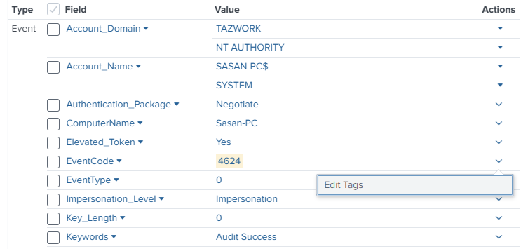
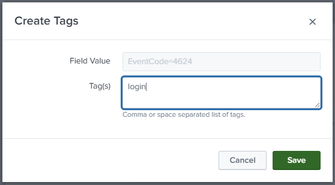
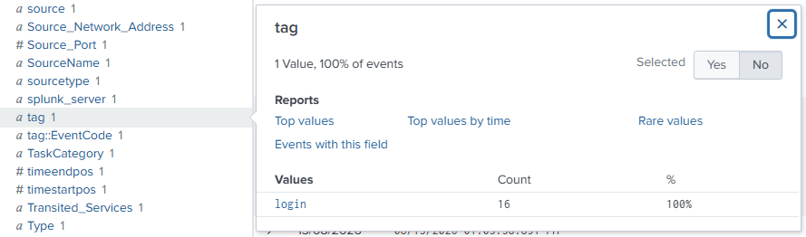
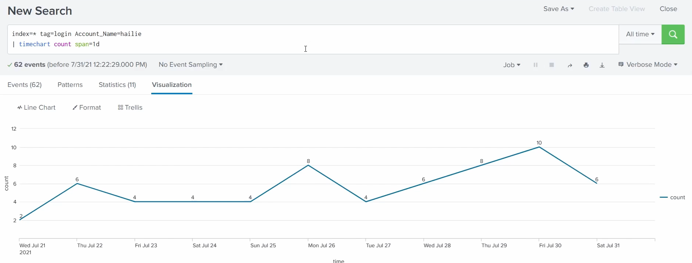

# Tags & Event Types

Two **knowledge objects** for **labelling** and **categorising** events. Both are defined in the main [glossary](../README.md#basic-terms-in-splunk-glossary), and [05 - creating an eventtype](05-knowledge-objects.md#example-creating-an-eventtype) walks through building one. This is the concept chapter.

> Screenshots in this file are from the Udemy course _Splunk: Zero to Power User_.

## Tags

A **tag** is a **label you attach to a field-value pair** (e.g. tag `web_error` on `status=404`).

- **Purpose** - a **quick reminder** of what a value means or what you were looking at, so you can search/group by a friendly name instead of the raw value.
- Create **as many as you want**, and attach several to the same value.
- **Case-sensitive** - `Error` and `error` are different tags.

### Creating and using a tag

Tags are attached to a **field-value pair** straight from the events list:

1. Expand an event, find the value you want to label, and open its **Actions** dropdown → **Edit Tags**:

   

2. In the **Create Tags** dialog the **Field Value** is fixed (here `EventCode=4624` - a Windows successful logon) and you type the **Tag(s)** - here `login` (comma/space-separated for several):

   

3. **Save**, and a **`tag`** field now appears with your value - here `tag=login` on 16 events - so the tag is a **searchable field**:

   

Now you can **search by the tag** instead of the raw value - e.g. `index=* tag=login` finds every event tagged `login` (across any sourcetype). Combined with other filters it answers real questions - here, one user's logins over time:

```spl
index=* tag=login Account_Name=hailie | timechart count span=1d
```



That's the payoff: `tag=login` is friendlier and more reusable than remembering `EventCode=4624`.

## Event types

An **event type** saves a **search as a named category**, so any events matching that search are automatically labelled. The course frames it three ways:

- **Highlighter** - give them **colours** and **mark events with similar criteria**, so matching events stand out visually in the results.
- **Like a report, but not** - you save a search as an event type and sort events into **categories** - but unlike a report, an event type has **no time range**. _Example:_ `status=404` can be saved as the event type **"Not Found"**.
- **More specific** - defined from **strings, field values, and tags**.

Other key points:

- **Categorises data** - groups all events matching the search under one named category.
- **Share knowledge with peers** - as a knowledge object, a good event type lets the whole team reuse your categorisation.

## Tags vs event types

They're related but operate at different levels:

| | **Tag** | **Event type** |
| --- | --- | --- |
| **Labels** | a single **field=value** pair | events matching a whole **search** |
| **Example** | `status=404` → tag `error` | `status=404` → event type `Not Found` |
| **Extras** | just the label | can have a **colour**, **priority**, and its own **tags** |
| **Time range** | n/a | **none** (event types never include a time range) |

So an event type categorises a *pattern of events*, and can itself carry tags; a tag just annotates a *value*.

## Creating them

For the hands-on build (Settings → Knowledge → Event types → New, with the **Color**, **Priority**, and **Tag(s)** fields), see [05 - creating an eventtype](05-knowledge-objects.md#example-creating-an-eventtype).

> **Set permissions.** Tags and event types are **knowledge objects** - default to private, so set the **Owner** and share them for the team to use. See [knowledge objects](05-knowledge-objects.md#sharing--governance).
