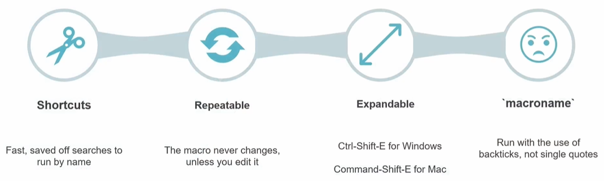
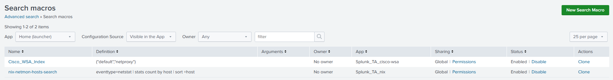
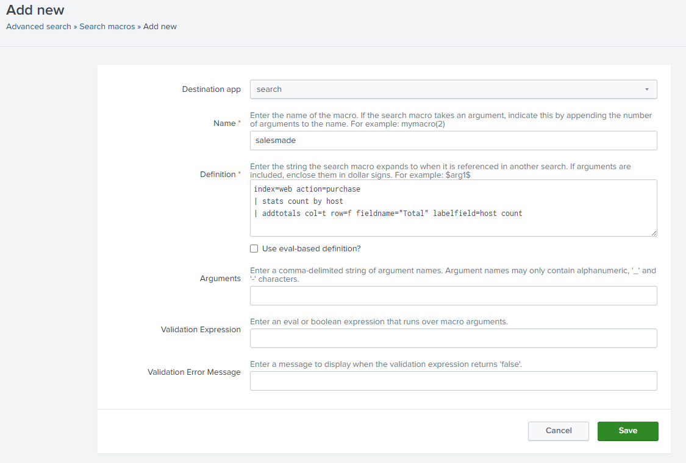
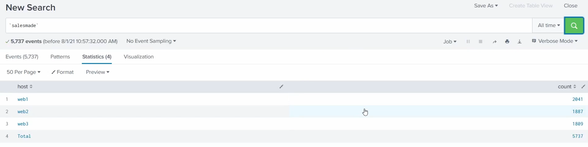
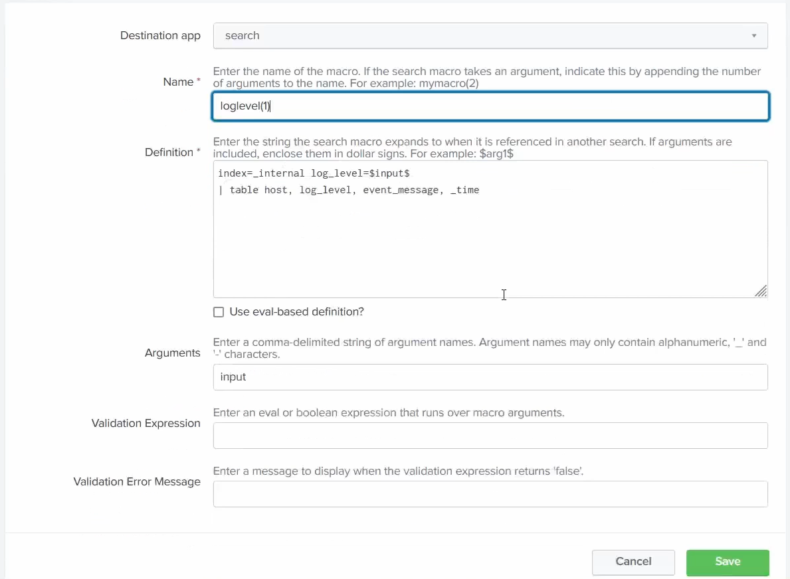

# Macros

A **macro** is a reusable, saved snippet of SPL you run by name - a shortcut for a chunk of search you use over and over. Macros are [knowledge objects](05-knowledge-objects.md).

> Screenshots in this file are from the Udemy course _Splunk: Zero to Power User_.



## What a macro is

- **Shortcut (DRY)** - write a complex or fiddly search fragment once, then run it by name across many searches, dashboards, and alerts instead of retyping it.
- **Single definition** - it only changes when you edit it; fix or improve it in one place and every search that uses it picks up the change.
- **Expandable** - preview the full SPL a macro resolves to before running it with `Ctrl-Shift-E` (Windows) / `Command-Shift-E` (Mac).
- **Called in backticks** - run a macro wrapped in `` `backticks` ``, not single quotes; the backticks are what tell Splunk to expand it.
- **Arguments** - a macro can take parameters, e.g. `` `failed_logins(web1)` ``, so one macro serves many cases.

## Accessing macros

Macros live under **Settings → Advanced search → Search macros**. This lists every macro you can see, with its **Definition**, **Arguments**, **Owner**, **App**, **Sharing**, and **Status** - and the **New Search Macro** button (top-right) to add one:



The two macros here - `Cisco_WSA_Index` and `nix-netmon-hosts-search` - are shipped by add-ons and show that a macro is just a named chunk of SPL (e.g. `eventtype=netstat | stats count by host | sort +host`), Global-shared so any search can call it.

## Creating a macro

Click **New Search Macro** to open the **Add new** form, then fill in:



- **Destination app** - which app the macro belongs to (here `search`).
- **Name** - what you call it in backticks. If it takes arguments, append the count, e.g. `mymacro(2)`.
- **Definition** - the SPL it expands to. Arguments are referenced with dollar signs, e.g. `$arg1$`. Here `salesmade` expands to:

  ```spl
  index=web action=purchase
  | stats count by host
  | addtotals col=t row=f fieldname="Total" labelfield=host count
  ```

- **Arguments** *(optional)* - comma-delimited argument names, plus optional **Validation Expression** / **Validation Error Message** to check them.

Then **Save**.

## Running a macro

Call it by name wrapped in backticks (`` `salesmade` ``), not single quotes. Splunk expands it to the full SPL and runs it, so `` `salesmade` `` returns the same results as typing the whole search by hand:



## Passing arguments

To make one macro serve many cases, define it with arguments and reference them as `$name$` in the definition:



- **Name** - `loglevel(1)` - the `(1)` tells Splunk this macro takes **one argument**.
- **Definition** - `index=_internal log_level=$input$ | table host, log_level, event_message, _time`. The `$input$` is the **placeholder** - whatever value you pass in the call gets substituted here before the search runs.
- **Arguments** - `input` - the argument's name (this is what must match the `$input$` in the definition).

So calling `` `loglevel(ERROR)` `` expands to `index=_internal log_level=ERROR | table host, log_level, event_message, _time`, listing every internal `ERROR` event. Swap the value - `` `loglevel(WARN)` ``, `` `loglevel(INFO)` `` - and the one macro filters to any log level you want, without editing its definition.

> **Set permissions.** A macro is a knowledge object - it defaults to private, so set the **Owner** and share it for the team/other searches to use. See [knowledge objects](05-knowledge-objects.md#sharing--governance).
