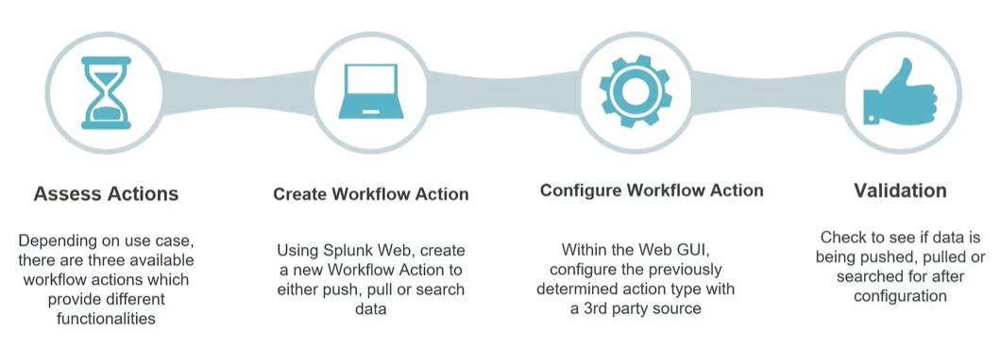
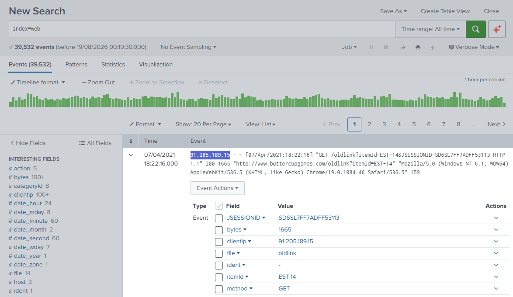
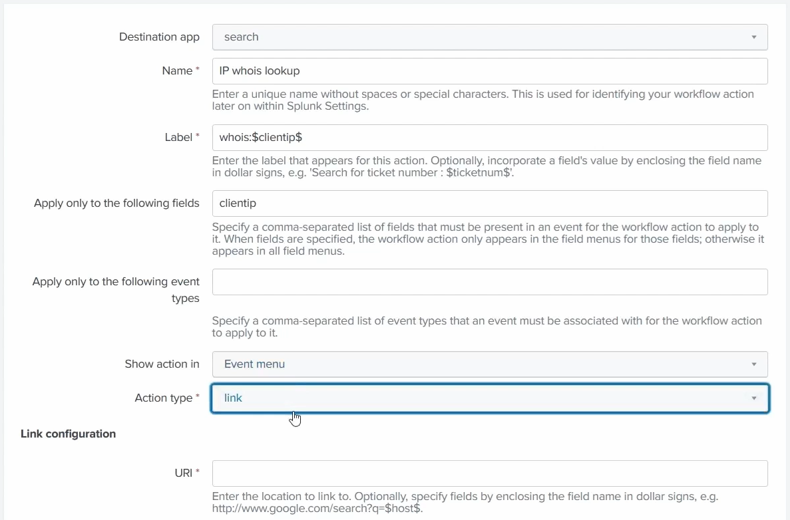
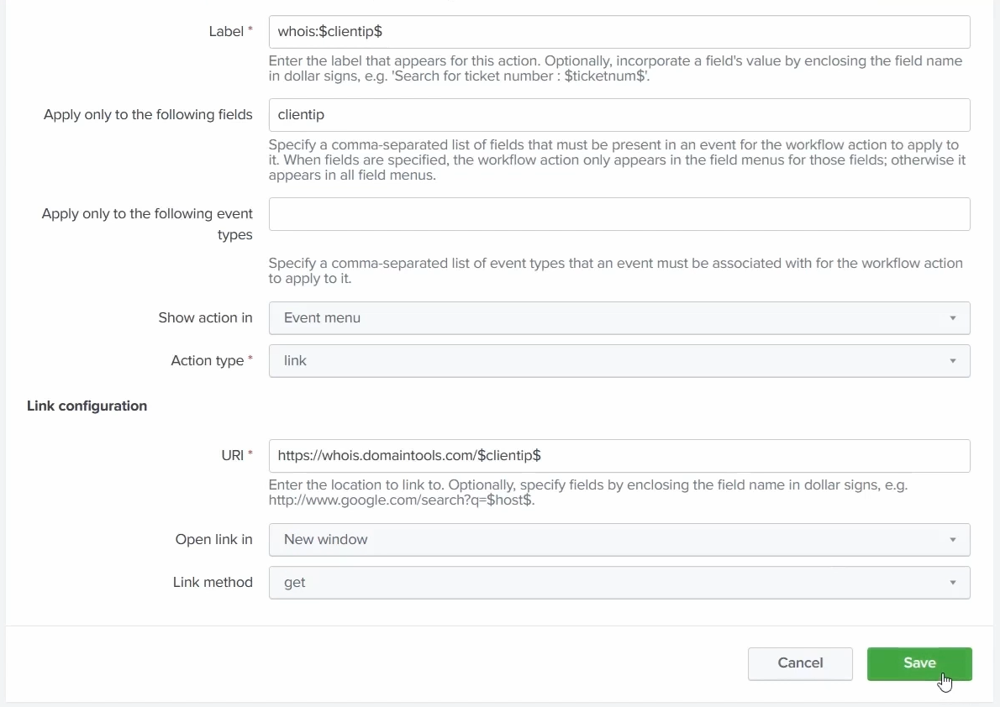
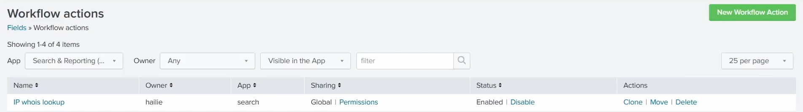
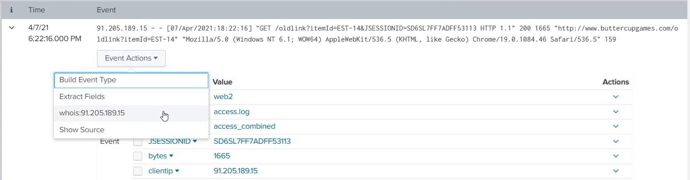
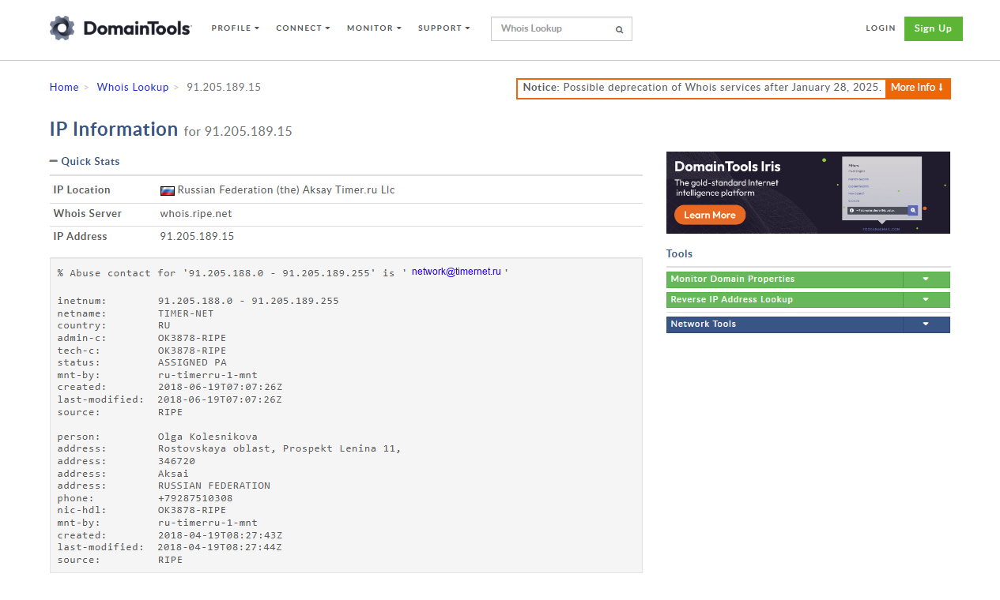

# Workflow Actions

**Workflows to save you time.** A **workflow action** turns a field value in your events into an **action** - a link that reaches out to a third-party web resource or kicks off another Splunk search. It's how you go from *looking* at an event to *doing something* with one of its values (e.g. look a suspicious `src_ip` up on a threat-intel site, or pivot to every other event from that IP) without retyping anything.

> Screenshots in this file are from the Udemy course _Splunk: Zero to Power User_.

## The four stages (from the image)

1. **Assess actions** - depending on the use case, there are **three** available workflow actions, each with different functionality (see below); pick the one that fits.
2. **Create workflow action** - using **Splunk Web**, create a new workflow action to **push**, **pull**, or **search** data.
3. **Configure workflow action** - within the Web GUI, configure the action type you chose and point it at the **3rd-party source** (a URL, an API endpoint, or a Splunk search).
4. **Validation** - test it: check that data is actually being pushed, pulled, or searched once you trigger the action from an event.

## The three action types: GET, POST, Search

| Type | Diagram term | What it does | Typical use |
| --- | --- | --- | --- |
| **GET** | pull | Builds a URL with the field value as a parameter and **opens it** (usually in the browser). | Look a value up on an external site - e.g. a WHOIS / VirusTotal lookup on an IP or file hash. |
| **POST** | push | Sends the field value(s) in an **HTTP POST request** to a third-party endpoint. | Hand data off to another system - e.g. raise a ticket / incident via its API. |
| **Search** | search | Launches a **new Splunk search** built from the event's field values. | Pivot within Splunk - e.g. "show every event from this `src_ip`". |

The diagram's **push / pull / search** maps straight onto these: **push = POST** (send data out), **pull = GET** (fetch or pass a value to a web resource), **search = Search** (run a secondary search).

## Worked example: whois lookup on an IP

A GET/`link` action that takes the `clientip` from a web event and looks it up on **`whois.domaintools.com`** - a one-click pivot from "here's a suspicious IP in my logs" to "who owns it?".

### 1. The value we want to action

Running `index=web`, an event has a `clientip` of `91.205.189.15`. That's the IP we want to investigate against an external whois service - so `clientip` is the field the workflow action will pull from:

### 2. Create the workflow action

Go to **Settings → Fields → Workflow actions**, then **New** (the **Add new** button at the bottom) to open the form. The fields:

| Field | What it does | Here |
| --- | --- | --- |
| **Destination app** | Which app the action belongs to. | `search` |
| **Name** | Unique internal name (no spaces/special chars) - identifies it in Settings. | `IP whois lookup` |
| **Label** | The text shown in the action menu. Embed a field value with `$field$`. | `whois:$clientip$` (so the menu item reads `whois:91.205.189.15`) |
| **Apply only to the following fields** | Comma-separated fields that must be present; the action only appears for those fields. | `clientip` |
| **Apply only to the following event types** | Restrict to certain event types (blank = any). | *(blank)* |
| **Show action in** | Where it appears - Event menu, Fields menu, or both. | `Event menu` |
| **Action type** | `link` (a GET/POST out to a URL) or `search` (run a Splunk search). | `link` |

Because **Action type** is `link`, a **Link configuration** section appears:

| Field | What it does | Here |
| --- | --- | --- |
| **URI** | The target URL. Embed the field value with `$field$`. | `https://whois.domaintools.com/$clientip$` |
| **Open link in** | Same window or a new one. | `New window` |
| **Link method** | `get` or `post` - this is what makes it a **GET** vs **POST** action. | `get` |

Then **Save**.

### 3. The action is created

It now shows in the **Workflow actions** list - `Global`-shared and `Enabled`, so it's live for everyone:

### 4. Trigger it from the event

Back on the event, the **Event Actions** dropdown now carries our action, with the label resolved to the real value - **`whois:91.205.189.15`**:

### 5. The result

Clicking it opens the DomainTools whois page for that exact IP (the `$clientip$` was substituted into the URI). We instantly learn the IP is registered in the **Russian Federation** (TIMER-NET, RIPE), with an abuse contact - real threat-intel context on the address straight from the log, no copy-paste:

That's the payoff: one saved action turns any `clientip` in your events into a live whois lookup.

## A POST example

Same idea, but instead of *opening* a URL you **send data out** to a third-party system - e.g. report a bad IP to a blocklist / ticketing API. The form is identical up to **Action type: `link`**, then set **Link method: `post`**. Choosing `post` swaps the single URI box for a **URI** *plus* **POST arguments** (key/value pairs sent in the request body):

- **Name** - `Report IP to blocklist`
- **Label** - `Report $clientip$`
- **Apply only to the following fields** - `clientip`
- **Action type** - `link`, **Link method** - `post`
- **URI** - `https://intel.example.com/api/report`
- **POST arguments** - `ip=$clientip$, source=splunk`

Triggering it POSTs `ip=91.205.189.15&source=splunk` to that endpoint - handing the value straight to the other system rather than just viewing it. (POST needs a real endpoint that accepts it, so there's nothing to *see* like the whois page - success is confirmed at the receiving system, i.e. the **Validation** stage.)

## A Search example

Here **Action type** is `search` (not `link`), so there's no URL at all - the action runs a **new Splunk search** built from the event's fields. This is the *pivot within Splunk*: from one event to every related event.

- **Name** - `Same client IP`
- **Label** - `All events from $clientip$`
- **Apply only to the following fields** - `clientip`
- **Action type** - `search`
- **Search string** - `index=* clientip=$clientip$`
- **Run in app** - `search`, **Open in view** - `search`, **Time range** - inherit or set explicitly

Clicking `All events from 91.205.189.15` opens a fresh search for `index=* clientip=91.205.189.15` - instantly showing everything that IP did across all indexes, without you typing the query.

> **Set permissions.** A workflow action is a **knowledge object** - it defaults to private, so set the **Owner** and share it for the team to use. See [knowledge objects](05-knowledge-objects.md#sharing--governance).
