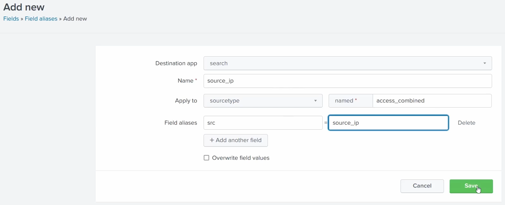
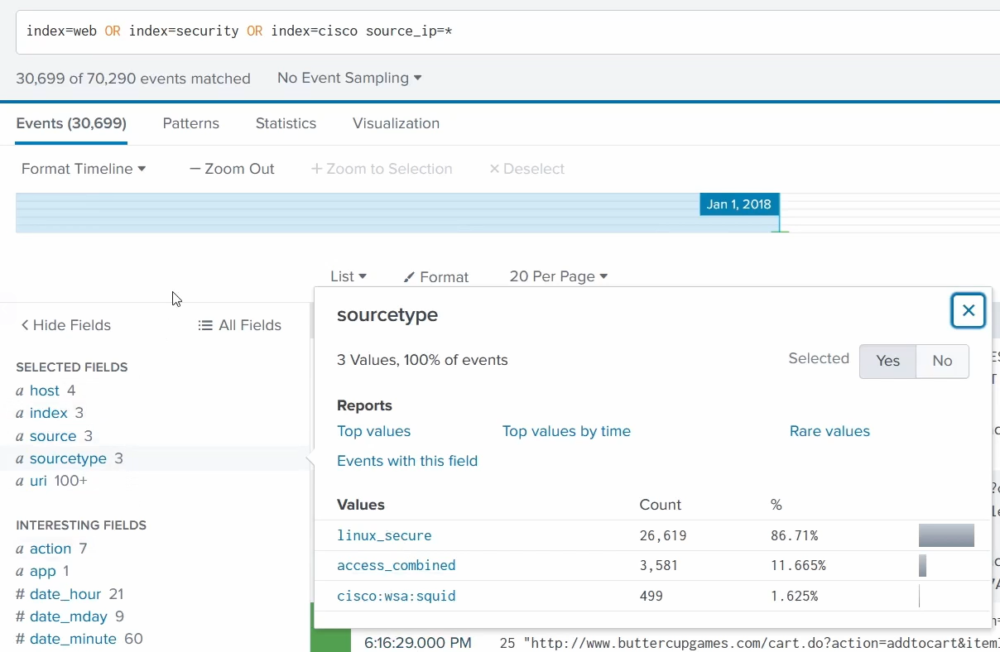
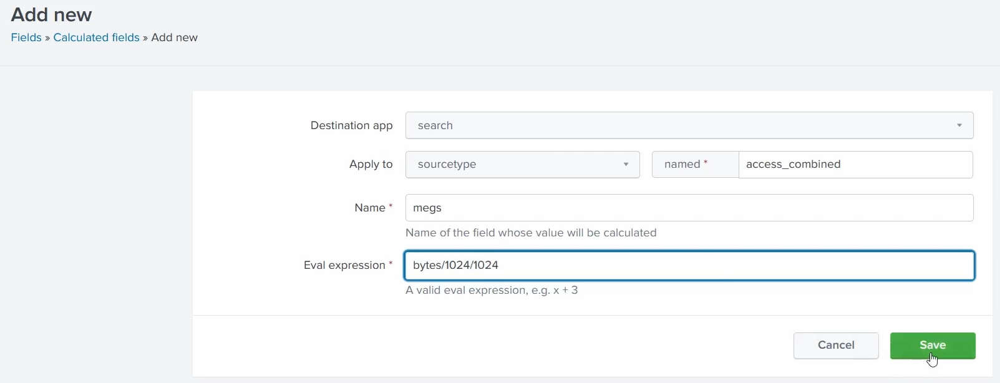
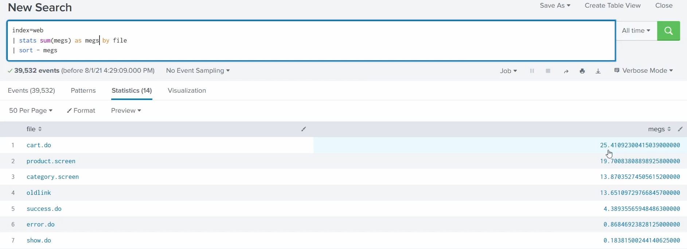
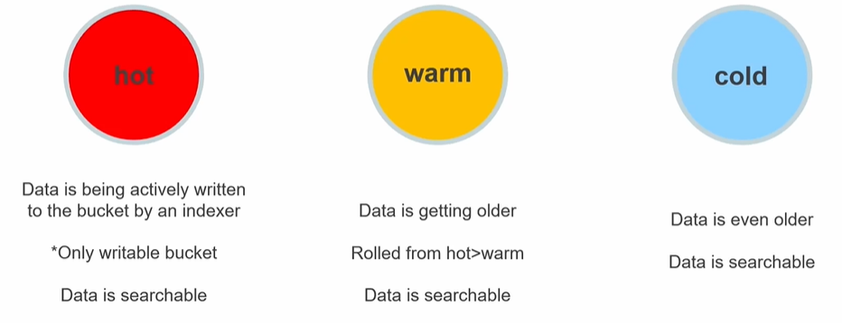
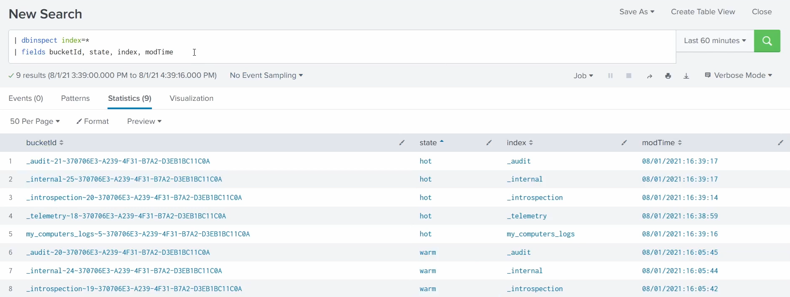
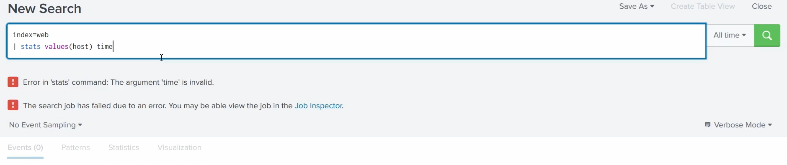
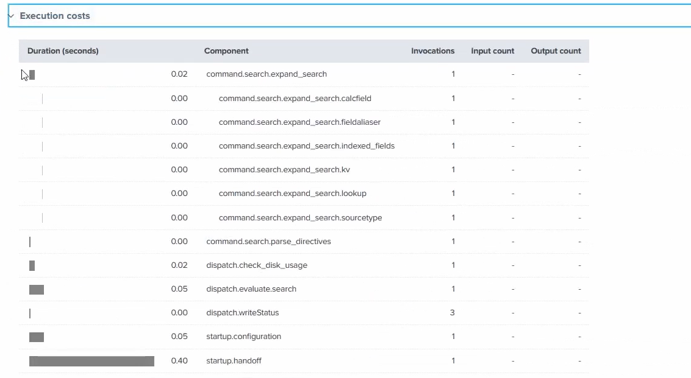

# Data Normalisation & Troubleshooting

Four more knowledge objects / tools, in two groups: **normalising** your data so it's consistent and easy to search (**field aliases**, **calculated fields**), and **troubleshooting** how Splunk stores and runs your searches (**buckets**, the **job inspector**).

> Screenshots in this file are from the Udemy course _Splunk: Zero to Power User_.

## Field aliases

A **field alias** gives an existing field an **alternative name**, so fields that mean the same thing but are *named* differently across sources can be searched under **one common name**.

- **Normalise your data** - "normalising" means making data from different sources use **consistent field names**. One log might call the source IP `clientip`, another `src_ip`, another `sourceAddress`; alias them all to a single name (e.g. `source_ip`) and you can search every source at once with one field.
- **Many fields → one alias** - you can point **multiple original fields at the same alias**, which is exactly what makes cross-source searching work.
- **Easier searching amongst users** - everyone on the team uses the same field name instead of remembering each source's quirk.
- **Think CIM** - this is manual normalisation toward the [Common Information Model](03-apps-vs-addons.md#the-cim-auto-mapping-point) - the same "one standard field name across all sources" idea, done by hand for a field a supported add-on didn't map for you.
- **The original field is untouched** - an alias is **additive**: after aliasing, both the original name *and* the alias work. You're adding a synonym, not renaming.

### Creating them

Create under **Settings → Fields → Field aliases → New field alias**. In the form you set:

- **Name** - a name for this field-alias config (here `source_ip`).
- **Apply to** - what to scope it to, e.g. **sourcetype** named `access_combined`.
- **Field aliases** - the mapping itself: **original field = new alias name** (here `src` = `source_ip`). **Add another field** maps several in one config.



To normalise "source IP" across three different sources, repeat this **once per sourcetype**, aliasing each one's own IP field to the **same** `source_ip`:

| Sourcetype | Original field | Alias |
| --- | --- | --- |
| `access_combined` | `src` | `source_ip` |
| `cisco:wsa:squid` | `ip_address` | `source_ip` |
| `linux_secure` | `src` | `source_ip` |

### The payoff: one field across all sources

Now a single field - `source_ip` - matches events from **all three** sourcetypes at once, even though two call the raw field `src` and one calls it `ip_address`:

```spl
index=web OR index=security OR index=cisco source_ip=*
```



The **sourcetype** breakdown confirms it - **30,699 events** matched across **linux_secure** (86.7%), **access_combined** (11.7%) and **cisco:wsa:squid** (1.6%), all via the one `source_ip` alias. Without it you'd have to write `(src=* OR ip_address=*)` and remember which source used which name; with it, one normalised field does the job - CIM-style normalisation done by hand.

## Calculated fields

A **calculated field** is **like a macro, but for a field** - a saved `eval` expression that Splunk applies **automatically at search time**, so the new field is always there without retyping the `eval` every search.

Built with the **`eval`** command - the same expression you'd write inline, saved once - so instead of typing `| eval megs = bytes/1024/1024` in every search, you save it and the field is always there.

### Creating one

Create under **Settings → Fields → Calculated fields → New calculated field**. Here we make a `megs` field that converts each event's `bytes` into megabytes:



- **Apply to** - scope it, e.g. **sourcetype** `access_combined`.
- **Name** - the field to create (`megs`) - "the field whose value will be calculated".
- **Eval expression** - `bytes/1024/1024` (bytes → KB → MB).

### Using it

Now `megs` behaves like any other field, even though it's **never stored in the raw data** - Splunk computes it on the fly at search time. Here we total it per file:

```spl
index=web
| stats sum(megs) as megs by file
| sort - megs
```



`cart.do` tops the list at ~25 MB. You never typed the `eval` - the calculated field supplied `megs` automatically, exactly like a macro does for a search snippet.

## Buckets

Splunk stores indexed data in **buckets** - directories of events that **age through stages** based on how old the data is. This was introduced with the indexer in the [main guide's storage section](../README.md#2-indexer---processing--storage); this is the course's view of the stages:



| Stage | What it means | Searchable? |
| --- | --- | --- |
| **Hot** | Data is being **actively written** by an indexer - the **only writable** bucket. | Yes |
| **Warm** | Data is **getting older**; **rolled from hot → warm** and closed to writes. | Yes |
| **Cold** | Data is **even older**, typically moved to cheaper storage. | Yes |
| **Frozen** | After cold, buckets **roll to frozen**. By default Splunk **deletes** them; if you configure an archive path they're **archived** instead. | **No** - deleted data is gone; only **archived** frozen data can be **thawed** back to search |

So the lifecycle is **hot → warm → cold → frozen**, oldest data ageing out at frozen. The [main guide](../README.md#2-indexer---processing--storage) shows the full lifecycle including the frozen/archive step.

### Inspecting buckets

You can list the real buckets and their current stage with the **`| dbinspect`** command:

```spl
| dbinspect index=*
| fields bucketId, state, index, modTime
```



Each row is one bucket, showing its **`state`** (`hot`, `warm`, `cold`…), the **`index`** it belongs to, and its **`modTime`** - a quick way to confirm which stage your data is actually in.

## Job inspector

The **Job Inspector** lets you **troubleshoot a search** - either its **efficiency** or **why it failed**.

- **Informative** - it tells you **how long** the search took to complete and **how** it completed (a breakdown of where the time went, which components were slow, etc.).
- **Fixes misused knowledge objects** - if you're using a knowledge object incorrectly, the inspector's messages **suggest how to correct your search**.

Open it after running a search from the **Job** dropdown → **Inspect Job**. It's also offered automatically when a search **fails** - here `stats values(host) time` passes an invalid argument to `stats`, and Splunk links straight to the **Job Inspector** to diagnose it:



The inspector is also how you check a search's **efficiency**. Its **Execution costs** table breaks a run down **by component** - how long each phase took and how many times it ran:



You can see where the time actually went (here `startup.handoff` at 0.40s is the biggest cost). Notice the `command.search.expand_search.calcfield` and `.fieldalias` rows - that's your **calculated fields and field aliases** being applied during search expansion, the very knowledge objects from the top of this chapter. This component breakdown is what lets you spot a slow or misused KO and fix your search.

> **Set permissions.** Field aliases and calculated fields are **knowledge objects** - they default to private, so set the **Owner** and share them for the team to use. See [knowledge objects](05-knowledge-objects.md#sharing--governance).
