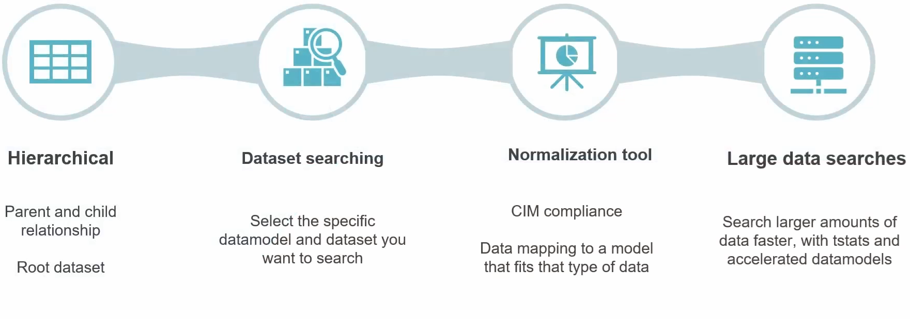
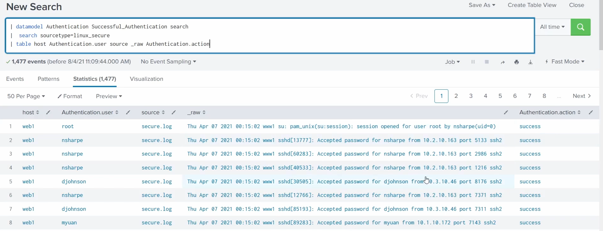

# Data Models

A **data model** is a **structured, hierarchical mapping of one or more datasets** - a model you associate specific **types of data** with, so you can search and report on that data by its *meaning* rather than by writing raw SPL. The mapping resolves at **search time**, or is **pre-computed in the background** once you accelerate it (see below). It's the layer that powers **[Pivot](13-visualisations.md)** (point-and-click reporting) and Splunk's **[CIM](03-apps-vs-addons.md#the-cim-auto-mapping-point)**, and it's itself a [knowledge object](05-knowledge-objects.md).

> Screenshots in this file are from the Udemy course _Splunk: Zero to Power User_.



## The four aspects (from the image)

- **Hierarchical** - a data model is built from **datasets** (each a **named set of events defined by constraints** - roughly an event category within the model). They sit in a **parent → child relationship** from a **root dataset**: child datasets inherit the parent's constraints and fields, then narrow them further.
- **Dataset searching** - you **select the specific data model and dataset** you want to search, then work with that curated slice instead of raw events.
- **Normalization tool** - **CIM compliance**: a data model maps data to a **standard schema that fits that type of data** (e.g. Authentication, Web, Network Traffic) so different sources line up under common field names. Same normalisation idea as [field aliases](19-normalisation-and-troubleshooting.md#field-aliases), but as a whole reusable model rather than one field.
- **Large data searches** - **search larger amounts of data faster**, using **`tstats`** and **accelerated data models** (see below).

## Why they speed up searches

**The problem:** a normal search **scans raw events**, so the **more data you have, the longer it takes**. If you're constantly running the same searches over a dataset that keeps growing, those searches only get slower.

**The fix — acceleration + `tstats`:**

- When you **accelerate** a data model, Splunk **pre-computes summaries** of its fields in the background (compact `tsidx` summary files) and keeps them updated as new data arrives.
- The **`tstats`** command runs over those **summaries instead of the raw events**, so it returns results **dramatically faster**.
- Crucially, the speed tracks the **summary size, not the full raw volume** - so as the raw data keeps growing, accelerated searches **stay fast** instead of degrading. That's how data models counteract the "more data = slower search" problem.

**Trade-offs:** acceleration costs **extra disk** for the summaries, and the model's fields must be **defined up front** - you accelerate a structured model, not arbitrary ad-hoc searches.

## Working with a data model

Three commands query a data model, from most flexible to fastest:

### `datamodel` — return the events

Pulls the **actual events** of a dataset, which you then pipe into normal SPL:

```spl
| datamodel <Data_Model> <Data_Model_Dataset> search
```

You get **full events**, so it's flexible - but it reads the underlying data, so it's **not the fast path**.

*Example* - `Successful_Authentication` events from the `Authentication` model, filtered to `linux_secure` and tabled:

```spl
| datamodel Authentication Successful_Authentication search
| search sourcetype=linux_secure
| table host Authentication.user _raw Authentication.action
```



**1,477 events** come back as full events carrying the model's **namespaced fields** - `Authentication.user`, `Authentication.action` (all `success`) - alongside the raw `_raw` and `host`. That `Dataset.field` naming is the same convention `tstats` uses below.

**Why this is useful:** we happened to filter to `linux_secure`, but `Authentication.user` and `Authentication.action` mean the same thing *whatever* the source - Linux, Windows Security logs, a VPN, a cloud IdP. Because the model normalises them all to the same fields, one query like "every successful authentication in the environment" works across every source at once, without you knowing each source's raw field names.

Add acceleration (fast as the data grows) and reuse (the same model feeds [Pivot](13-visualisations.md) and every detection built on it), and the payoff is simple: **write the question once, in normalised terms, and it holds everywhere.**

### `tstats` — fast stats from the summaries

Runs statistical functions over the model's data - and **when the model is accelerated**, over the compact **`tsidx` summaries** instead of raw events, which is the fast path:

```spl
| tstats <stats-function> from datamodel=<datamodel-name> where <where-conditions> by <field-list>
```

*Simple* - count everything in the `web` model:

```spl
| tstats count from datamodel=web
```

*Real detection* - high/critical IDS attacks, grouped by source, destination, signature and severity:

```spl
| tstats `summariesonly` count from datamodel=Intrusion_Detection.IDS_Attacks
    where IDS_Attacks.severity=high OR IDS_Attacks.severity=critical
    by IDS_Attacks.src, IDS_Attacks.dest, IDS_Attacks.signature, IDS_Attacks.severity
```

Key points:

- **`datamodel=Model.Dataset`** - the dotted notation drills into a **child dataset** (here `IDS_Attacks` under `Intrusion_Detection`).
- Fields are referenced as **`Dataset.field`** (e.g. `IDS_Attacks.src`) - the model's namespaced field names.
- **`` `summariesonly` ``** - a built-in macro telling `tstats` to use **only accelerated summary data** and ignore un-summarised raw events. It guarantees the fast path, at the cost of only seeing data that's already been summarised.

### `pivot` — point-and-click

Build tables and charts from a data model with **no SPL**, through the **[Pivot](13-visualisations.md)** interface (there's also a `| pivot` command, but the GUI is the usual way). Like `tstats`, it runs off the accelerated model.

## Creating & using one

- **Create** - **Settings → Data models → New Data Model**, then add a **root dataset** (a constraint that selects the events) and build **child datasets** and **fields** beneath it.
- **Accelerate** - in the data model's **Edit → Acceleration** settings, turn acceleration on and pick a summary time range.
- **Use** - query it with the `datamodel`, `tstats`, or `pivot` commands, as covered in [Working with a data model](#working-with-a-data-model) above.

> Splunk ships **prebuilt CIM data models** (Authentication, Web, Malware, …). Premium apps like **Enterprise Security** run their correlation searches against these models, which is why CIM-normalised data "just works" across sources - the [add-on normalises → app analyses](03-apps-vs-addons.md) relationship in action.

> **Set permissions.** A data model is a **knowledge object** - it defaults to private, so set the **Owner** and share it for the team to use. See [knowledge objects](05-knowledge-objects.md#sharing--governance).
