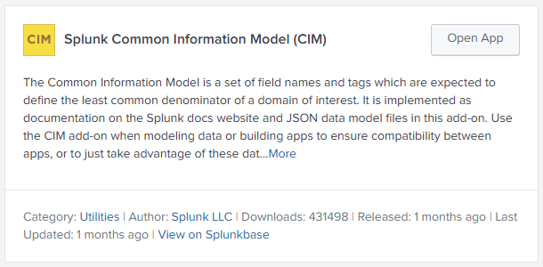
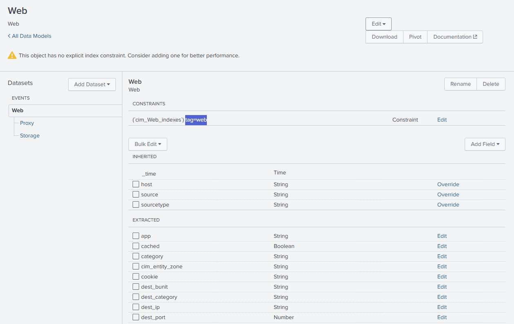
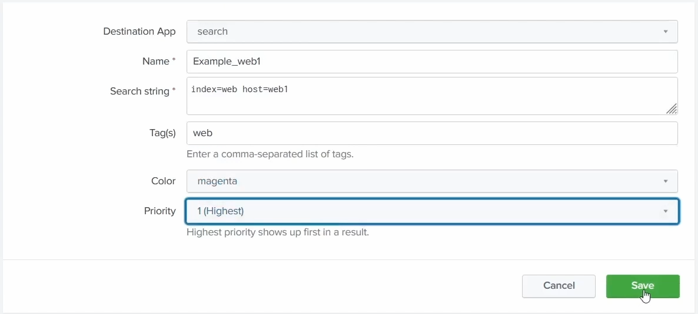
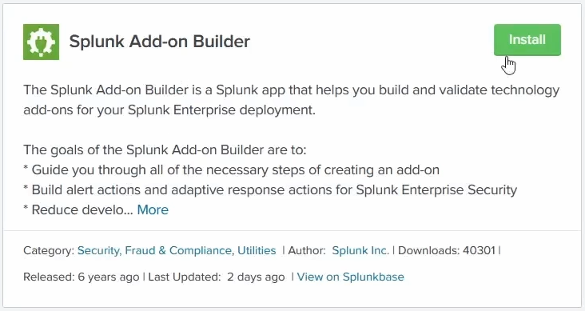
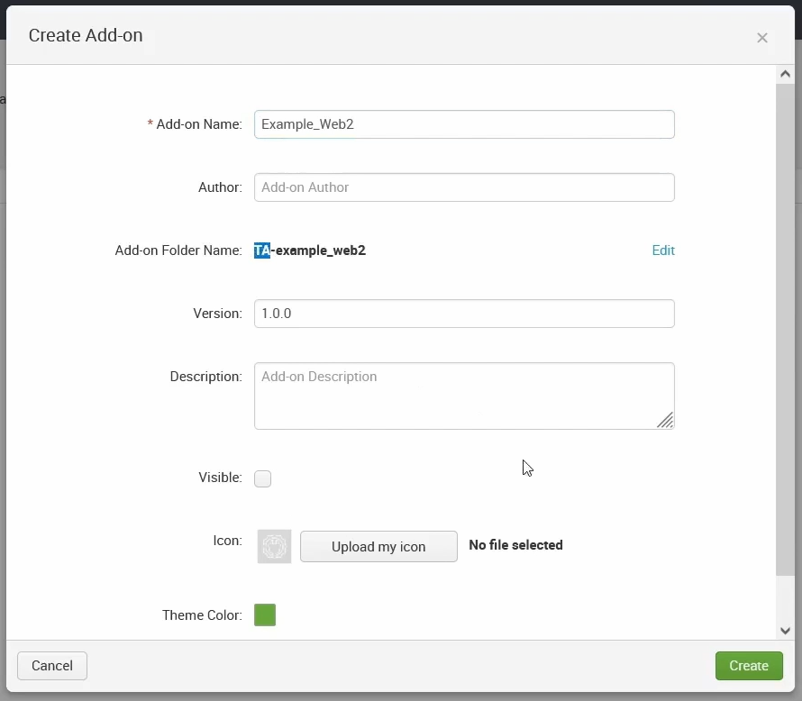
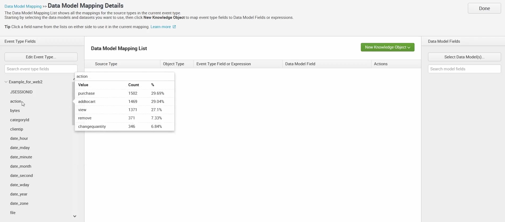
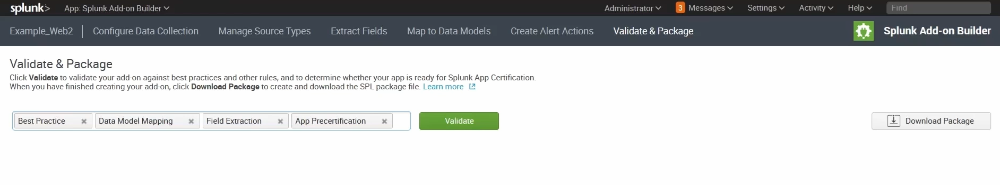

# Common Information Model (CIM)

The **Common Information Model (CIM)** is Splunk's **standard field-naming schema** - a shared "dictionary" that says what a field *should* be called (a source IP is `src`, a user is `user`, …) no matter which vendor's log it came from. It's the backbone of **data normalisation** in Splunk, it **leverages [data models](20-data-models.md)**, and it's delivered through a free **CIM add-on** that ships **22 pre-configured data models** you map your data to.

> The basic "supported add-ons normalise to the CIM automatically" mechanic is covered in [03 - the CIM auto-mapping point](03-apps-vs-addons.md#the-cim-auto-mapping-point); this chapter is the dedicated concept.

> Screenshots in this file are from the Udemy course _Splunk: Zero to Power User_.

## What is the CIM

- **A Model** - a model to **use and reference a common standard** for **how all data is handled**: the agreed field names and event structures.
- **An Application** - the **CIM Add-On** and the **CIM Add-On Builder** are **available for free**. The add-on delivers the models; the builder helps you map your own data onto them.
- **Data Normalizer** - in the end, **all fields can have the same name**, and **all apps can co-exist together** because they share that one common schema.

## How to leverage its features

- **Normalize Data** - the CIM gives Splunkers a way to **normalise data**, so different sources line up under common field names.
- **Assistance** - lean on it when creating **field extractions, [aliases](19-normalisation-and-troubleshooting.md#field-aliases), tags**, etc. - map your fields to CIM names as you build those knowledge objects.
- **Datamodel command** - because CIM data is modelled, you can run **common searches that span larger amounts of data** via **`tstats`** and the **[`datamodel`](20-data-models.md#working-with-a-data-model)** command over accelerated models.

## Why it is important

- **Splunk Premium Apps** - **Enterprise Security relies heavily on CIM-compliant data**; its correlation searches are written against CIM field names, so one detection works across every normalised source.
- **Health Check Tool** - perform **faster, more efficient searches** that leverage **data models instead of raw events** (the acceleration payoff from [ch20](20-data-models.md#why-they-speed-up-searches)).
- **Ease of Use** - **find commonality between Splunkers** - everyone speaks the same field-name language, so searches and dashboards are portable between people and teams.
- **Audit** - **check whether all data going into Splunk is CIM compliant**, so you can spot sources that haven't been normalised yet.

## The CIM add-on & its 22 data models

The CIM ships as a **free, Splunk-supported add-on** containing **22 pre-configured [data models](20-data-models.md)** (Authentication, Network Traffic, Web, Malware, …). You **use them as-is**, **build off** them, and **tune / map** your own data to them so it becomes CIM-compliant - and the **CIM Add-On Builder** guides that mapping. Because every model follows the same standard, premium apps and your own searches all interpret the data the same way. That's the whole point: **commonality in field names → normalised data → searches and detections that work everywhere.**

## Mapping your data to a CIM model

The models are driven by **tags** - a model only "sees" events that carry the tag it looks for. So getting your data into a CIM model is really about **tagging the right events**. Here's the workflow.

### 1. Install the CIM add-on

First download the free **Splunk Common Information Model (CIM)** add-on from Splunkbase - it's the **set of field names and tags** plus the JSON data model files that define the models:

### 2. The model is driven by tags

Open a model (here **Web**) under **Settings → Data models**. Its **root dataset's constraint is `` `cim_Web_indexes` `` tag=web** - so **only events tagged `web`** populate it. The **child datasets** (`Proxy`, `Storage`) have their **own tags/constraints** on top:

The model's fields are grouped into sections that **match the [CIM docs](https://docs.splunk.com/Documentation/CIM/latest/User/Overview)**:

- **Inherited** - Splunk's main **metafields**: `_time`, `host`, `source`, `sourcetype`.
- **Extracted** - the model's **field values**, mostly **strings** (`app`, `dest_ip`, `dest_port`, …).
- **Calculated** - values produced by [calculated fields](19-normalisation-and-troubleshooting.md#calculated-fields).

### 3. Pivot shows nothing is mapped yet

Run a **[Pivot](13-visualisations.md)** on the model (the **Pivot** button on the data model page) and you'll get **0 events** - none of your data carries the `tag=web` the model looks for, so nothing populates it yet. That's the gap to fill.

### 4. Map data in by tagging it

You need to get `tag=web` onto the right events. One way is an **event type** whose search selects the events and applies the tag. It's the same **Settings → Event types → New Event Type** form covered in [ch05](05-knowledge-objects.md#example-creating-an-eventtype) / [ch16](16-tags-and-event-types.md) - here used for CIM mapping:

- **Name** `Example_web1`, **Search string** `index=web host=web1`, **Tag(s)** `web`.
- Now those events carry `tag=web`, so they **populate the Web model** - re-run the Pivot and they appear.

> The course also walks through creating a **[field alias](19-normalisation-and-troubleshooting.md#field-aliases)** here (to map a raw field onto its CIM name) - that's the same workflow already covered in ch19, so it's not repeated. Field extractions, aliases, and tags are all just ways to make your data match the CIM's expected names and tags.

## Mapping with the Add-on Builder

The **Splunk Add-on Builder** is a free app that gives a **guided GUI** for building a CIM-compliant [add-on](03-apps-vs-addons.md). It wraps the same **tag / event-type** mapping used above in a point-and-click UI, then lets you **validate and package** the result as an installable add-on you can deploy anywhere.

### 1. Open the builder and create an add-on

Open the **Splunk Add-on Builder** app and **create a new add-on** (give it a name, author, and version):

### 2. Manage source types

Inside the add-on, go to **Manage Source Types → Add → Import from Splunk**, and select the source type **`access_combined`**. This pulls that source type into the add-on so its fields are available to map.

### 3. Create a data model mapping

Switch to **Map to Data Models → New Data Model Mapping**. Give the mapping a **name** and set its search to the source type in the right index - **`index=web sourcetype=access_combined`**. The builder runs that search and lists the **extracted field names** as **Event Type Fields** - a **1:1 match** with what Splunk already extracts. Note it works off an **event type** (there's an *Edit Event Type* button), the same tag-driven mechanism as above, just wrapped in a GUI.

### 4. Map fields to the model

On the **Data Model Mapping Details** screen, first **Select Data Model(s)** on the right (e.g. **Web**) to load its CIM fields. Then pair **your fields on the left** with the model's **CIM fields on the right** - click a name on each side to map them (the target can be a **field or an eval expression**), and use **New Knowledge Object** to add each mapping row. When every field is mapped, click **Done**:

### 5. Validate and package

Move to **Validate & Package** and click **Validate**. The builder checks the add-on against a set of rules - **Best Practice, Data Model Mapping, Field Extraction, and App Precertification** - to confirm the CIM mappings and configs are sound and the add-on is ready for **Splunk App Certification**, reporting any **errors or warnings** to fix:

Once it passes clean, click **Download Package** to create and download the installable **`.spl`** package file. That package carries your CIM mappings with it, so it can be **installed on any Splunk instance** (or published to Splunkbase) rather than living as loose knowledge objects in one app.

> The Add-on Builder isn't a different mechanism - the screen literally works off an **event type** and tags (note *Edit Event Type*), the same tag-driven mapping as above. What it adds is a **GUI** over that plumbing and a **portable, packaged add-on** as the output, rather than knowledge objects living loose in one app.
